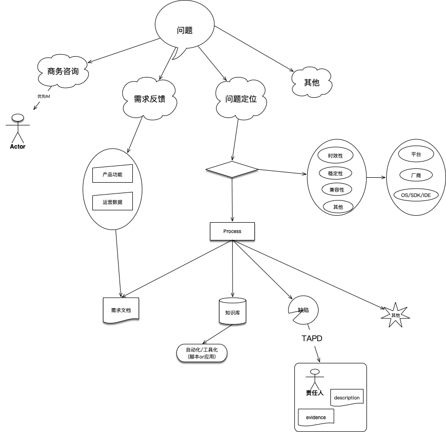

# 技术支持工作流程化建设

在信鸽技术支持工作的高效、专业、服务方面需要流程化建设，技术支持不仅可以协助客户完成服务的集成接入测试，还可以对服务中出现的问题进行分解、提炼，从而驱动服务质量的提升，更进一步，将客户问题背后潜在的需求转化为产品机会，助力平台发展

支持工作，在IM、AiSee、Tapd平台上完成了初步的流程搭建，仍存在流程具体细节的执行产出缺陷，以下是应对方案

## 内容分类

将问题大致分为：

- 问题定位
- 需求反馈
- 商务咨询
- 其他

> 如有其他，可补充

## 问题定位

问题定位需要先弄明白具体的问题轮廓，整体服务目前主要问题的分类：

- 时效性
- 稳定性
- 兼容性
- 其他

以上分类是表现在更加具体的环境上，对于环境信息需要明确：

- 平台
- 厂商
- OS/SDK/IDE
- 设备网络环境
- 其他

弄清楚以上问题之后，需要对问题进行二次加工处理，可以将处理问题的方向大致分为以下：

- 需求文档

  目前服务中缺失的部分，将视为需求

- 知识库

  FAQ是最为直接、高效的一种展现形式，将重复问题简化的必要步骤，作为进一步的补充，可以使用脚本实现或者是桌面、移动端的界面应用

- 缺陷

  对外服务中出现问题的产品、功能都在其中，此类需要更加细致的优先等级（比如SDK 导致App Crash，则是最高优先级，比如内部游戏反馈，优先级保持为高），明确等级之后，根据上述流程，将缺陷录入TAPD，包含：1.明确的客户提供的evidence和对缺陷的描述，并争取在实际环境中复现，以方便定位，2.具体的问题处理责任人，处理周期，反馈结果

- 其他

问题定位需要尽可能明确的描述和证据，问题的响应需要建立优先等级，问题的解决结果需要及时传递到接入方，问题的总结是支持工作自动化的必要手段

## 需求反馈

从问题中分解、提炼出产品需求是支持工作的更高价值，特别是当用户反馈强烈的诉求，需要重视。特别针对竞品也没有满足接入方的反馈，此处可能隐藏着平台发展优势。在日常的需求反馈中主要分为以下大类：

- 产品功能
- 运营数据

将此类反馈，提炼为更加完整的需求文档，甚至与竞品相比较，整理出产品策划文档雏形

## 商务咨询

目前对于私有化、付费的咨询，尽量通过IM或者是面对面的快速响应方式

## 其他

