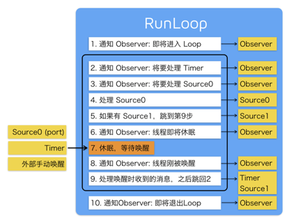
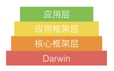
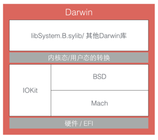
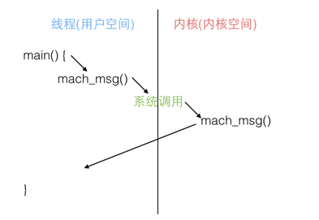
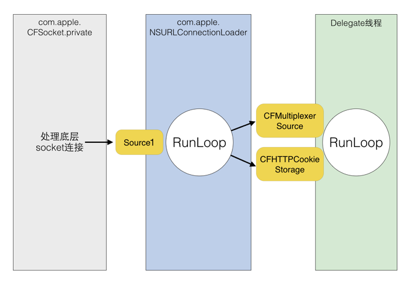

## RunLoop

将从CFRunLoop的源码入手，介绍RunLoop的概念以及底层实现原理。之后会介绍一下在iOS中，苹果是如何利用RunLoop实现自动释放池、延迟回调、触摸事件、屏幕刷新等功能的。


### Runloop 概念

一般来讲，一个线程一次只能执行一个任务，执行完成后线程就会退出。如果我们需要一个机制，让线程能随时处理事件但并不退出，通常的代码逻辑是这样的：

```C
 functionloop(){ 
     initialize(); 
     do{ 
         var message=get_next_message(); 
         process_message(message); 
     }while(message!=quit); 
 } 
```

这种模型通常被称作[EventLoop](http://en.wikipedia.org/wiki/Event_loop) 

EventLoop在很多系统和框架里都有实现，比如Node.js的事件处理，比如Windows程序的消息循环，再比如OSX/iOS里的RunLoop。实现这种模型的关键点在于：如何管理事件/消息，如何让线程在没有处理消息时休眠以避免资源占用、在有消息到来时立刻被唤醒。

所以，RunLoop实际上就是一个对象，这个对象管理了其需要处理的事件和消息，并提供了一个入口函数来执行上面EventLoop的逻辑。线程执行了这个函数后，就会一直处于这个函数内部"接受消息->等待->处理"的循环中，直到这个循环结束（比如传入quit的消息），函数返回。

OSX/iOS系统中，提供了两个这样的对象：NSRunLoop和CFRunLoopRef。

- [CFRunLoopRef](http://opensource.apple.com/source/CF/CF-855.17/CFRunLoop.c)是在CoreFoundation框架内的，它提供了纯C函数的API，所有这些API都是线程安全的
- NSRunLoop是基于CFRunLoopRef的封装，提供了面向对象的API，但是这些API不是线程安全的。

CFRunLoopRef的代码是[开源](http://opensource.apple.com/source/CF/CF-855.17/CFRunLoop.c)的，Swift开源后，一个跨平台的[CoreFoundation](https://github.com/apple/swift-corelibs-foundation/)


### RunLoop与线程

iOS开发有两个线程数据接口: pthread_t和NSThread，过去苹果有标明了NSThread只是pthread_t的封装，但那份文档已经失效了，现在它们也有可能都是直接包装自最底层的mach_thread。

苹果并没有提供这两个对象相互转换的接口，但肯定的是pthread_t和NSThread是对应的

- 可以通过 `pthread_main_thread_np()` 或 `[NSThread mainThread]`来获取主线程
- 可以通 `pthread_self()` 或  `[NSThread currentThread]` 来获取当前线程

CFRunLoop是基于pthread来管理的，不允许直接创建RunLoop，它只提供了两个自动获取的函数：`CFRunLoopGetMain()`和 `CFRunLoopGetCurrent()`

这两个函数内部的逻辑大概是下面这样:

```c
///全局的Dictionary，key是pthread_t，value是
CFRunLoopRef Static CFMutableDictionaryRef loopsDic; 
///访问loopsDic时的锁 
Static CFSpinLock_t loopsLock; 
///获取一个pthread对应的RunLoop
CFRunLoopRef _CFRunLoopGet(pthread_t thread){ 
OSSpinLockLock(&loopsLock); 
if(!loopsDic){ 
//第一次进入时，初始化全局Dic，并先为主线程创建一个RunLoop
loopsDic = CFDictionaryCreateMutable(); 
CFRunLoopRef mainLoop=_CFRunLoopCreate(); CFDictionarySetValue(loopsDic,pthread_main_thread_np(),mainLoop);
} 
    ///直接从Dictionary里获取
    CFRunLoopRef loop = CFDictionaryGetValue(loopsDic,thread)); 
    if(!loop){
        ///取不到时，创建一个 
        loop = _CFRunLoopCreate(); 
        CFDictionarySetValue(loopsDic,thread,loop); 
        ///注册一个回调，当线程销毁时，顺便也销毁其对应的RunLoop
        _CFSetTSD(...,thread,loop,__CFFinalizeRunLoop); 
    } 
    OSSpinLockUnLock(&loopsLock); 
    return loop; 
} 
CFRunLoopRef CFRunLoopGetMain(){ 
    return _CFRunLoopGet(pthread_main_thread_np()); 
} 
CFRunLoopRef CFRunLoopGetCurrent(){ 
    return _CFRunLoopGet(pthread_self()); 
}
```

从上面的代码可以看出，线程和RunLoop之间是一一对应的，其关系是保存在一个全局的Dictionary里。线程刚创建时并没有RunLoop，如果你不主动获取，那它一直都不会有。RunLoop的创建是发生在第一次获取时，RunLoop的销毁是发生在线程结束时。你只能在一个线程的内部获取其RunLoop（主线程除外）

### RunLoop 接口

在CoreFoundation里面关于RunLoop有5个类:

CFRunLoopRef
CFRunLoopModeRef
CFRunLoopSourceRef
CFRunLoopTimerRef
CFRunLoopObserverRef

其中CFRunLoopModeRef类并没有对外暴露，只是通过CFRunLoopRef的接口进行了封装

一个RunLoop包含若干个Mode，每个Mode又包含若干个Source/Timer/Observer

每次调用RunLoop的主函数时，只能指定其中一个Mode，这个Mode被称作Current Mode

如果需要切换Mode，只能退出Loop，再重新指定一个Mode进入

这样做主要是为了分隔开不同Mode下的Source/Timer/Observer，让其互不影响


**CFRunLoopSourceRef**是事件产生的地方。Source有两个：Source0和Source1。

Source0只包含了一个回调（函数指针），它并不能主动触发事件。使用时，需要先调用CFRunLoopSourceSignal(source)，将这个Source标记为待处理，然后手动调用CFRunLoopWakeUp(runloop)来唤醒RunLoop，让其处理这个事件。

 Source1包含了一个mach_port和一个回调（函数指针），被用于通过内核和其他线程相互发送消息。这种Source能主动唤醒RunLoop的线程，其原理在下面会讲到。

**CFRunLoopTimerRef**是基于时间的触发器，它和NSTimer是toll-freebridged的，可以混用。其包含一个时间长度和一个回调（函数指针）。当其加入到RunLoop时，RunLoop会注册对应的时间点，当时间点到时，RunLoop会被唤醒以执行那个回调。

**CFRunLoopObserverRef**是观察者，每个Observer都包含了一个回调（函数指针），当RunLoop的状态发生变化时，观察者就能通过回调接受到这个变化。可以观测的时间点有以下几个

```c
typedefCF_OPTIONS(CFOptionFlags,CFRunLoopActivity){ 
    kCFRunLoopEntry=(1UL<<0),//即将进入Loop 
    kCFRunLoopBeforeTimers=(1UL<<1),//即将处理Timer 
    kCFRunLoopBeforeSources=(1UL<<2),//即将处理Source 
    kCFRunLoopBeforeWaiting=(1UL<<5),//即将进入休眠 
    kCFRunLoopAfterWaiting=(1UL<<6),//刚从休眠中唤醒 
    kCFRunLoopExit=(1UL<<7),//即将退出Loop 
}; 
```

上面的Source/Timer/Observer被统称为**mode item**，

一个item可以被同时加入多个mode

一个item被重复加入同一个mode是不会有效果的

一个mode中一个item都没有，则RunLoop会直接退出，不进入循环


### RunLoop Mode

CFRunLoopMode和CFRunLoop的结构大致如下：

```c
struct __CFRunLoopMode{ 
    CFStringRef _name;//ModeName,例如@"kCFRunLoopDefaultMode"
    CFMutableSetRef _sources0;//Set
    CFMutableSetRef _sources1;//Set
    CFMutableArrayRef _observers;//Array
    CFMutableArrayRef _timers;//Array
};   
struct __CFRunLoop{ 
    CFMutableSetRef _commonModes;//Set
    CFMutableSetRef _commonModeItems;//Set <Source/Observer/Timer>
    CFRunLoopModeRef _currentMode;//CurrentRunloopMode
    CFMutableSetRef _modes;//Set
}; 
```


这里有个概念叫"CommonModes"：一个Mode可以将自己标记为"Common"属性（通过将其ModeName添加到RunLoop的"commonModes"中）

每当RunLoop的内容发生变化，RunLoop都会自动将_commonModeItems里的Source/Observer/Timer同步到具有"Common"标记的所有Mode里

应用场景举例：

主线程的RunLoop里有两个预置的Mode：kCFRunLoopDefaultMode和UITrackingRunLoopMode，这两个Mode都已经被标记为"Common"属性。

- DefaultMode是App平时所处的状态
- TrackingRunLoopMode是追踪ScrollView、TableView 等滑动时的状态。

当你创建一个Timer并加到DefaultMode时，Timer会得到重复回调，但此时滑动一个TableView时，RunLoop会将mode切换为TrackingRunLoopMode，这时Timer就不会被回调，并且也不会影响到滑动操作。

有时你需要一个Timer，在两个Mode中都能得到回调：

- 将Timer分别加入这两个Mode

- 将Timer加入到顶层的RunLoop的"commonModeItems"中

  "commonModeItems"被RunLoop自动更新到所有具有"Common"属性的Mode里去。

CFRunLoop对外暴露的管理Mode接口只有下面2个:

```c
CFRunLoopAddCommonMode(CFRunLoopRefrunloop,CFStringRefmodeName); CFRunLoopRunInMode(CFStringRefmodeName,...); 
```

Mode暴露的管理mode item的接口有下面几个：

```c
CFRunLoopAddSource(CFRunLoopRefrl,CFRunLoopSourceRefsource,CFStringRefmodeName);
CFRunLoopAddObserver(CFRunLoopRefrl,CFRunLoopObserverRefobserver,CFStringRefmodeName); 
CFRunLoopAddTimer(CFRunLoopRefrl,CFRunLoopTimerReftimer,CFStringRefmode);
CFRunLoopRemoveSource(CFRunLoopRefrl,CFRunLoopSourceRefsource,CFStringRefmodeName);
CFRunLoopRemoveObserver(CFRunLoopRefrl,CFRunLoopObserverRefobserver,CFStringRefmodeName); 
CFRunLoopRemoveTimer(CFRunLoopRefrl,CFRunLoopTimerReftimer,CFStringRefmode); 
```

只能通过mode name来操作内部的mode，当传入一个新的mode name但RunLoop内部没有对应mode时，RunLoop会自动帮你创建对应的CFRunLoopModeRef。

对于一个RunLoop来说，其内部的mode只能增加不能删除。

苹果公开提供的Mode有两个：

kCFRunLoopDefaultMode(NSDefaultRunLoopMode)和UITrackingRunLoopMode，可以用这两个Mode Name来操作其对应的Mode。

同时苹果还提供了一个操作Common标记的字符串：kCFRunLoopCommonModes(NSRunLoopCommonModes)，可以用这个字符串来操作CommonItems，或标记一个Mode为"Common"

> 使用时注意区分这个字符串和其他mode name


### RunLoop 内部逻辑

根据苹果在[文档](https://developer.apple.com/library/mac/documentation/Cocoa/Conceptual/Multithreading/RunLoopManagement/RunLoopManagement.html#//apple_ref/doc/uid/10000057i-CH16-SW23)里的说明，RunLoop内部的逻辑大致如下:



其内部代码整理如下:

```objective-c
///用DefaultMode启动
void CFRunLoopRun(void){
CFRunLoopRunSpecific(CFRunLoopGetCurrent(),kCFRunLoopDefaultMode,1.0e10,false);
}

///用指定的Mode启动，允许设置RunLoop超时时间
int CFRunLoopRunInMode(CFStringRef modeName,CFTimeInterval seconds,Boolean stopAfterHandle){
return CFRunLoopRunSpecific(CFRunLoopGetCurrent(),modeName,seconds,returnAfterSourceHandled);
}

///RunLoop的实现
int CFRunLoopRunSpecific(runloop,modeName,seconds,stopAfterHandle){
    ///首先根据modeName找到对应mode
    CFRunLoopModeRef currentMode = __CFRunLoopFindMode(runloop,modeName,false);
    ///如果mode里没有source/timer/observer,直接返回
    if(__CFRunLoopModeIsEmpty(currentMode))return;
    ///1.通知Observers:RunLoop即将进入loop
    __CFRunLoopDoObservers(runloop,currentMode,kCFRunLoopEntry);
    ///内部函数，进入loop
    __CFRunLoopRun(runloop,currentMode,seconds,returnAfterSourceHandled){
        Boolean sourceHandledThisLoop = NO;
        int retVal=0;
        do{
            ///2.通知Observers:RunLoop即将触发Timer回调
            __CFRunLoopDoObservers(runloop,currentMode,kCFRunLoopBeforeTimers);
            ///3.通知Observers:RunLoop即将触发Source0(非port)回调
            __CFRunLoopDoObservers(runloop,currentMode,kCFRunLoopBeforeSources);
            ///执行被加入的block
            __CFRunLoopDoBlocks(runloop,currentMode);
            ///4.RunLoop触发Source0(非port)回调      
          sourceHandledThisLoop = __CFRunLoopDoSources0(runloop,currentMode,stopAfterHandle);
            ///执行被加入的block
            __CFRunLoopDoBlocks(runloop,currentMode);
            ///5.如果有Source1(基于port)处于ready状态，直接处理这个Source1然后跳转去处理消息
            if(__Source0DidDispatchPortLastTime){
                Boolean hasMsg = __CFRunLoopServiceMachPort(dispatchPort,&msg)
                    if(hasMsg)
                    goto handle_msg;
            }
            ///通知Observers:RunLoop的线程即将进入休眠(sleep)
            if(!sourceHandledThisLoop){
               __CFRunLoopDoObservers(runloop,currentMode,kCFRunLoopBeforeWaiting);
            }
            ///7.调用mach_msg等待接受mach_port的消息。线程将进入休眠,直到被下面某一个事件唤醒
            /// 一个基于port的Source的事件
            ///一个Timer到时间了
            ///RunLoop自身的超时时间到了
            ///被其他什么调用者手动唤醒
            __CFRunLoopServiceMachPort(waitSet,&msg,sizeof(msg_buffer),&livePort){
                mach_msg(msg,MACH_RCV_MSG,port);//thread wait for receive msg
            }
            ///8.通知Observers:RunLoop的线程刚刚被唤醒
            __CFRunLoopDoObservers(runloop,currentMode,kCFRunLoopAfterWaiting);

            ///收到消息，处理消息
            handle_msg:
            ///9.1如果一个Timer到时间了，触发这个Timer的回调
            if(msg_is_timer){
                __CFRunLoopDoTimers(runloop,currentMode,mach_absolute_time())
            }///9.2如果有dispatch到main_queue的block，执行block
            else if(msg_is_dispatch){
                __CFRUNLOOP_IS_SERVICING_THE_MAIN_DISPATCH_QUEUE__(msg);
            }
            ///9.3如果一个Source1(基于port)发出事件了，处理这个事件
            else{
                CFRunLoopSourceRef source1 = __CFRunLoopModeFindSourceForMachPort(runloop,currentMode,livePort);
                sourceHandledThisLoop = __CFRunLoopDoSource1(runloop,currentMode,source1,msg);
                if(sourceHandledThisLoop){
                    mach_msg(reply,MACH_SEND_MSG,reply);
                }
            }
            ///执行加入到Loop的block
            __CFRunLoopDoBlocks(runloop,currentMode);
            if(sourceHandledThisLoop&&stopAfterHandle){
                ///进入loop时参数说处理完事件就返回
                retVal = kCFRunLoopRunHandledSource;
            }else if(timeout){
                ///超出传入参数标记的超时时间了
                retVal = kCFRunLoopRunTimedOut;
            } else if(__CFRunLoopIsStopped(runloop)){
                ///被外部调用者强制停止了
                retVal = kCFRunLoopRunStopped;
            }else if(__CFRunLoopModeIsEmpty(runloop,currentMode)){
                ///source/timer/observer一个都没有了
                retVal = kCFRunLoopRunFinished;
            }
            ///如果没超时，mode里没空，loop也没被停止，那继续loop。
        }while(retVal == 0);
    }
///10.通知Observers:RunLoop即将退出
    __CFRunLoopDoObservers(rl,currentMode,kCFRunLoopExit);
}
```

可以看到，实际上RunLoop就是这样一个函数，其内部是一个do-while循环。当你调用CFRunLoopRun()时，线程就会一直停留在这个循环里；直到超时或被手动停止，该函数才会返回。

### RunLoop 底层实现

从上面代码可以看到，RunLoop的核心是基于mach port的，其进入休眠时调用的函数是mach_msg()。为了解释这个逻辑，下面稍微介绍一下OSX/iOS的系统架构



苹果官方将整个系统大致划分为上述4个层次：

- 应用层包括用户能接触到的图形应用，例如Spotlight、Aqua、SpringBoard等

- 应用框架层即开发人员接触到的Cocoa/Cocoa Touch等
- 核心框架层包括各种核心框架、OpenGL等
- Darwin即操作系统的核心，包括系统内核、驱动、Shell等内容，[source code](http://opensource.apple.com/)

我们在深入看一下Darwin这个核心的架构：



其中，在硬件层上面的三个组成部分：Mach、BSD、IOKit(还包括一些上面没标注的内容)，共同组成了XNU内核。

XNU内核的内环被称作Mach，其作为一个微内核，仅提供了诸如处理器调度、IPC(进程间通信)等非常少量的基础服务。

BSD层可以看作围绕Mach层的一个外环，其提供了诸如进程管理、文件系统和网络等功能。

IOKit层是为设备驱动提供了一个面向对象(C++)的一个框架。

Mach本身提供的API非常有限，而且苹果也不鼓励使用Mach的API，但是这些API非常基础，如果没有这些API的话，其他任何工作都无法实施。在Mach中，所有的东西都是通过自己的对象实现的，进程、线程和虚拟内存都被称为"对象"。和其他架构不同，Mach的对象间不能直接调用，只能通过消息传递的方式实现对象间的通信。"消息"是Mach中最基础的概念，消息在两个端口(port)之间传递，这就是Mach的IPC(进程间通信)的核心。

Mach的消息定义是在<mach/message.h>头文件

```c
typedef struct{
    mach_msg_header_t header;
    mach_msg_body_t body;
}mach_msg_base_t;

typedef struct{
    mach_msg_bits_t msgh_bits;
    mach_msg_size_t msgh_size;
    mach_port_t msgh_remote_port;
    mach_port_t msgh_local_port;
    mach_port_name_t msgh_voucher_port;
    mach_msg_id_t msgh_id;
}mach_msg_header_t;
```

一条Mach消息实际上就是一个二进制数据包(BLOB)，其头部定义了当前端口local_port和目标端口remote_port，发送和接受消息是通过同一个API进行的，其option标记了消息传递的方向：

```c
mach_msg_return_t mach_msg( mach_msg_header_t *msg, mach_msg_option_t option, mach_msg_size_t send_size, mach_msg_size_t rcv_size, mach_port_name_t rcv_name, mach_msg_timeout_t timeout, mach_port_name_t notify);
```

为了实现消息的发送和接收，mach_msg()函数实际上是调用了一个Mach陷阱(trap)，即函数mach_msg_trap()，陷阱这个概念在Mach中等同于系统调用。当你在用户态调用mach_msg_trap()时会触发陷阱机制，切换到内核态；内核态中内核实现的mach_msg()函数会完成实际的工作，如下图：



参考维基百科:[System_call](http://en.wikipedia.org/wiki/System_call)、[Trap_(computing)](http://en.wikipedia.org/wiki/Trap_(computing))。

RunLoop的核心就是一个mach_msg()(见上面代码的第7步)，RunLoop调用这个函数去接收消息，如果没有别人发送port消息过来，内核会将线程置于等待状态。例如你在模拟器里跑起一个iOS的App，然后在App静止时点击暂停，你会看到主线程调用栈是停留在mach_msg_trap()这个地方。

关于具体的如何利用machport发送信息，可以看看[NSHipster这一篇文章](http://nshipster.com/inter-process-communication/)

关于Mach的历史可以看看这篇很有趣的文章：[MacOSX背后的故事（三）Mach之父AvieTevanian](http://www.programmer.com.cn/8121/)。

###  RunLoop 功能实现

首先我们可以看一下App启动后RunLoop的状态

```objective-c
CFRunLoop{
currentmode=kCFRunLoopDefaultMode
commonmodes={
UITrackingRunLoopMode
kCFRunLoopDefaultMode
}

commonmodeitems={
//source0(manual)
CFRunLoopSource{order=-1,{
callout=_UIApplicationHandleEventQueue}}
CFRunLoopSource{order=-1,{
callout=PurpleEventSignalCallback}}
CFRunLoopSource{order=0,{
callout=FBSSerialQueueRunLoopSourceHandler}}

//source1(machport)
CFRunLoopSource{order=0,{port=17923}}
CFRunLoopSource{order=0,{port=12039}}
CFRunLoopSource{order=0,{port=16647}}
CFRunLoopSource{order=-1,{
callout=PurpleEventCallback}}
CFRunLoopSource{order=0,{port=2407,
callout=_ZL20notify_port_callbackP12__CFMachPortPvlS1_}}
CFRunLoopSource{order=0,{port=1c03,
callout=__IOHIDEventSystemClientAvailabilityCallback}}
CFRunLoopSource{order=0,{port=1b03,
callout=__IOHIDEventSystemClientQueueCallback}}
CFRunLoopSource{order=1,{port=1903,
callout=__IOMIGMachPortPortCallback}}

//Ovserver
CFRunLoopObserver{order=-2147483647,activities=0x1,//Entry
callout=_wrapRunLoopWithAutoreleasePoolHandler}
CFRunLoopObserver{order=0,activities=0x20,//BeforeWaiting
callout=_UIGestureRecognizerUpdateObserver}
CFRunLoopObserver{order=1999000,activities=0xa0,//BeforeWaiting|Exit
callout=_afterCACommitHandler}
CFRunLoopObserver{order=2000000,activities=0xa0,//BeforeWaiting|Exit
callout=_ZN2CA11Transaction17observer_callbackEP19__CFRunLoopObservermPv}
CFRunLoopObserver{order=2147483647,activities=0xa0,//BeforeWaiting|Exit
callout=_wrapRunLoopWithAutoreleasePoolHandler}

//Timer
CFRunLoopTimer{firing=No,interval=3.1536e+09,tolerance=0,
nextfiredate=453098071(-4421.76019@96223387169499),
callout=_ZN2CAL14timer_callbackEP16__CFRunLoopTimerPv(QuartzCore.framework)}
},

modes＝{
CFRunLoopMode{
sources0={/*sameas'commonmodeitems'*/},
sources1={/*sameas'commonmodeitems'*/},
observers={/*sameas'commonmodeitems'*/},
timers={/*sameas'commonmodeitems'*/},
},

CFRunLoopMode{
sources0={/*sameas'commonmodeitems'*/},
sources1={/*sameas'commonmodeitems'*/},
observers={/*sameas'commonmodeitems'*/},
timers={/*sameas'commonmodeitems'*/},
},

CFRunLoopMode{
sources0={
CFRunLoopSource{order=0,{
callout=FBSSerialQueueRunLoopSourceHandler}}
},
sources1=(null),
observers={
CFRunLoopObserver>{activities=0xa0,order=2000000,
callout=_ZN2CA11Transaction17observer_callbackEP19__CFRunLoopObservermPv}
)},
timers=(null),
},

CFRunLoopMode{
sources0={
CFRunLoopSource{order=-1,{
callout=PurpleEventSignalCallback}}
},
sources1={
CFRunLoopSource{order=-1,{
callout=PurpleEventCallback}}
},
observers=(null),
timers=(null),
},

CFRunLoopMode{
sources0=(null),
sources1=(null),
observers=(null),
timers=(null),
}
}
}
```


可以看到，系统默认注册了5个Mode:

1. kCFRunLoopDefaultMode:App的默认Mode，通常主线程是在这个Mode下运行的。

2. UITrackingRunLoopMode:界面跟踪Mode，用于ScrollView追踪触摸滑动，保证界面滑动时不受其他Mode影响。

3. UIInitializationRunLoopMode:在刚启动App时进入的第一个Mode，启动完成后就不再使用。

4. GSEventReceiveRunLoopMode:接受系统事件的内部Mode，通常用不到。

5. kCFRunLoopCommonModes:这是一个占位的Mode，没有实际作用。

你可以在[这里](http://iphonedevwiki.net/index.php/CFRunLoop)看到更多的苹果内部的Mode，但那些Mode在开发中就很难遇到了。

当RunLoop进行回调时，一般都是通过一个很长的函数调用出去(callout),当你在你的代码中下断点调试时，通常能在调用栈上看到这些函数。下面是这几个函数的整理版本，如果你在调用栈中看到这些长函数名，在这里查找一下就能定位到具体的调用

```objective-c
{
    ///1.通知Observers，即将进入RunLoop
    ///此处有Observer会创建AutoreleasePool:_objc_autoreleasePoolPush()
    __CFRUNLOOP_IS_CALLING_OUT_TO_AN_OBSERVER_CALLBACK_FUNCTION__(kCFRunLoopEntry);
    do{
        ///2.通知Observers:即将触发Timer回调
        __CFRUNLOOP_IS_CALLING_OUT_TO_AN_OBSERVER_CALLBACK_FUNCTION__(kCFRunLoopBeforeTimers);
        ///3.通知Observers:即将触发Source(非基于port的,Source0)回调      
        __CFRUNLOOP_IS_CALLING_OUT_TO_AN_OBSERVER_CALLBACK_FUNCTION__(kCFRunLoopBeforeSources);
        __CFRUNLOOP_IS_CALLING_OUT_TO_A_BLOCK__(block);
        ///4.触发Source0(非基于port的)回调

        __CFRUNLOOP_IS_CALLING_OUT_TO_A_SOURCE0_PERFORM_FUNCTION__(source0);
        __CFRUNLOOP_IS_CALLING_OUT_TO_A_BLOCK__(block);
        ///6.通知Observers，即将进入休眠
        ///此处有Observer释放并新建AutoreleasePool:_objc_autoreleasePoolPop();_objc_autoreleasePoolPush()
        __CFRUNLOOP_IS_CALLING_OUT_TO_AN_OBSERVER_CALLBACK_FUNCTION__(kCFRunLoopBeforeWaiting);
        ///7.sleep to wait msg
        mach_msg()->mach_msg_trap();
        ///8.通知Observers，线程被唤醒
 __CFRUNLOOP_IS_CALLING_OUT_TO_AN_OBSERVER_CALLBACK_FUNCTION__(kCFRunLoopAfterWaiting);
        ///9.如果是被Timer唤醒的，回调Timer
        __CFRUNLOOP_IS_CALLING_OUT_TO_A_TIMER_CALLBACK_FUNCTION__(timer);
        ///9.如果是被dispatch唤醒的，执行所有调用dispatch_async等方法放入mainqueue的block
        __CFRUNLOOP_IS_SERVICING_THE_MAIN_DISPATCH_QUEUE__(dispatched_block);
        ///9.如果是被Source1(基于port的)的事件唤醒，处理这个事件
        __CFRUNLOOP_IS_CALLING_OUT_TO_A_SOURCE1_PERFORM_FUNCTION__(source1);
    } while(...);
    ///10.通知Observers，即将退出RunLoop
    ///此处有Observer释放AutoreleasePool:_objc_autoreleasePoolPop();
    __CFRUNLOOP_IS_CALLING_OUT_TO_AN_OBSERVER_CALLBACK_FUNCTION__(kCFRunLoopExit);
}
```

### AutoreleasePool

App启动后，苹果在主线程RunLoop里注册了两个Observer，其回调都是_ `wrapRunLoopWithAutoreleasePoolHandler()`

- 第一个Observer监视的事件是Entry(即将进入Loop)，其回调内会调用 `_objc_autoreleasePoolPush()` 创建自动释放池

  其order是-2147483647，优先级最高，保证创建释放池发生在其他所有回调之前

- 第二个Observer监视了两个事件：

  BeforeWaiting(准备进入休眠)时调用`_objc_autoreleasePoolPop()`和 `_objc_autoreleasePoolPush()`释放旧池并创建新池；

  Exit(即将退出Loop)时调用`_objc_autoreleasePoolPop()`来释放自动释放池；

  其order是2147483647，优先级最低，保证其释放池子发生在其他所有回调之后

在主线程执行的代码，通常是写在诸如事件回调、Timer回调内的。这些回调会被RunLoop创建好的AutoreleasePool环绕着，所以不会出现内存泄漏，开发者也不必显示创建Pool

### Event Response

iOS 注册了一个Source1(基于machport的)用来接收系统事件，其回调函数为`__IOHIDEventSystemClientQueueCallback()`

当一个硬件事件(触摸/锁屏/摇晃等)发生后，首先由IOKit.framework生成一个IOHIDEvent事件并由SpringBoard接收。这个过程的详细情况可以参考[IOHID](http://iphonedevwiki.net/index.php/IOHIDFamily)，SpringBoard只接收按键(锁屏/静音)，触摸，加速，传感器等几种Event，随后用machport转发给需要的App进程。随后iOS注册的那个Source1就会触发回调，并调用`_UIApplicationHandleEventQueue()`进行应用内部的分发，`_UIApplicationHandleEventQueue()`会把IOHIDEvent处理并包装成UIEvent进行处理或分发，其中包括：手势识别，屏幕旋转，普通事件：比如Button点击，Touch事件，Motion事件都是在这个回调中完成的

### Gesture Recognizer

当上面的`_UIApplicationHandleEventQueue()`识别了一个手势时，其首先会调用Cancel将当前的UITouch 的 Begin/Move/End系列回调打断。随后系统将对应的UIGestureRecognizer标记为待处理。iOS注册了一个Observer监测BeforeWaiting(Loop即将进入休眠)事件，这个Observer的回调函数是`_UIGestureRecognizerUpdateObserver()`，其内部会获取所有刚被标记为待处理的GestureRecognizer，并执行GestureRecognizer的回调。当有UIGestureRecognizer的变化(创建/销毁/状态改变)时，这个回调都会进行相应处理。

### UI Refresh

当在操作UI时，比如改变Frame，更新UIView/CALayer的层次时，或者手动调用了UIView/CALayer的setNeedsLayout/setNeedsDisplay方法后，这个UIView/CALayer就被标记为待处理，并被提交到一个全局的容器。

iOS 注册了一个Observer监听BeforeWaiting(即将进入休眠)和Exit(即将退出)事件，回调去执行一个很长的函数：_ZN2CA11Transaction17observer_callbackEP19__CFRunLoopObservermPv()。这个函数会遍历所有被标记为待处理的UIView/CAlayer以执行实际的绘制和调整，并更新UI界面。

这个函数内部的调用栈大概是这样的：

```objective-c
void _ZN2CA11Transaction17observer_callbackEP19__CFRunLoopObservermPv(){
    QuartzCore:CA::Transaction::observer_callback:
    CA::Transaction::commit();
    CA::Context::commit_transaction();
    CA::Layer::layout_and_display_if_needed();
    CA::Layer::layout_if_needed();
    [CALayer layoutSublayers];
    [UIView layoutSubviews];
    CA::Layer::display_if_needed();
    [CALayer display];
    [UIView drawRect];
}
```


### Timer

NSTimer其实就是CFRunLoopTimerRef，他们之间是toll-freebridged的。一个NSTimer注册到RunLoop后，RunLoop会为其重复的时间点注册好事件。例如10:00,10:10,10:20这几个时间点。RunLoop为了节省资源，并不会在非常准确的时间点回调这个Timer。Timer有个属性叫做Tolerance(宽容度)，标示了当时间点到后，容许有多少最大误差。

如果某个时间点被错过了，例如执行了一个很长的任务，则那个时间点的回调也会跳过去，不会延后执行。就比如等公交，如果10:10时我忙着玩手机错过了那个点的公交，那我只能等10:20的下一趟。

CADisplayLink是一个和屏幕刷新率一致的定时器（但实际实现原理更复杂，和NSTimer并不一样，其内部实际是操作了一个Source）。如果在两次屏幕刷新之间执行了一个长任务，那其中就会有一帧被跳过去（和NSTimer相似），造成界面卡顿的感觉。在快速滑动TableView时，即使一帧的卡顿也会让用户有所察觉。Facebook开源的AsyncDisplayLink就是为了解决界面卡顿的问题，其内部也用到了RunLoop


### Perform Selecter

当调用NSObject的performSelecter:afterDelay:时，实际上其内部会创建一个Timer并添加到当前线程的RunLoop中。所以如果当前线程没有RunLoop，则这个方法会失效。

当调用performSelector:onThread:时，实际上会创建一个Timer加到对应的线程去，同样的，如果对应线程没有RunLoop该方法也会失效。

### GCD

实际上RunLoop底层也会用到GCD，（NSTimer是由mk_timer驱动，而非GCD驱动的），同时GCD提供的某些接口也用到了RunLoop，例如dispatch_async()，当调用dispatch_async(dispatch_get_main_queue(),block)时，libDispatch会向主线程的RunLoop发送消息，RunLoop会被唤醒，并从消息中取得这个block，并在回调`__CFRUNLOOP_IS_SERVICING_THE_MAIN_DISPATCH_QUEUE__()`里执行这个block。但这个逻辑仅限于dispatch到主线程，dispatch到其他线程仍然是由libDispatch处理的。


关于网络请求

iOS中，关于网络请求的接口自下至上有如下几层:

```
CFSocket
CFNetwork->ASIHttpRequest
NSURLConnection->AFNetworking
NSURLSession->AFNetworking2,Alamofire
```

- CFSocket是最底层的接口，只负责socket通信
- CFNetwork是基于CFSocket等接口的上层封装，ASIHttpRequest 框架在此层上实现
- NSURLConnection是基于CFNetwork的更高层的封装，提供面向对象的接口，AFNetworking框架在此层上实现
- NSURLSession是iOS7中新增的接口，表面上是和NSURLConnection并列的，但底层仍然用到了NSURLConnection的部分功能(比如com.apple.NSURLConnectionLoader线程)，AFNetworking2和Alamofire框架在此层上实现

下面主要介绍下NSURLConnection的工作过程。

通常使用NSURLConnection时，你会传入一个Delegate，当调用了[connection start]后，这个Delegate就会不停收到事件回调。实际上，start这个函数的内部会获取CurrentRunLoop，然后在其DefaultMode添加了4个Source0(即需要手动触发的Source)。CFMultiplexerSource是负责各种Delegate回调的，CFHTTPCookieStorage是处理各种Cookie的。

当开始网络传输时，我们可以看到NSURLConnection创建了两个新线程：com.apple.NSURLConnectionLoader和com.apple.CFSocket.private。其中CFSocket线程是处理底层socket连接的。NSURLConnectionLoader这个线程内部会使用RunLoop来接收底层socket的事件，并通过之前添加的Source0通知到上层的Delegate。



NSURLConnectionLoader中的RunLoop通过一些基于machport的Source接收来自底层CFSocket的通知。当收到通知后，其会在合适的时机向CFMultiplexerSource等Source0发送通知，同时唤醒Delegate线程的RunLoop来让其处理这些通知。CFMultiplexerSource会在Delegate线程的RunLoop对Delegate执行实际的回调。

### RunLoop Ex.

#### AFNetworking

[AFURLConnectionOperation](https://github.com/AFNetworking/AFNetworking/blob/master/AFNetworking%252FAFURLConnectionOperation.m)这个类是基于NSURLConnection构建的，其希望能在后台线程接收Delegate回调。为此AFNetworking单独创建了一个线程，并在这个线程中启动了一个RunLoop：

```objective-c
+(void)networkRequestThreadEntryPoint:(id)__unusedobject{
    @autoreleasepool{
        [[NSThread currentThread] setName:@"AFNetworking"];
        NSRunLoop *runLoop=[NSRunLoop currentRunLoop];
        [runLoop addPort:[NSMachPort port] forMode:NSDefaultRunLoopMode];
        [runLoop run];
    }
}

+(NSThread *)networkRequestThread{
    static NSThread *_networkRequestThread = nil;
    static dispatch_once_t oncePredicate;
    dispatch_once(&oncePredicate,^{
        _networkRequestThread=[[NSThread alloc]initWithTarget:self
                               selector:@selector(networkRequestThreadEntryPoint:)
                               object:nil];
        [_networkRequestThread start];
    });
    return _networkRequestThread;
}
```

RunLoop启动前内部必须要有至少一个Timer/Observer/Source，所以AFNetworking在[runLoop run]之前先创建一个新的NSMachPort。通常情况下，调用者需要持有这个NSMachPort(mach_port)并在外部线程通过这个port发送消息到loop内；但此处添加port只是为了让RunLoop不至于退出，并没有用于实际的发送消息

```objective-c
-(void)start{
    [self.lock lock];
    if([self isCancelled]){
        [self performSelector:@selector(cancelConnection) 
         onThread:[[self class] networkRequestThread] 
         withObject:nil 
         waitUntilDone:NO 
         modes:[self.runLoopModes allObjects]];
} else if([self isReady]){
        self.state=AFOperationExecutingState;
        [self performSelector:@selector(operationDidStart) 
         onThread:[[self class] networkRequestThread] 
         withObject:nil 
         waitUntilDone:NO 
         modes:[self.runLoopModes allObjects]];
    }
    [self.lock unlock];
}
```

当需要这个后台线程执行任务时，AFNetworking通过调用[NSObject performSelector:onThread:]就将这个任务扔到了后台线程的RunLoop中。

#### AsyncDisplayKit

[AsyncDisplayKit](https://github.com/facebook/AsyncDisplayKit)是Facebook推出的用于保持界面流畅性的框架，其原理大致如下：

UI线程中一旦出现繁重的任务就会导致界面卡顿，这类任务通常分为3类：排版，绘制，UI对象操作。

排版通常包括计算视图大小、计算文本高度、重新计算子式图的排版等操作。

绘制一般有文本绘制(例如CoreText)、图片绘制(例如预先解压)、元素绘制(Quartz)等操作。

UI对象操作通常包括UIView/CALayer等UI对象的创建、设置属性和销毁。

其中前两类操作可以通过各种方法扔到后台线程执行，而最后一类操作只能在主线程完成，并且有时后面的操作需要依赖前面操作的结果（例如TextView创建时可能需要提前计算出文本的大小）。ASDK所做的，就是尽量将能放入后台的任务放入后台，不能的则尽量推迟(例如视图的创建、属性的调整)。

为此，ASDK创建了一个名为ASDisplayNode的对象，并在内部封装了UIView/CALayer，它具有和UIView/CALayer相似的属性，例如frame、backgroundColor等。所有这些属性都可以在后台线程更改，开发者可以只通过Node来操作其内部的UIView/CALayer，这样就可以将排版和绘制放入了后台线程。但是无论怎么操作，这些属性总需要在某个时刻同步到主线程的UIView/CALayer。

ASDK仿照QuartzCore/UIKit框架的模式，实现了一套类似的界面更新的机制：即在主线程的RunLoop中添加一个Observer，监听了kCFRunLoopBeforeWaiting和kCFRunLoopExit事件，在收到回调时，遍历所有之前放入队列的待处理的任务，然后一一执行。

具体的代码可以看这里：[_ASAsyncTransactionGroup](https://github.com/facebook/AsyncDisplayKit/blob/master/AsyncDisplayKit%252FDetails%252FTransactions%252F_ASAsyncTransactionGroup.m)。
