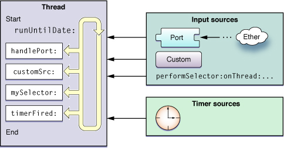
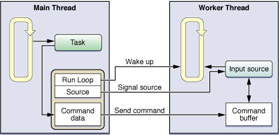

# About Threaded Programming

- 线程仍然是实现**必须实时运行**的代码的好方法。 调度队列尽可能快地执行任务，但它们不解决实时约束。 
- 如果需要从后台运行的代码中获得更多可预测的行为，则线程是更好的方案。

## NSThread 备选方案

自己创建线程的一个问题是它们会给代码增加不确定性。线程是一种支持应用程序并发性的相对低级且复杂的方法。如果您不完全了解设计选择的含义，则可能很容易遇到同步或计时问题，其严重性可能从细微的行为更改到应用程序崩溃以及用户数据损坏。

另一个要考虑的因素是你是否需要线程或并发。线程解决了如何在同一进程内同时执行多个代码路径的特定问题。但是，在某些情况下，您所做的工作量并不能保证并发性。线程在内存消耗和CPU时间方面为您的进程带来了巨大的开销。您可能会发现此开销对于预期任务来说太大了，或者其他选项更容易实现。

表1-1列出了一些线程的替代方案。此表包括线程的替换技术（例如操作对象和GCD）以及旨在有效使用您已有的单个线程的替代方案


| **Technology**               | **Description**                                              |
| ---------------------------- | ------------------------------------------------------------ |
| Operation objects            | 在OS X v10.5中引入的 Operation 对象是通常在辅助线程上执行的任务的封装器。 这个封装器隐藏了执行任务的线程管理方面，让您可以专注于任务本身。 您通常将这些对象与Operation Queue 对象结合使用，该 Operation Queue 对象实际上管理一个或多个线程上的 Operation 对象的执行。[Concurrency Programming Guide](https://developer.apple.com/library/archive/documentation/General/Conceptual/ConcurrencyProgrammingGuide/Introduction/Introduction.html#//apple_ref/doc/uid/TP40008091) |
| Grand Central Dispatch (GCD) | Grand Central Dispatch在Mac OS x v10.6中引入，是线程的另一种替代方案，可让您专注于执行所需的任务，而不是线程管理。 使用GCD，您可以定义要执行的任务并将其添加到工作队列，该队列在适当的线程上处理任务的计划。 工作队列考虑到可用内核的数量以及比使用线程自己更有效地执行任务的当前负载。 |
| Idle-time notifications      | 对于相对较短且优先级较低的任务，空闲时间通知允许您在应用程序不忙时执行任务。 Cocoa 使用NSNotificationQueue对象提供对空闲时间通知的支持。 要请求空闲时间通知，请使用NSPostWhenIdle选项将通知发布到默认NSNotificationQueue对象。 队列延迟通知对象的传递，直到运行循环变为空闲 |
| Asynchronous functions       | 系统接口包括许多为您提供自动并发的异步函数。 这些API可以使用系统守护程序和进程，或创建自定义线程来执行其任务并将结果返回给您。 （实际的实现是无关紧要的，因为它与代码分开。）在设计应用程序时，查找提供异步行为的函数，并考虑使用它们而不是在自定义线程上使用等效的同步函数。 |
| Timers                       | 您可以在应用程序的主线程上使用计时器来执行定期任务，这些任务太简单而不需要线程，但仍需要定期维护 [Timer Sources](https://developer.apple.com/library/archive/documentation/Cocoa/Conceptual/Multithreading/RunLoopManagement/RunLoopManagement.html#//apple_ref/doc/uid/10000057i-CH16-SW21) |
| Separate processes           | 尽管比线程更重，但在任务与应用程序只是切线相关的情况下，创建单独的进程可能很有用。 如果任务需要大量内存或必须使用root权限执行，则可以使用进程。 例如，您可以使用64位服务器进程计算大型数据集，而32位应用程序将结果显示给用户。 |

## Threading Support

如果您有现有使用线程的代码，OS X和iOS提供了几种在应用程序中创建线程的技术。 此外，两个系统还支持管理和同步需要在这些线程上完成的工作。 以下部分描述了在OS X和iOS中使用线程时需要注意的一些关键技术

### 线程包
虽然线程的底层实现机制是Mach线程，但很少（如果有的话）使用Mach级别的线程。 相反，您通常使用更方便的POSIX API或其衍生产品之一。 然而，Mach实现确实提供了所有线程的基本功能，包括抢先执行模型和调度线程的能力，因此它们彼此独立。

清单2-2列出了可以在应用程序中使用的线程技术。

| **Technology**           | **Description**                                              |
| ------------------------ | ------------------------------------------------------------ |
| Cocoa threads            | Cocoa implements threads using the `NSThread` class. Cocoa also provides methods on `NSObject` for spawning new threads and executing code on already-running threads. For more information, see [Using NSThread](https://developer.apple.com/library/archive/documentation/Cocoa/Conceptual/Multithreading/CreatingThreads/CreatingThreads.html#//apple_ref/doc/uid/10000057i-CH15-SW11) and [Using NSObject to Spawn a Thread](https://developer.apple.com/library/archive/documentation/Cocoa/Conceptual/Multithreading/CreatingThreads/CreatingThreads.html#//apple_ref/doc/uid/10000057i-CH15-SW13). |
| POSIX threads            | POSIX线程提供了一个用于创建线程的基于C的接口。 如果您没有编写Cocoa应用程序，这是创建线程的最佳选择。 POSIX接口使用起来相对简单，并为配置线程提供了充分的灵活性， [Using POSIX Threads](https://developer.apple.com/library/archive/documentation/Cocoa/Conceptual/Multithreading/CreatingThreads/CreatingThreads.html#//apple_ref/doc/uid/10000057i-CH15-SW12) |
| Multiprocessing Services | 多处理服务是从旧版Mac OS转换的应用程序使用的基于C的传统接口。 此技术仅适用于OS X， **任何新开发都应避免使用** 。 相反，您应该使用NSThread类或POSIX线程 |


### Run Loops

运行循环是一个基础结构，用于管理在线程上异步到达的事件。运行循环通过监视线程的一个或多个事件源来工作。当事件到达时，系统唤醒线程并将事件调度到运行循环，然后运行循环将它们分派给您指定的处理程序。如果没有事件存在且准备好处理，则运行循环使线程进入休眠状态。

您不需要对您创建的任何线程使用运行循环，但这样做可以为用户提供更好的体验。运行循环可以创建使用最少量资源的长期线程。因为运行循环在没有任何操作时将其线程置于休眠状态，所以它消除了轮询的需要(轮询会浪费CPU周期并阻止处理器本身休眠)，并节省电力。

要配置运行循环，您所要做的就是启动线程，获取对运行循环对象的引用，安装事件处理程序，并告诉运行循环运行。 OS X提供的基础结构会自动为您处理主线程运行循环的配置。但是，如果您计划创建长期存在的辅助线程，则必须自己为这些线程配置运行循环

 [Run Loops](https://developer.apple.com/library/archive/documentation/Cocoa/Conceptual/Multithreading/RunLoopManagement/RunLoopManagement.html#//apple_ref/doc/uid/10000057i-CH16-SW1)


### Synchronization Tools

线程编程的一个危险是多线程之间的资源争用。如果多个线程尝试同时使用或修改同一资源，则可能会出现问题。缓解该问题的一种方法是完全消除共享资源，并确保每个线程都有自己独特的资源集来操作。但是，维护完全独立的资源不是一种选择，您可能必须使用锁，条件，原子操作和其他技术来同步对资源的访问。

锁为代码提供强力形式的保护，一次只能由一个线程执行。最常见的锁类型是 mutual exclusion lock，也称为mutex(互斥锁)。当一个线程试图获取当前由另一个线程持有的互斥锁时，它会阻塞，直到另一个线程释放该锁。多个系统框架提供对互斥锁的支持，尽管它们都基于相同的底层技术。此外，Cocoa提供了互斥锁的几种变体，以支持不同类型的行为，例如递归。 [Locks](https://developer.apple.com/library/archive/documentation/Cocoa/Conceptual/Multithreading/ThreadSafety/ThreadSafety.html#//apple_ref/doc/uid/10000057i-CH8-126320)

除锁外，系统还提供对条件(Condition)的支持，以确保应用程序中任务的正确排序。条件充当 gatekeeper，阻止给定线程，直到它表示的条件变为真。当发生这种情况时，条件释放线程并允许它继续。 POSIX层和Foundation框架都为条件提供直接支持。 （如果使用操作对象，则可以配置操作对象之间的依赖关系以对任务的执行进行排序，这与条件提供的行为非常相似。）

虽然锁和条件在并发设计中非常常见，但原子操作是保护和同步数据访问的另一种方法。在可以对标量数据类型执行数学或逻辑运算的情况下，原子操提供了 Lock的轻量级替代。原子操作使用特殊的 **硬件** 指令来确保在其他线程有机会访问变量之前完成对变量的修改， [Synchronization Tools](https://developer.apple.com/library/archive/documentation/Cocoa/Conceptual/Multithreading/ThreadSafety/ThreadSafety.html#//apple_ref/doc/uid/10000057i-CH8-124887)


### Inter-thread Communication

虽然良好的设计可以最大限度地减少所需的通信量，但在某些时候，线程之间的通信变得必要。 （线程的工作是为您的应用程序工作，但如果从未使用过该作业的结果，它有什么用处？）线程可能需要处理新的作业请求或将其进度报告给应用程序的主线程。 在这些情况下，您需要一种方法来从一个线程获取信息到另一个线程。 幸运的是，线程共享相同的进程空间这一事实意味着您有很多通信选项。

线程之间有许多通信方式，每种方式都有自己的优点和缺点。 Configuring Thread-Local Storage 列出了您可以在OS X中使用的最常见的通信机制。（除了 message queues and Cocoa distributed objects，其他技术也可以在iOS中使用。）此表中的技术按复杂度增加的顺序列出

| **Mechanism**                                | **Description**                                              |
| -------------------------------------------- | ------------------------------------------------------------ |
| Direct messaging                             | Cocoa应用程序支持直接在其他线程上执行选择器的能力。 此功能意味着一个线程基本上可以在任何其他线程上执行方法。 因为它们是在目标线程的上下文中执行的，所以以这种方式发送的消息会在该线程上自动序列化 |
| Global variables, shared memory, and objects | 在两个线程之间传递信息的另一种简单方法是使用全局变量，共享对象或共享内存块。 虽然共享变量快速而简单，但它们也比 Direct messaging 更脆弱。 必须使用锁或其他同步机制小心保护共享变量，以确保代码的正确性。 如果不这样做可能会导致竞争条件，数据损坏或崩溃。 |
| Conditions                                   | 条件是一种同步工具，可用于控制线程何时执行特定代码部分。 您可以将条件视为gatekeeper，让线程仅在满足所述条件时运行 |
| Run loop sources                             | 自定义 run loop source 是您设置为在线程上接收特定于应用程序的消息的源。 因为它们是事件驱动的，所以当没有任何事情要做时，运行循环源会让你的线程自动进入休眠状态，从而提高线程的效率 |
| Ports and sockets                            | 基于端口的通信是两种线程之间通信的更精细的方式，但它也是一种非常可靠的技术。 更重要的是，端口和套接字可用于与外部实体（例如其他进程和服务）进行通信。 为了提高效率，端口是使用 run loop sources 实现的，因此当端口上没有数据等待时，线程会休眠 |
| Message queues                               | (不推荐)传统的多处理服务定义了用于管理传入和传出数据的先进先出（FIFO）队列抽象。 尽管消息队列简单方便，但它们并不像其他一些通信技术那样高效 |
| Cocoa distributed objects                    | (不推荐)分布式对象是一种Cocoa技术，可提供基于端口的通信的高级实现。 尽管可以将此技术用于线程间通信，但由于其产生的开销量很大，因此非常不鼓励这样做。 分布式对象更适合与其他进程通信，其中进程之间的开销已经很高 |


# Thread Management

## Thread Costs

在内存使用和性能方面，线程对程序（和系统）来说是有实际存在的成本。 

- 每个线程都需要在内核内存空间和程序的内存空间中分配内存

- 管理线程和协调其调度所需的内核数据结构是 使用 wired memory 存储在内核中

- 线程的堆栈空间和线程数据存储在程序的内存空间中

-  大多数这些数据结构都是在您第一次创建线程时创建和初始化的(由于需要与内核交互，这个过程可能相对昂贵)

  

线程创建的开销

| **Item**               | **Approximate cost**                                         | Note                                                         |
| ---------------------- | ------------------------------------------------------------ | ------------------------------------------------------------ |
| Kernel data structures | Approximately 1 KB                                           | 此内存用于存储线程数据结构和属性，其中大部分被分配为 wired memory，因此无法分页到磁盘。 |
| Stack space            | 512 KB (secondary threads)<br/>8 MB (OS X main thread)
1 MB (iOS main thread) | 辅助线程允许的最小堆栈大小为16 KB，堆栈大小必须是4 KB的倍数。 在创建线程时，您的进程空间中会留出此内存的空间，但在被需要之前不会创建与该内存关联的实际page |
| Creation time          | Approximately 90 ms                                          | 此值反映了创建线程的初始调用与线程的入口函数开始执行之间的时间。 这些数据是通过分析在基于Intel的iMac上使用2 GHz Core Duo处理器和运行OS X v10.5的1 GB RAM创建线程时生成的平均值和中值来确定的。 |


## Creating a Thread

### Using NSThread

```objective-c
[NSThread detachNewThreadSelector:@selector(myThreadMainMethod:) toTarget:self withObject:nil];
```

```objective-c
NSThread* myThread = [[NSThread alloc] initWithTarget:self
                                        selector:@selector(myThreadMainMethod:)
                                        object:nil];
[myThread start];  // Actually create the thread
```

Note1:

>An alternative to using the `initWithTarget:selector:object:` method is to subclass `NSThread` and override its `main` method. You would use the overridden version of this method to implement your thread’s main entry point

Note2:

> Although good for occasional communication between threads, you should not use the  `performSelector:onThread:withObject:waitUntilDone:` method for time critical or frequent communication between threads.

### Using POSIX Threads

```c
#include <assert.h>
#include <pthread.h>
 
void* PosixThreadMainRoutine(void* data)
{
    // Do some work here.
 
    return NULL;
}
 
void LaunchThread()
{
    // Create the thread using POSIX routines.
    pthread_attr_t  attr;
    pthread_t       posixThreadID;
    int             returnVal;
 
    returnVal = pthread_attr_init(&attr);
    assert(!returnVal);
    returnVal = pthread_attr_setdetachstate(&attr, PTHREAD_CREATE_DETACHED);
    assert(!returnVal);
 
    int     threadError = pthread_create(&posixThreadID, &attr, &PosixThreadMainRoutine, NULL);
 
    returnVal = pthread_attr_destroy(&attr);
    assert(!returnVal);
    if (threadError != 0)
    {
         // Report an error.
    }
}
```


### Using NSObject to Spawn a Thread

```objective-c
[myObj performSelectorInBackground:@selector(doSomething) withObject:nil];
```


## Configuring Thread Attributes

### Configuring the Stack Size of a Thread

如果要更改给定线程的堆栈大小，则必须在创建线程之前执行此操作。 尽管使用NSThread设置堆栈大小仅在iOS和OS X v10.5及更高版本中可用，但所有线程技术都提供了一些设置堆栈大小的方法。

| Technology               | Option                                                       |
| ------------------------ | ------------------------------------------------------------ |
| Cocoa                    | 在iOS和OS X v10.5及更高版本中，分配并初始化`NSThread`对象（不要使用`detachNewThreadSelector：toTarget：withObject：`方法）。 在调用线程对象的`start`方法之前，使用`setStackSize：`方法指定新的堆栈大小。 |
| POSIX                    | 创建一个新的`pthread_attr_t`结构并使用`pthread_attr_setstacksize`函数来更改默认的堆栈大小。 创建线程时，将属性传递给`pthread_create`函数。 |
| Multiprocessing Services | (不推荐)在创建线程时，将适当的堆栈大小值传递给`MPCreateTask`函数。 |


### Configuring Thread-Local Storage

每个线程都维护一个 **键值对的字典**，可以从线程中的任何位置访问。 您可以使用此字典存储要在整个线程执行期间保留的信息。 例如，您可以使用它来存储要通过线程运行循环的多次迭代持久化的状态信息。

Cocoa和POSIX以不同的方式存储线程字典，因此您无法混合和匹配对这两种技术的调用。 但是，只要您在线程代码中坚持使用一种技术，最终结果应该是相似的。 

- 在Cocoa中，使用 `NSThread` 对象的 `threadDictionary`方法来检索 `NSMutableDictionary` 对象，您可以向该对象添加线程所需的任何键值对

- 在POSIX中，使用 `pthread_setspecific` 和 `pthread_getspecific` 函数来设置和获取线程的键和值


### Setting the Detached State of a Thread

大多数高级线程技术默认创建 detached 线程。在大多数情况下，首选 detached 线程是因为它们允许系统在完成线程后立即释放线程的数据结构。detached 线程也不需要与您的程序进行明确的交互。从线程中检索结果的方法由您自行决定。相比之下，系统不会回收joinable线程的资源，直到另一个线程显式加入该线程，这个进程可能会阻塞执行连接的线程。

您可以将joinable线程视为类似于子线程。尽管它们仍然作为独立线程运行，但是在系统可以回收其资源之前，必须由另一个线程连接这个joinable线程。joinable线程还提供了一种将数据从现有线程传递到另一个线程的显式方法。在它退出之前，joinable线程可以将数据指针或其他返回值传递给 `pthread_exit` 函数。然后，另一个线程可以通过调用 `pthread_join` 函数来声明此数据。

> 在应用程序退出时，detached 线程可以立即终止，但joinable线程不能。 必须先连接每个joinable线程，然后才允许进程退出。 因此，在线程正在执行不应被中断的关键工作（例如将数据保存到磁盘）的情况下，joinable线程可能是优选的。

如果您确实想要创建joinable线程，**唯一的方法是使用POSIX线程**。 默认情况下，POSIX将线程创建为joinable。 要将线程标记为detached or joinable，请在创建线程之前使用 `pthread_attr_setdetachstate` 函数修改线程属性。 线程开始后，您可以通过调用 `pthread_detach` 函数将joinable线程更改为detached线程


### Setting the Thread Priority

您创建的任何新线程都具有与之关联的默认优先级。 内核的调度算法在确定要运行的线程时会考虑线程优先级，优先级较高的线程比优先级较低的线程**更可能**运行。 较高的优先级并不能保证线程的特定执行时间，只是与较低优先级的线程相比，调度程序更有可能选择它。说白了，优先级高的线程并不一定就会优先执行

> 将线程的优先级保留为默认值通常是个好主意。 增加某些线程的优先级也会增加低优先级线程们的饥饿的可能性。 如果您的应用程序包含必须相互交互的高优先级和低优先级线程，则较低优先级线程的饥饿可能会阻塞其他线程并产生性能瓶颈

- 对于Cocoa线程，使用 `NSThread` 的 Class 方法 `setThreadPriority：`方法
-  对于POSIX线程，使用 `pthread_setschedparam` 函数

## Writing Your Thread Entry Routine

在大多数情况下，线程的entry routine的结构，在OS X中与在其他平台上的结构相同。 初始化数据结构，执行某些操作或者可选地设置运行循环，并在线程代码完成时进行清理。 根据您的设计，在编写entry routine时可能需要执行一些额外的步骤

### Creating an Autorelease Pool

在Objective-C框架中链接的应用程序通常必须在每个线程中创建至少一个自动释放池。如果应用程序使用托管模型 - 在应用程序中处理保留和释放对象 - 自动释放池将捕获从该线程自动释放的所有对象。

如果应用程序使用GC而不是托管内存模型，则不一定要创建自动释放池。在GC的应用程序中存在自动释放池是无害的，并且在很大程度上被忽略。允许代码模块必须同时支持GC和托管内存模型的情况。在这种情况下，必须存在自动释放池以支持托管内存模型代码，如果应用程序在启用了GC的情况下运行，则会被忽略。

如果您的应用程序使用托管内存模型，那么创建自动释放池应该是您在线程entry routine中首先要做的事情。同样，销毁这个自动释放池应该是你在线程中做的最后一件事。此池确保捕获自动释放的对象，但在线程本身退出之前不会释放它们

```objective-c
- (void)myThreadMainRoutine
{
    NSAutoreleasePool *pool = [[NSAutoreleasePool alloc] init]; // Top-level pool
 
    // Do thread work here.
 
    [pool release];  // Release the objects in the pool.
}
```

因为顶级自动释放池在线程退出之前不释放其对象，所以长期存在的线程应该创建额外的自动释放池以更频繁地释放对象。 例如，使用 run loop 的线程可能每次通过该 run loop 创建并释放自动释放池。 更频繁地释放对象可以防止应用程序的内存占用过大，从而导致性能问题。 与任何性能相关的行为一样，您应该测量代码的实际性能并适当调整自动释放池的使用


### Setting Up an Exception Handler

在Xcode中构建项目时，可以使用C ++或Objective-C异常处理样式。 有关设置如何在Objective-C中引发和捕获异常的信息：[Exception Programming Topics](https://developer.apple.com/library/archive/documentation/Cocoa/Conceptual/Exceptions/Exceptions.html#//apple_ref/doc/uid/10000012i)

### Setting Up a Run Loop

在编写要在单独的线程上运行的代码时，您有两个选择。 

1. 第一个选项是将线程的代码编写为一个长任务，在很少或没有中断的情况下执行，并在完成时让线程退出。 
2. 第二个选项是将您的线程置于一个 run loop 中，让它在到达时动态处理请求

第一个选项不需要为您的代码进行特殊设置，你只需要做你想做的工作。 

第二个选项涉及设置线程的run loop

OS X和iOS为在每个线程中提供run loop内置实现的支持。 应用程序框架自动启动应用程序 **主线程**的run loop。 如果创建任何辅助线程，则必须配置run loop 并手动启动它，也就是说，在应用程序中使用上述提到的线程创建技术进行线程的创建，这样创建的辅助线程的run loop 是不会自动启动的，[Run Loops](https://developer.apple.com/library/archive/documentation/Cocoa/Conceptual/Multithreading/RunLoopManagement/RunLoopManagement.html#//apple_ref/doc/uid/10000057i-CH16-SW1)


## Terminating a Thread

退出线程的推荐方法是让它正常退出其entry point。 尽管Cocoa，POSIX和Multiprocessing Services提供了直接杀死线程的例程，**但强烈建议不要使用此类例程**。 杀死一个线程会阻碍该线程的自行清理。 线程分配的内存可能会被泄露，并且线程当前正在使用的任何其他资源可能无法正确清理，从而在以后产生潜在问题

如果您预计需要在操作过程中终止线程，则应该从一开始就设计线程以响应取消或退出消息。 对于长时间运行的操作，这可能意味着定期停止工作并检查是否有这样的消息到达。 如果确实有消息要求线程退出，则线程将有机会执行任何所需的清理并正常退出; 否则，它可以简单地返回工作并处理下一个数据块

响应取消消息的一种方法是使用run loop input source来接收此类消息

该示例在run loop上安装自定义输入源，它可能是从另一个线程中发出来的消息

```objective-c
- (void)threadMainRoutine
{
    BOOL moreWorkToDo = YES;
    BOOL exitNow = NO;
    NSRunLoop* runLoop = [NSRunLoop currentRunLoop];
 
    // Add the exitNow BOOL to the thread dictionary.
    NSMutableDictionary* threadDict = [[NSThread currentThread] threadDictionary];
    [threadDict setValue:[NSNumber numberWithBool:exitNow] forKey:@"ThreadShouldExitNow"];
 
    // Install an input source.
    [self myInstallCustomInputSource];
 
    while (moreWorkToDo && !exitNow)
    {
        // Do one chunk of a larger body of work here.
        // Change the value of the moreWorkToDo Boolean when done.
 
        // Run the run loop but timeout immediately if the input source isn't waiting to fire.
        [runLoop runUntilDate:[NSDate date]];
 
        // Check to see if an input source handler changed the exitNow value.
        exitNow = [[threadDict valueForKey:@"ThreadShouldExitNow"] boolValue];
    }
}
```

执行总工作量的一部分后，线程会短暂运行运行循环，以查看是否有消息到达输入源。 如果没有，则运行循环立即退出，循环继续下一个工作块。 因为处理程序不能直接访问exitNow局部变量，所以退出条件通过线程字典中的键值对进行通信

有关设置输入源的信息: [Configuring Run Loop Sources](https://developer.apple.com/library/archive/documentation/Cocoa/Conceptual/Multithreading/RunLoopManagement/RunLoopManagement.html#//apple_ref/doc/uid/10000057i-CH16-SW7)

# Run Loops

运行循环是与线程相关的基础架构的一部分。运行循环是一个事件处理循环，用于调度任务、协调传入事件的接收。运行循环的目的是在有工作时保持线程忙，并在没有线程时让线程进入休眠状态。

运行循环管理不是完全自动的。您仍然必须设计线程的代码以在适当的时间启动运行循环并响应传入的事件。 Cocoa和Core Foundation都提供了运行循环对象，以帮助您配置和管理线程的运行循环。

- 应用程序不需要显式创建这些对象
- 每个线程（包括应用程序的主线程）都有一个关联的运行循环对象
- 只有辅助线程需要显式运行其运行循环
- 作为应用程序启动过程的一部分，应用程序框架会自动在主线程上设置并运行运行循环

## Anatomy of a Run Loop

运行循环从**两种**不同类型的源接收事件。 

- 输入源（input source）提供异步事件，通常是来自另一个线程或来自不同应用程序的消息。 
- 定时器源（timer source）提供同步事件，发生在预定时间或重复间隔。 两种类型的源都使用特定于应用程序的处理程序例程来处理事件到达时。





除了处理输入源之外，运行循环还会生成有关运行循环行为的通知。 已注册的运行循环观察器可以接收这些通知并使用它们在线程上执行其他处理。 可以使用Core Foundation在线程上安装运行循环观察器。

### Run Loop Modes

| Mode           | Name                                                         | Description                                                  |
| -------------- | ------------------------------------------------------------ | ------------------------------------------------------------ |
| Default        | `NSDefaultRunLoopMode`(Cocoa)`kCFRunLoopDefaultMode` (Core Foundation) | 默认模式是用于大多数操作的模式。 大多数情况下，应该使用此模式启动运行循环并配置输入源 |
| Connection     | `NSConnectionReplyMode`(Cocoa)                               | （不推荐）Cocoa 使用这个mode 与`NSConnection` 对象配合用以监视网络应答 |
| Modal          | `NSModalPanelRunLoopMode`(Cocoa)                             | Cocoa使用此模式来识别用于模态面板的事件                      |
| Event tracking | `NSEventTrackingRunLoopMode`(Cocoa)                          | Cocoa使用此模式限制鼠标拖动循环和其他的用户界面跟踪循环期间的传入事件 |
| Common modes   | `NSRunLoopCommonModes`(Cocoa)`kCFRunLoopCommonModes` (Core Foundation) | 这是一组可配置的常用模式。 将输入源与此模式相关联也会将其与组中的每个模式相关联。 对于Cocoa应用程序，此集合包括默认，模态和事件跟踪模式。 Core Foundation最初只包含默认模式。 您可以使用`CFRunLoopAddCommonMode`函数将自定义模式添加到集合中。 |


### Input Sources

#### Port-Based Sources

只需创建一个端口对象，并使用NSPort的方法将该端口添加到运行循环中。 port对象会处理所需输入源的创建和配置

NSPort的子类：

- NSSocketPort(CFSocketRef)
- NSMachPort(CFMachPortRef)
- NSMessagePort(CFMessagePortRef)

#### Custom Input Sources

[ `CFRunLoopSourceRef`](https://developer.apple.com/documentation/corefoundation/cfrunloopsource)opaque type in Core Foundation

可以使用多个回调函数配置自定义输入源。 

Core Foundation在不同的点调用这些函数来配置源，处理传入事件，并在源从运行循环中被删除时拆除源。

除了在事件到达时定义自定义源的行为，还必须定义事件传递机制。 这部分源在一个单独的线程上运行，负责为输入源提供其数据，并在数据准备好进行处理时发出信号。 事件传递机制取决于开发的逻辑，但不必过于复杂

#### Cocoa Perform Selector Sources

| Methods                                                      | Description                                                  |
| ------------------------------------------------------------ | ------------------------------------------------------------ |
| `performSelectorOnMainThread:withObject:waitUntilDone:` `performSelectorOnMainThread:withObject:waitUntilDone:modes:` | 在该线程的下一个运行循环周期中，在应用程序的主线程上执行指定的选择器，阻止当前线程直到执行选择器 |
| `performSelector:onThread:withObject:waitUntilDone:` `performSelector:onThread:withObject:waitUntilDone:modes:` | 在具有`NSThread`对象的任何线程上执行指定的选择器，阻止当前线程直到执行选择器的选项。 |
| `performSelector:withObject:afterDelay:`  `performSelector:withObject:afterDelay:inModes:` | 在下一个运行循环周期和可选的延迟周期之后，在当前线程上执行指定的选择器。 因为它等待直到下一个运行循环周期来执行选择器，自动短时地延迟当前执行代码的。 多个排队选择器按排队顺序依次执行。 |
| `cancelPreviousPerformRequestsWithTarget:`  `cancelPreviousPerformRequestsWithTarget:selector:object:` | 允许取消发送到当前线程的消息 `performSelector:withObject:afterDelay:` `performSelector:withObject:afterDelay:inModes:` method. |

#### Timer Sources

- NSTimer
- CFRunLoopTimer

计时器源在将来的预设时间将事件同步地传递给线程，计时器不是实时机制，

定时器与运行循环的特定模式相关联，如果计时器未处于运行循环当前正在监视的模式，则在使用其中一个计时器支持的模式运行运行循环之前，它不会触发。类似地，如果计时器在运行循环处于执行处理程序例程的过程中触发，则计时器将等待直到下一次通过运行循环来调用其处理程序例程。如果运行循环根本没有运行，则计时器永远不会触发。


## When Would You Use a Run Loop?

需要显式运行运行循环的唯一时间是为应用程序创建辅助线程

应用程序主线程的运行循环是一个至关重要的基础架构。因此，应用程序框架提供了运行主应用程序循环的代码并自动启动该循环(主线程中的runloop是自启动的)

 iOS中的UIApplication的运行方法（或OS X中的NSApplication）启动应用程序的主循环作为正常启动序列的一部分

对于辅助线程，需要确定是否需要运行循环，如果是，请自行配置并启动它。在所有情况下，都不需要启动线程的运行循环。例如，如果使用线程执行某些长时间运行且预定义的任务，则不要启动运行循环。运行循环适用于您希望与线程进行更多交互的情况。例如，如果计划执行以下任何操作，则需要启动运行循环：

- 使用端口或自定义输入源与其他线程通信
- 在线程上使用计时器
- 在Cocoa应用程序中使用任何performSelector ...方法
- 保持线程以执行定期任务

## Using Run Loop Objects

### Getting a Run Loop Object

- In a Cocoa application, use the `currentRunLoop` class method of `NSRunLoop` to retrieve an `NSRunLoop` object.
- Use the `CFRunLoopGetCurrent` function.


### Configuring the Run Loop

1. add input source or timer 
2. install run loop observers

Ex: Creating a run loop observer

```objective-c
- (void)threadMain
{
    // The application uses garbage collection, so no autorelease pool is needed.
    NSRunLoop* myRunLoop = [NSRunLoop currentRunLoop];
 
    // Create a run loop observer and attach it to the run loop.
    CFRunLoopObserverContext  context = {0, self, NULL, NULL, NULL};
    CFRunLoopObserverRef    observer = CFRunLoopObserverCreate(kCFAllocatorDefault,
            kCFRunLoopAllActivities, YES, 0, &myRunLoopObserver, &context);
 
    if (observer)
    {
        CFRunLoopRef    cfLoop = [myRunLoop getCFRunLoop];
        CFRunLoopAddObserver(cfLoop, observer, kCFRunLoopDefaultMode);
    }
 
    // Create and schedule the timer.
    [NSTimer scheduledTimerWithTimeInterval:0.1 target:self
                selector:@selector(doFireTimer:) userInfo:nil repeats:YES];
 
    NSInteger    loopCount = 10;
    do
    {
        // Run the run loop 10 times to let the timer fire.
        [myRunLoop runUntilDate:[NSDate dateWithTimeIntervalSinceNow:1]];
        loopCount--;
    }
    while (loopCount);
}
```


### Starting the Run Loop

Ex: Running a run loop

```objective-c
- (void)skeletonThreadMain
{
    // Set up an autorelease pool here if not using garbage collection.
    BOOL done = NO;
 
    // Add your sources or timers to the run loop and do any other setup.
 
    do
    {
        // Start the run loop but return after each source is handled.
        SInt32    result = CFRunLoopRunInMode(kCFRunLoopDefaultMode, 10, YES);
 
        // If a source explicitly stopped the run loop, or if there are no
        // sources or timers, go ahead and exit.
        if ((result == kCFRunLoopRunStopped) || (result == kCFRunLoopRunFinished))
            done = YES;
 
        // Check for any other exit conditions here and set the
        // done variable as needed.
    }
    while (!done);
 
    // Clean up code here. Be sure to release any allocated autorelease pools.
}
```


## Configuring Run Loop Sources

创建自定义输入源涉及定义以下内容：

- 需要输入源处理的信息
- 一个调度函数，用于客户端联系输入源
- 一个回调函数，用于执行客户端发送的请求
- 一个取消函数，用以使输入源作废

应用程序的主线程维护对输入源，该输入源的自定义命令缓冲区以及安装输入源的运行循环的引用。 当主线程有一个任务，它想要传递给工作线程时，它会向命令缓冲区发布一个命令以及工作线程启动任务所需的任何信息。 （因为工作线程的主线程和输入源都可以访问命令缓冲区，所以必须同步该访问。）一旦命令发布，主线程就会发出信号输入源并唤醒工作线程的运行循环。 收到唤醒命令后，运行循环调用输入源的处理程序，该处理程序处理命令缓冲区中的命令，设计如图：




#### Defining the Input Source

```objective-c
@interface RunLoopSource : NSObject
{
    CFRunLoopSourceRef runLoopSource;
    NSMutableArray* commands;
}
 
- (id)init;
- (void)addToCurrentRunLoop;
- (void)invalidate;
 
// Handler method
- (void)sourceFired;
 
// Client interface for registering commands to process
- (void)addCommand:(NSInteger)command withData:(id)data;
- (void)fireAllCommandsOnRunLoop:(CFRunLoopRef)runloop;
 
@end
 
// These are the CFRunLoopSourceRef callback functions.
void RunLoopSourceScheduleRoutine (void *info, CFRunLoopRef rl, CFStringRef mode);
void RunLoopSourcePerformRoutine (void *info);
void RunLoopSourceCancelRoutine (void *info, CFRunLoopRef rl, CFStringRef mode);
 
// RunLoopContext is a container object used during registration of the input source.
@interface RunLoopContext : NSObject
{
    CFRunLoopRef        runLoop;
    RunLoopSource*        source;
}
@property (readonly) CFRunLoopRef runLoop;
@property (readonly) RunLoopSource* source;
 
- (id)initWithSource:(RunLoopSource*)src andLoop:(CFRunLoopRef)loop;
@end
    
    // Scheduling a run loop source
void RunLoopSourceScheduleRoutine (void *info, CFRunLoopRef rl, CFStringRef mode)
{
    RunLoopSource* obj = (RunLoopSource*)info;
    AppDelegate*   del = [AppDelegate sharedAppDelegate];
    RunLoopContext* theContext = [[RunLoopContext alloc] initWithSource:obj andLoop:rl];
 
    [del performSelectorOnMainThread:@selector(registerSource:)
                                withObject:theContext waitUntilDone:NO];
}

// Performing work in the input source
void RunLoopSourcePerformRoutine (void *info)
{
    RunLoopSource*  obj = (RunLoopSource*)info;
    [obj sourceFired];
}

// Invalidating an input source
void RunLoopSourceCancelRoutine (void *info, CFRunLoopRef rl, CFStringRef mode)
{
    RunLoopSource* obj = (RunLoopSource*)info;
    AppDelegate* del = [AppDelegate sharedAppDelegate];
    RunLoopContext* theContext = [[RunLoopContext alloc] initWithSource:obj andLoop:rl];
 
    [del performSelectorOnMainThread:@selector(removeSource:)
                                withObject:theContext waitUntilDone:YES];
}
```

#### Installing the Input Source on the Run Loop

```objective-c
- (id)init
{
    CFRunLoopSourceContext    context = {0, self, NULL, NULL, NULL, NULL, NULL,
                                        &RunLoopSourceScheduleRoutine,
                                        RunLoopSourceCancelRoutine,
                                        RunLoopSourcePerformRoutine};
 
    runLoopSource = CFRunLoopSourceCreate(NULL, 0, &context);
    commands = [[NSMutableArray alloc] init];
 
    return self;
}
 
- (void)addToCurrentRunLoop
{
    CFRunLoopRef runLoop = CFRunLoopGetCurrent();
    CFRunLoopAddSource(runLoop, runLoopSource, kCFRunLoopDefaultMode);
}

```

#### Coordinating with Clients of the Input Source

Registering and removing an input source with the application delegate

```objective-c
- (void)registerSource:(RunLoopContext*)sourceInfo;
{
    [sourcesToPing addObject:sourceInfo];
}
 
- (void)removeSource:(RunLoopContext*)sourceInfo
{
    id    objToRemove = nil;
 
    for (RunLoopContext* context in sourcesToPing)
    {
        if ([context isEqual:sourceInfo])
        {
            objToRemove = context;
            break;
        }
    }
 
    if (objToRemove)
        [sourcesToPing removeObject:objToRemove];
}
```

#### Signaling the Input Source

```objective-c
- (void)fireCommandsOnRunLoop:(CFRunLoopRef)runloop
{
    CFRunLoopSourceSignal(runLoopSource);
    CFRunLoopWakeUp(runloop);
}
```


### Configuring Timer Sources

In Cocoa, you can create and schedule a timer all at once using either of these class methods:

- `scheduledTimerWithTimeInterval:target:selector:userInfo:repeats:`
- `scheduledTimerWithTimeInterval:invocation:repeats:`

These methods create the timer and add it to the current thread’s run loop in the default mode (`NSDefaultRunLoopMode`)

// NSTimer

```objective-c
NSRunLoop* myRunLoop = [NSRunLoop currentRunLoop];
 
// Create and schedule the first timer.
NSDate* futureDate = [NSDate dateWithTimeIntervalSinceNow:1.0];
NSTimer* myTimer = [[NSTimer alloc] initWithFireDate:futureDate
                        interval:0.1
                        target:self
                        selector:@selector(myDoFireTimer1:)
                        userInfo:nil
                        repeats:YES];
[myRunLoop addTimer:myTimer forMode:NSDefaultRunLoopMode];
 
// Create and schedule the second timer.
[NSTimer scheduledTimerWithTimeInterval:0.2
                        target:self
                        selector:@selector(myDoFireTimer2:)
                        userInfo:nil
                        repeats:YES];
```

// Core Foundation

```objective-c
CFRunLoopRef runLoop = CFRunLoopGetCurrent();
CFRunLoopTimerContext context = {0, NULL, NULL, NULL, NULL};
CFRunLoopTimerRef timer = CFRunLoopTimerCreate(kCFAllocatorDefault, 0.1, 0.3, 0, 0,
                                        &myCFTimerCallback, &context);
 
CFRunLoopAddTimer(runLoop, timer, kCFRunLoopCommonModes);

```

### Configuring a Port-Based Input Source

Cocoa和Core Foundation都提供了基于端口的对象，用于线程之间或进程之间的通信

#### Configuring an NSMachPort Object

要与NSMachPort对象建立本地连接，要创建端口对象并将其添加到主线程的运行循环中。启动辅助线程时，将同一对象传递给线程的入口函数。 辅助线程可以使用相同的对象将消息发送回主线程。

##### Implementing the Main Thread Code

```objective-c
- (void)launchThread
{
    NSPort* myPort = [NSMachPort port];
    if (myPort)
    {
        // This class handles incoming port messages.
        [myPort setDelegate:self];
 
        // Install the port as an input source on the current run loop.
        [[NSRunLoop currentRunLoop] addPort:myPort forMode:NSDefaultRunLoopMode];
 
        // Detach the thread. Let the worker release the port.
        [NSThread detachNewThreadSelector:@selector(LaunchThreadWithPort:)
               toTarget:[MyWorkerClass class] withObject:myPort];
    }
}


#define kCheckinMessage 100

#pragma mark - NSMachPortDelegate
// Handle responses from the worker thread.
- (void)handlePortMessage:(NSPortMessage *)portMessage
{
    unsigned int message = [portMessage msgid];
    NSPort* distantPort = nil;
 
    if (message == kCheckinMessage)
    {
        // Get the worker thread’s communications port.
        distantPort = [portMessage sendPort];
 
        // Retain and save the worker port for later use.
        [self storeDistantPort:distantPort];
    }
    else
    {
        // Handle other messages.
    }
}

```

##### Implementing the Secondary Thread Code

```objective-c
+(void)LaunchThreadWithPort:(id)inData
{
    NSAutoreleasePool*  pool = [[NSAutoreleasePool alloc] init];
 
    // Set up the connection between this thread and the main thread.
    NSPort* distantPort = (NSPort*)inData;
 
    MyWorkerClass*  workerObj = [[self alloc] init];
    [workerObj sendCheckinMessage:distantPort];
    [distantPort release];
 
    // Let the run loop process things.
    do
    {
        [[NSRunLoop currentRunLoop] runMode:NSDefaultRunLoopMode
                            beforeDate:[NSDate distantFuture]];
    }
    while (![workerObj shouldExit]);
 
    [workerObj release];
    [pool release];
}

// Worker thread check-in method
- (void)sendCheckinMessage:(NSPort*)outPort
{
    // Retain and save the remote port for future use.
    [self setRemotePort:outPort];
 
    // Create and configure the worker thread port.
    NSPort* myPort = [NSMachPort port];
    [myPort setDelegate:self];
    [[NSRunLoop currentRunLoop] addPort:myPort forMode:NSDefaultRunLoopMode];
 
    // Create the check-in message.
    NSPortMessage* messageObj = [[NSPortMessage alloc] initWithSendPort:outPort
                                         receivePort:myPort components:nil];
 
    if (messageObj)
    {
        // Finish configuring the message and send it immediately.
        [messageObj setMsgId:setMsgid:kCheckinMessage];
        [messageObj sendBeforeDate:[NSDate date]];
    }
}

```


#### Configuring an NSMessagePort Object

```objective-c
NSPort* localPort = [[NSMessagePort alloc] init];
 
// Configure the object and add it to the current run loop.
[localPort setDelegate:self];
[[NSRunLoop currentRunLoop] addPort:localPort forMode:NSDefaultRunLoopMode];
 
// Register the port using a specific name. The name must be unique.
NSString* localPortName = [NSString stringWithFormat:@"MyPortName"];
[[NSMessagePortNameServer sharedInstance] registerPort:localPort
                     name:localPortName];

```


##### Implementing the Main Thread Code

以下代码是显示应用程序主线程调用的代码，用以启动工作线程：

```objective-c
#define kThreadStackSize        (8 *4096)
 
OSStatus MySpawnThread()
{
    // Create a local port for receiving responses.
    CFStringRef myPortName;
    CFMessagePortRef myPort;
    CFRunLoopSourceRef rlSource;
    CFMessagePortContext context = {0, NULL, NULL, NULL, NULL};
    Boolean shouldFreeInfo;
 
    // Create a string with the port name.
    myPortName = CFStringCreateWithFormat(NULL, NULL, CFSTR("com.myapp.MainThread"));
 
    // Create the port.
    myPort = CFMessagePortCreateLocal(NULL,
                myPortName,
                &MainThreadResponseHandler,
                &context,
                &shouldFreeInfo);
 
    if (myPort != NULL)
    {
        // The port was successfully created.
        // Now create a run loop source for it.
        rlSource = CFMessagePortCreateRunLoopSource(NULL, myPort, 0);
 
        if (rlSource)
        {
            // Add the source to the current run loop.
            CFRunLoopAddSource(CFRunLoopGetCurrent(), rlSource, kCFRunLoopDefaultMode);
 
            // Once installed, these can be freed.
            CFRelease(myPort);
            CFRelease(rlSource);
        }
    }
 
    // Create the thread and continue processing.
    MPTaskID        taskID;
    return(MPCreateTask(&ServerThreadEntryPoint,
                    (void*)myPortName,
                    kThreadStackSize,
                    NULL,
                    NULL,
                    NULL,
                    0,
                    &taskID));
}
```

> 代码所做的第一件事就是设置一个CFMessagePortRef opaque类型来监听来自工作线程的消息。 工作线程需要端口的名称来建立连接，以便将字符串值传递给工作线程的入口函数。 端口名称在当前用户上下文中通常应该是唯一的; 否则，可能会遇到冲突

// main thread's function of Receiving the checkin message

```objective-c
#define kCheckinMessage 100
 
// Main thread port message handler
CFDataRef MainThreadResponseHandler(CFMessagePortRef local,
                    SInt32 msgid,
                    CFDataRef data,
                    void* info)
{
    if (msgid == kCheckinMessage)
    {
        CFMessagePortRef messagePort;
        CFStringRef threadPortName;
        CFIndex bufferLength = CFDataGetLength(data);
        UInt8* buffer = CFAllocatorAllocate(NULL, bufferLength, 0);
 
        CFDataGetBytes(data, CFRangeMake(0, bufferLength), buffer);
        threadPortName = CFStringCreateWithBytes (NULL, buffer, bufferLength, kCFStringEncodingASCII, FALSE);
 
        // You must obtain a remote message port by name.
        messagePort = CFMessagePortCreateRemote(NULL, (CFStringRef)threadPortName);
 
        if (messagePort)
        {
            // Retain and save the thread’s comm port for future reference.
            AddPortToListOfActiveThreads(messagePort);
 
            // Since the port is retained by the previous function, release
            // it here.
            CFRelease(messagePort);
        }
 
        // Clean up.
        CFRelease(threadPortName);
        CFAllocatorDeallocate(NULL, buffer);
    }
    else
    {
        // Process other messages.
    }
 
    return NULL;
}
```


##### Implementing the Secondary Thread Code

// the entry point function for the worker thread

```objective-c
OSStatus ServerThreadEntryPoint(void* param)
{
    // Create the remote port to the main thread.
    CFMessagePortRef mainThreadPort;
    CFStringRef portName = (CFStringRef)param;
 
    mainThreadPort = CFMessagePortCreateRemote(NULL, portName);
 
    // Free the string that was passed in param.
    CFRelease(portName);
 
    // Create a port for the worker thread.
    CFStringRef myPortName = CFStringCreateWithFormat(NULL, NULL, CFSTR("com.MyApp.Thread-%d"), MPCurrentTaskID());
 
    // Store the port in this thread’s context info for later reference.
    CFMessagePortContext context = {0, mainThreadPort, NULL, NULL, NULL};
    Boolean shouldFreeInfo;
    Boolean shouldAbort = TRUE;
 
    CFMessagePortRef myPort = CFMessagePortCreateLocal(NULL,
                myPortName,
                &ProcessClientRequest,// a function to process data
                &context,
                &shouldFreeInfo);
 
    if (shouldFreeInfo)
    {
        // Couldn't create a local port, so kill the thread.
        MPExit(0);
    }
 
    CFRunLoopSourceRef rlSource = CFMessagePortCreateRunLoopSource(NULL, myPort, 0);
    if (!rlSource)
    {
        // Couldn't create a local port, so kill the thread.
        MPExit(0);
    }
 
    // Add the source to the current run loop.
    CFRunLoopAddSource(CFRunLoopGetCurrent(), rlSource, kCFRunLoopDefaultMode);
 
    // Once installed, these can be freed.
    CFRelease(myPort);
    CFRelease(rlSource);
 
    // Package up the port name and send the check-in message.
    CFDataRef returnData = nil;
    CFDataRef outData;
    CFIndex stringLength = CFStringGetLength(myPortName);
    UInt8* buffer = CFAllocatorAllocate(NULL, stringLength, 0);
 
    CFStringGetBytes(myPortName,
                CFRangeMake(0,stringLength),
                kCFStringEncodingASCII,
                0,
                FALSE,
                buffer,
                stringLength,
                NULL);
 
    outData = CFDataCreate(NULL, buffer, stringLength);
 
    CFMessagePortSendRequest(mainThreadPort, kCheckinMessage, outData, 0.1, 0.0, NULL, NULL);
 
    // Clean up thread data structures.
    CFRelease(outData);
    CFAllocatorDeallocate(NULL, buffer);
 
    // Enter the run loop.
    CFRunLoopRun();
}
```


# Synchronization

```objective-c
NSMutableArray *shareArray = [NSMutableArray new];
__block int index = 0;
NSLock *lock = nil;
//NSLock *lock = [NSLock new];
for (int i = 0; i < 100; ++i) {
    [NSThread detachNewThreadWithBlock:^{
        [lock lock];
        [shareArray insertObject:@(i) atIndex:index++];
        [lock unlock];
    }];
}
for (int i = 0; i < 100; ++i) {
    [NSThread detachNewThreadWithBlock:^{
        [lock lock];
        [shareArray removeObjectAtIndex:--index];
        [lock unlock];
    }];
}
```

## Synchronization Tools

### Atomic Operations

原子操作是一种简单的同步形式，适用于简单的数据类型。 原子操作的优点是它们不会阻止竞争线程。 对于简单的操作，例如递增计数器变量，这可以带来比锁定更好的性能。

```c
#include <libkern/OSAtomic.h>
typedef struct elem {
                           long    data1;
                           struct elem *link;
                           int     data2;
                   } elem_t;

                   elem_t fred, mary, *p;

                   OSQueueHead q = OS_ATOMIC_QUEUE_INIT;

                   OSAtomicEnqueue( &q, &fred, offsetof(elem_t,link) );
                   OSAtomicEnqueue( &q, &mary, offsetof(elem_t,link) );

                   p = OSAtomicDequeue( &q, offsetof(elem_t,link) );
     // In this example, the call of OSAtomicDequeue() will return a ptr to mary.
```

> man atomic

### Memory Barriers and Volatile Variables

- OSMemoryBarrier
- volatile

### Locks

| Description                                                  | Lock                |
| ------------------------------------------------------------ | ------------------- |
| 互斥锁作为资源周围的保护屏障。 互斥锁是一种信号量，一次只允许访问一个线程。 如果正在使用互斥锁并且另一个线程尝试获取它，则该线程会阻塞，直到互斥锁被其原始持有者释放。 如果多个线程竞争相同的互斥锁，则一次只允许一个互斥锁访问它。 | Mutex               |
| 递归锁是互斥锁的变体。 递归锁允许单个线程在释放之前多次获取锁。 其他线程保持阻塞状态，直到锁的所有者释放锁的次数与获取锁的次数相同。 在递归迭代期间主要使用递归锁，但也可以在多个方法分别需要获取锁的情况下使用递归锁。 | Recursive lock      |
| 读写锁也称为共享独占锁。 这种类型的锁通常用于大规模操作，并且如果经常读取受保护的数据结构并且仅偶尔修改，则可以显着提高性能。 在正常操作期间，多个读取器可以同时访问数据结构。 但是，当线程想要写入结构时，它会阻塞，直到所有读取器释放锁定，此时它获取锁定并可以更新结构。 当写入线程正在等待锁定时，新的读取器线程会阻塞，直到写入线程完成。 系统仅支持使用POSIX线程的读写锁。 有关如何使用这些锁的更多信息，请参阅`pthread`手册页。 | Read-write lock     |
| 分布式锁提供进程级别的互斥访问。 与真正的互斥锁不同，分布式锁定不会阻止进程或阻止进程运行。 它只是报告锁何时繁忙，并让流程决定如何继续。 | Distributed lock    |
| 自旋锁重复轮询其锁定条件，直到该条件成立为止。 自旋锁最常用于多处理器系统，其中锁的预期等待时间很短。 在这些情况下，轮询通常比阻塞线程更有效，这涉及上下文切换和线程数据结构的更新。 由于它们的轮询性质，系统不提供自旋锁的任何实现，但您可以在特定情况下轻松实现它们。 有关在内核中实现自旋锁的信息，请参阅*内核编程指南*。 | Spin lock           |
| (不推荐)双重检查锁是试图通过在锁定之前测试锁定标准来减少锁定的开销。 由于双重检查的锁可能不安全，因此系统不会为它们提供明确的支持，因此不鼓励使用它们。 | Double-checked lock |

> 大多数类型的锁还包含一个 Memory Barriers，以确保在进入临界区之前完成任何先前的加载和存储指令

### Conditions

条件是另一种类型的信号量，它允许线程在某个条件为真时相互发信号。条件通常用于指示资源的可用性或确保以特定顺序执行任务。当一个线程测试一个条件时，它会阻塞，除非该条件已经为真。它会保持阻塞状态，直到某个其他线程明确更改并发出信号。条件和互斥锁之间的区别在于可以允许多个线程同时访问该条件。这个条件更像是一个守门员，它根据一些指定的标准让不同的线程通过门。

您可能使用条件的可能情况是管理待处理事件池。当队列中有事件时，事件队列将使用条件变量来发出等待线程的信号。如果一个事件到达，队列将适当地发出信号。如果一个线程已经在等待，它将被唤醒，然后它将从队列中拉出事件并处理它。如果两个事件大致同时进入队列，则队列将发出两次信号以唤醒两个线程。

该系统为几种不同技术的条件提供支持。但是，正确实现条件需要仔细编码


### Perform Selector Routines

Cocoa应用程序具有以同步方式将消息传递到单个线程的便捷方式。 NSObject类声明了在应用程序的某个活动线程上执行选择器的方法。 这些方法允许线程异步传递消息，并保证它们将由目标线程同步执行。 例如，可以使用执行选择器消息将分布式计算的结果传递到应用程序的主线程或指定线程。 每个执行选择器的请求都在目标线程的运行循环中排队，然后按接收顺序依次处理请求。


## Synchronization Costs and Performance

| Item                    | Approximate cost                | Notes                                                        |
| ----------------------- | ------------------------------- | ------------------------------------------------------------ |
| Mutex acquisition time  | Approximately 0.2 microseconds  | 这是无争议情况下的锁定获取时间。 如果锁由另一个线程保持，则获取时间可以更长。 这些数据是通过分析在具有2 GHz Core Duo处理器和运行OS X v10.5的1 GB RAM的基于Intel的iMac上获取互斥锁时产生的平均值和中值来确定的。 |
| Atomic compare-and-swap | Approximately 0.05 microseconds | 这是无争议情况下的compare-and-swap时间。 这些数字是通过分析操作的平均值和中值来确定的，并且是在基于Intel的iMac上生成的，该iMac具有2 GHz Core Duo处理器和运行OS X v10.5的1 GB RAM。 |


## Thread Safety and Signals

man signal

man sigaction

## Tips for Thread-Safe Designs

同步工具是使代码线程安全的有用方法，但它们不是灵丹妙药。 使用过多，与其非线程的性能相比，锁和其他类型的同步原语实际上可以降低应用程序的线程性能。 在安全性和性能之间找到适当的平衡是一种需要经验的艺术。 以下部分提供了一些提示，可帮助为应用程序选择适当的同步级别。

### Avoid Synchronization Altogether

对于正在处理的任何新项目，甚至对于现有项目，设计代码和数据结构以避免同步是最佳解决方案。 虽然锁和其他同步工具很有用，但它们确实会影响任何应用程序的性能。 如果整体设计导致特定资源之间存在高竞争性，那么线程可能会等待更长时间

实现并发性的最佳方法是减少并发任务之间的交互和相互依赖性。 如果每个任务都在自己的私有数据集上运行，则不需要使用锁保护该数据。 即使在两个任务共享公共数据集的情况下，也可以寻找分离数据集的方法或为每个任务提供自己的数据集副本。 当然，复制数据集也有其成本，因此在做出决定之前，必须权衡这些成本与同步成本

### Understand the Limits of Synchronization

只有当应用程序中的所有线程一致地使用同步工具时，它们才有效。 如果创建互斥锁以限制对特定资源的访问，则在尝试操作资源之前，所有线程都必须获取相同的互斥锁。 如果不这样做会导致互斥锁提供的保护机制失败，并且是程序员错误。

### Be Aware of Threats to Code Correctness

```objective-c
NSLock* arrayLock = GetArrayLock();
NSMutableArray* myArray = GetSharedArray();
id anObject;
 
[arrayLock lock];
anObject = [myArray objectAtIndex:0];
[arrayLock unlock];
 
[anObject doSomething]; // maybe error
```

> 例子存在问题:
>
> 如果释放锁的同时另一个线程进入，并在执行doSomething方法之前从数组中删除所有对象，会发生什么？ 在没有垃圾收集的应用程序中，可以释放代码所持有的对象，从而使对象指向无效的内存地址

```objective-c
NSLock* arrayLock = GetArrayLock();
NSMutableArray* myArray = GetSharedArray();
id anObject;
 
[arrayLock lock];
anObject = [myArray objectAtIndex:0];
[anObject doSomething]; // take long time to execute,how?
[arrayLock unlock];
```

> 很不幸，如果 `doSomething` 执行的时间很长，可能导致锁被持有很长时间，这可能导致性能瓶颈
>
> 代码的问题不是关键区域定义不明确，而是实际问题没有被理解。 真正的问题是内存管理问题，且这个问题是由其他线程的存在触发的。 因为它可以被另一个线程释放，更好的解决方案是在释放锁之前保留anObject。 该解决方案解决了被释放对象的真正问题，并且没有引入潜在的性能损失。

```objective-c
NSLock* arrayLock = GetArrayLock();
NSMutableArray* myArray = GetSharedArray();
id anObject;
 
[arrayLock lock];
anObject = [myArray objectAtIndex:0];
[anObject retain];
[arrayLock unlock];
 
[anObject doSomething];
[anObject release];
```


### Watch Out for Deadlocks and Livelocks

每当线程同时尝试获取多个锁时，就有可能发生死锁。当两个线程TA、TB分别拥有锁LA，LB，而此时TA又想去获取TB持有的锁LB时，就会发生死锁。 结果是每个线程永久阻塞，因为它永远不会获得另一个锁。

活锁类似于死锁，当两个线程竞争同一组资源时发生。 在活锁情况下，线程在尝试获取其第二个锁时放弃其第一个锁。 一旦获得第二个锁，它就会返回并尝试再次获取第一个锁。 it locks up，因为它花费所有时间释放一个锁并试图获得另一个锁，而不是做任何实际的工作。

### Use Volatile Variables Correctly

如果已经使用互斥锁来保护代码段，请不要假设需要使用volatile关键字来保护该部分中的重要变量。互斥锁包括一个内存屏障，以确保正确的加载和存储操作顺序。将volatile关键字添加到临界区中的变量会强制每次访问时从内存加载该值。在特定情况下，两种同步技术的组合可能是必要的，但也会导致显着的性能损失。如果仅使用互斥锁足以保护变量，则省略volatile关键字。

同样重要的是，不要使用volatile变量来避免使用互斥锁。通常，互斥锁和其他同步机制是比volatile变量更好的保护数据结构完整性的方法。 volatile关键字仅确保从内存加载变量而不是存储在寄存器中。它不能确保代码正确访问变量。


## Using Atomic Operations

```c
int32_t  theValue = 0;
OSAtomicTestAndSet(0, &theValue);
// theValue is now 128.
 
theValue = 0;
OSAtomicTestAndSet(7, &theValue);
// theValue is now 1.
 
theValue = 0;
OSAtomicTestAndSet(15, &theValue)
// theValue is now 256.
 
OSAtomicCompareAndSwap32(256, 512, &theValue);
// theValue is now 512.
 
OSAtomicCompareAndSwap32(256, 1024, &theValue);
// theValue is still 512.
```

man atomic,

/usr/include/libkern/OSAtomic.h


## Using Locks

### Using a POSIX Mutex Lock

```c
pthread_mutex_t mutex;
void MyInitFunction()
{
    pthread_mutex_init(&mutex, NULL);
}
 
void MyLockingFunction()
{
    pthread_mutex_lock(&mutex);
    // Do work.
    pthread_mutex_unlock(&mutex);
}
```


### Using the NSLock Class

下面的示例演示如何使用NSLock对象协调可视化数据的更新，需要显示的可视化数据是由多个线程计算。 如果线程无法立即获取锁，它只会继续计算，直到它可以获取锁并更新显示

```objective-c
BOOL moreToDo = YES;
NSLock *theLock = [[NSLock alloc] init];
...
while (moreToDo) {
    /* Do another increment of calculation */
    /* until there’s no more to do. */
    if ([theLock tryLock]) { // attempts to acquire the lock but does not block if the lock is unavailable
        /* Update display used by all threads. */
        [theLock unlock];
    }
}

```

### Using the @synchronized Directive

 @synchronized 指令执行任何其他互斥锁将执行的操作，且可以防止不同的线程同时获取相同的锁

```objective-c
- (void)myMethod:(id)anObj
{
    @synchronized(anObj)
    {
        // Everything between the braces is protected by the @synchronized directive.
    }
}
```

传递给@synchronized指令的对象是用于区分受保护块的唯一标识符。 如果在两个不同的线程中执行上述方法，则在每个线程上为anObj参数传递一个不同的对象，每个线程都将锁定并继续处理而不被另一个阻塞。 但是，如果在两种情况下都传递相同的对象，则其中一个线程将首先获取锁定，另一个线程将阻塞，直到第一个线程完成关键部分。

作为预防措施，@synchronized块隐式地向受保护代码添加异常处理程序。 如果抛出异常，此处理程序会自动释放互斥锁。 这意味着，为了使用@synchronized指令，还必须在代码中启用Objective-C异常处理。 如果不希望由隐式异常处理程序引起额外开销，则应考虑使用NSLock。

*如果 @synchronized(obj)中，obj为nil，则锁会失效*


### Using Other Cocoa Locks

#### Using an NSRecursiveLock Object

这种类型的锁通常在递归函数中使用，以防止递归阻塞线程

```objective-c
NSRecursiveLock *theLock = [[NSRecursiveLock alloc] init];
 
void MyRecursiveFunction(int value)
{
    [theLock lock];
    if (value != 0)
    {
        --value;
        MyRecursiveFunction(value);
    }
    [theLock unlock];
}
 
MyRecursiveFunction(5);
```

#### Using an NSConditionLock Object

通常，当线程需要按特定顺序执行任务时，例如当一个线程生成另一个线程消耗的数据时，使用NSConditionLock对象。 当生产者正在执行时，消费者使用特定的条件获取锁。 （条件本身只是定义的整数值。）当生产者完成时，它解锁锁并将锁的条件设置为适当的整数值以唤醒消费者线程，然后继续处理数据。

// A producer thread adds data to the queue, and consumer threads extract data from the queue

```objective-c
// producer thread
id condLock = [[NSConditionLock alloc] initWithCondition:NO_DATA];
 
while(true)
{
    [condLock lock];
    /* Add data to the queue. */
    [condLock unlockWithCondition:HAS_DATA];
}

// consumer thread
while (true)
{
    [condLock lockWhenCondition:HAS_DATA];
    /* Remove data from the queue. */
    [condLock unlockWithCondition:(isEmpty ? NO_DATA : HAS_DATA)];
    // Process the data locally.
}

```

#### Using an NSDistributedLock Object

多个主机上的多个应用程序可以使用NSDistributedLock类来限制对某些共享资源（如文件）的访问。锁本身实际上是一个互斥锁，它使用文件系统项（例如文件或目录）实现。要使NSDistributedLock对象可用，锁必须可由所有使用它的应用程序写入。这通常意味着将其放在文件系统上，该文件系统可供运行该应用程序的所有计算机访问。

与其他类型的锁不同，NSDistributedLock不符合NSLocking协议，因此没有锁定方法。锁定方法将阻止线程的执行并要求系统以预定速率轮询锁定。 NSDistributedLock不是对您的代码强加此惩罚，而是提供tryLock方法，让您决定是否进行轮询。

因为它是使用文件系统实现的，所以除非所有者明确释放NSDistributedLock对象，否则不会释放它。如果您的应用程序在持有分布式锁定时崩溃，则其他客户端将无法访问受保护资源。在这种情况下，您可以使用breakLock方法来破坏现有锁，以便您可以获取它。但是，通常应该避免断开锁定，除非您确定拥有过程已经死亡并且无法释放锁定。

与其他类型的锁一样，当您使用NSDistributedLock对象时，可以通过调用unlock方法释放它。


## Using Conditions

条件是一种特殊类型的锁，可用于同步操作按照顺序进行。 它与互斥锁有微妙的不同。 等待条件的线程将保持阻塞状态，直到该条件由另一个线程显式发出信号

由于实现操作系统所涉及的微妙之处，即使条件锁实际上没有通过代码发出信号，也允许条件锁以虚假的成功返回。 为避免这些虚假信号引起的问题，应始终将 predicate 与条件锁一起使用。 predicate 是一种用于确定线程是否安全的方法。 该条件只是让线程保持睡眠状态，直到可以通过信号线程设置 predicate

### Using the NSCondition Class

// skeleton

```objective-c
// Using a Cocoa condition
[cocoaCondition lock];
while (timeToDoWork <= 0)
    [cocoaCondition wait];
 
timeToDoWork--;
 
// Do real work here.
 
[cocoaCondition unlock];

// Signaling a Cocoa condition
[cocoaCondition lock];
timeToDoWork++;
[cocoaCondition signal];
[cocoaCondition unlock];
```

### Using POSIX Conditions


// POSIX Condition

```c
pthread_mutex_t mutex;
pthread_cond_t condition;
Boolean     ready_to_go = true;
 
void MyCondInitFunction()
{
    pthread_mutex_init(&mutex);
    pthread_cond_init(&condition, NULL);
}
 
void MyWaitOnConditionFunction()
{
    // Lock the mutex.
    pthread_mutex_lock(&mutex);
 
    // If the predicate is already set, then the while loop is bypassed;
    // otherwise, the thread sleeps until the predicate is set.
    while(ready_to_go == false)
    {
        pthread_cond_wait(&condition, &mutex);
    }
 
    // Do work. (The mutex should stay locked.)
 
    // Reset the predicate and release the mutex.
    ready_to_go = false;
    pthread_mutex_unlock(&mutex);
}
```

// Signaling a POSIX condition lock

```c
void SignalThreadUsingCondition()
{
    // At this point, there should be work for the other thread to do.
    pthread_mutex_lock(&mutex);
    ready_to_go = true;
 
    // Signal the other thread to begin work.
    pthread_cond_signal(&condition);
 
    pthread_mutex_unlock(&mutex);
}
```


## Synchronization Demo Code

实现消费者-生产者示例

// Demo

```objective-c
__block int index = 0;
NSCondition *lock = [[NSCondition alloc] init];
while (1) {
    [NSThread detachNewThreadWithBlock:^{ // Producer Thread
        [lock lock];
        while (index >= 5) {
            [lock wait];
            NSLog(@"wait....");
        }
        for (int i = 0; i < 5; ++i) {
            [shareArray insertObject:@(i) atIndex:index++];
        }
        NSLog(@"producer :%d", index);
        [lock unlock];
    }];
    
    [NSThread detachNewThreadWithBlock:^{ // Cosumer Thread
        [lock lock];
        for (int i = 0; i < 5; ++i) {
            if (index >= 1) {
                [shareArray removeObjectAtIndex:--index];
                NSLog(@"consumer :%d", index);
            }
        }
        [lock signal];
        [lock unlock];
    }];
}
```

// Additional GCD

```objective-c
dispatch_queue_t sq = dispatch_queue_create("sq.demo", DISPATCH_QUEUE_SERIAL);
while (1) {
    dispatch_async(sq, ^{ // producer
        for (int i = 0; i < 5; ++i) {
            [shareArray insertObject:@(i) atIndex:index++];
        }
        NSLog(@"producer :%d", index);
    });
    
    dispatch_async(sq, ^{ // comsumer
        for (int i = 0; i < 5; ++i) {
            if (index >= 1) {
                [shareArray removeObjectAtIndex:--index];
                NSLog(@"consumer :%d", index);
            }
        }
    });
}
```

// Additional Operation Queue

```objective-c
NSOperationQueue *oq = [NSOperationQueue new];
while (1) {
    NSBlockOperation *po = [NSBlockOperation blockOperationWithBlock:^{
        for (int i = 0; i < 5; ++i) {
            [shareArray insertObject:@(i) atIndex:index++];
        }
        NSLog(@"NSOperationQueue producer :%d", index);
    }];
    
    NSBlockOperation *co = [NSBlockOperation blockOperationWithBlock:^{
        for (int i = 0; i < 5; ++i) {
            if (index >= 1) {
                [shareArray removeObjectAtIndex:--index];
                NSLog(@"NSOperationQueue consumer :%d", index);
            }
        }
    }];
    [co addDependency:po];
    [oq addOperation:co];
    [oq addOperation:po];
    [oq waitUntilAllOperationsAreFinished];
}
```


# 参照

[Threading Programming Guide](https://developer.apple.com/library/archive/documentation/Cocoa/Conceptual/Multithreading/AboutThreads/AboutThreads.html)

[runloop 分析与应用](./RunLoop.md)