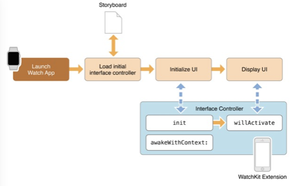

# Watch OS 开发笔记

uweiyuan

## 开发概要

Watch App的主要目的是展现iOS App的简单且重要的信息提示，所以尽量不要让Watch App 做后台任务，或者是在前台运行的任务也不能耗时较长。Watch App的任务尽量保证都在前台完成。

## OS

系统版本: OS1, OS2

对比：

如果决定将Watch 1.0 App迁移到2.0上，必须得评估这两者完全不同的系统架构对1.0版本App架构设计带来的影响。

以下问题需要慎重考虑：

App是否严重依赖iCloud？

WatchOS2中，WatchKit extension不再被允许直接访问iCloud。此类功能都必须由配对的iOS应用完成，再传输给手表。

Watch应用是否依赖配对的iOS应用的数据？

手机上创建的数据，必须传输到手表上供手表应用使用；手表应用更改后，必须传回手机，供其备份。纵然AppleWatch有提供传输的帮助，这里也必须更新相关的数据处理代码已支持数据同步。这里，可以考虑异步同步数据，手表和手机都连接到一个共享的服务器，通过服务器来同步数据。

是否要支持早期的Apple Watch版本？

如果要支持初代WatchKit和WatchOS1，那么我们需要有不同的target并编译产生不同的可执行文件。这是因为Watch OS1.0与Watch OS2.0是两个完全不同的系统架构，共享代码远比分开编译target的代价大的多。

## 基本要求

1. Watch App必须要依附于一个iOS的App
2. 一个Watch App由以下部分组成：extension(在iPhone上的Watch 应用中看到的部分)，Watch App(运行在Watch OS上的)，可选部分是：Notification，Glance

Extension的作用：管理，响应用户的操作

App   的作用：资源文件管理，主要是界面搭建，资源文件管理

Notification作用：支持自定义的推送通知的界面

Glance  的作用：Watch App的重要信息的一个快速展示界面，可以快速启动App

## 架构

## 开发

### 界面控制器WKInterfaceController

类似iOS中的ViewController，与 view controller 不同的是 interface controller 不管理屏幕中实际的 view，WatchKit 以透明的方式对 view 进行处理。一般，一个 WatchKit 应用程序会有多个 interface controller，用来显示不同的数据类型

### App生命周期

### 控制器生命周期

### UI开发部分

4.1 主要界面都要在extension的storyboard文件中预制好

4.2 在运行时不允许，动态创建控制器，通过代码自定义创建控件，修改控件位置

4.3 在运行时可修改，控件的透明度、show/hide、更新支持修改的控件的属性

WatchKit中类层次结构

WKInerfacePicker

WKInerfaceMoive

WKInerfaceMenu

5.界面导航

导航的形式只有两种：

5.1 page形式

​	使用segue相关的转场

5.2 Hierarchical 形式

​	这个必须要基于控件(button,Grpup,Table row)的事件，使用push或者pop方法来实现转场

6 iOS APP与Watch App之间数据共享

方式：蓝牙

技术：OS1通过创建App group来实现， OS2 通过Watch connectivity framework实现

区别：OS1可以使用NSFileManager的方法来操作iOS上App的目录；OS2则只能使用NSUserDefaults只读到iOS App的偏好设置文件

7.Notification

分为Short-Look和Long-Look两种形式

1. Short-Look

如果你的iOS App注册了通知，当iOS App收到了推送消息后，Watch也会提示推送，推送提示的界面是系统提供的模板样式，包括(App名字，icon，本地或者是远程通知的payload)

1. Long-Look

当你点击Short-Look推送界面的时候，系统就会切换到Long-Look界面，这个界面分为静态和动态两种，可以在Storyboard中自定义样式。点击推送的消息之后，可以在WKUserNotificationInterface子类接收并响应用户的操作。

详细开发指导请参照Apple官网： [App Programming Guide for watchOS](https://developer.apple.com/library/watchos/documentation/General/Conceptual/WatchKitProgrammingGuide/index.html)