# iOS View Layout

`Absolutely Position`，绝对位置方式布局

`AutoResizing`，自动调整子级视图

`Stack views`，`Auto Layout`界面视图

`Auto Layout`，精确放置视图

`Trait & Size Class`，对 `Auto Layout` 中的constraint的补充


 ## 概览

在设计应用程序界面时，可以在应用程序window中放置视图和其他界面元素，并对其进行适当调整。但是，由于各种原因，这些视图的大小和位置可能需要在运行时更改：

- 用户可以调整包含视图的window的大小

- iOS 设备的屏幕大小的变化（包括纵向和横向方向之间的差异）需要为每个设备和方向设置不同的布局

- iPad 上的应用必须适应不同的屏幕空间，从屏幕的三分之一到整个屏幕

- 语言更改可能需要更改 label 和其他基于文本的视图的大小

- 动态类型允许更改文本的大小，这会影响视图的大小

当界面大小(dimension)发生变化时：

`UIStackView` 对象会自动调整其包含视图的位置

`Auto Layout` constraint，可以指定用于确定界面中视图大小和位置的规则

`Size Class` 可以再次给机会去调整布局


## Absolutely Position

绝对位置布局，适合当前 view 的 frame 与屏幕的方向和大小无关，则可以使用绝对位置布局

例如代码：

```objective-c
UIView *subView = [[UIView alloc] initWithFrame:CGRectMake(0,0,self.view.frame.size.width,50)];
[self.view addSubview:subView];
```

代码相对比较简洁，但不适应需求的变化，当需要修改时，可能会耗时且难懂


## Auto Resizing(iOS 2.0+)

它是UIView类的属性， 是一个整数位掩码，用于确定子级视图在父级视图的边界发生变化时如何调整自身大小

在 UIKit 中的枚举定义是：

```objective-c
typedef enum UIViewAutoresizing : NSUInteger {
    UIViewAutoresizingNone = 0,
    UIViewAutoresizingFlexibleLeftMargin = 1 << 0,
    UIViewAutoresizingFlexibleWidth = 1 << 1,
    UIViewAutoresizingFlexibleRightMargin = 1 << 2,
    UIViewAutoresizingFlexibleTopMargin = 1 << 3,
    UIViewAutoresizingFlexibleHeight = 1 << 4,
    UIViewAutoresizingFlexibleBottomMargin = 1 << 5
} UIViewAutoresizing;
```

在Xcode中可以看到如图的可视化操作：

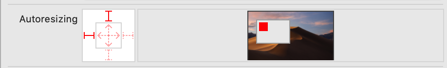


每一个单词中都有“Flexible”这个单词，意味着，你用了某个枚举，当父控件发生变化之后，子空间对应的属性可以resize self去适配父控件，举例如下：(OC)

```objective-c
self.testAutoSizingMaskParentView = [[UIView alloc] initWithFrame:CGRectMake(105, 205, 100, 100)];
    [self.view addSubview:_testAutoSizingMaskParentView];
    
    UIView *testAutoSizingMaskView = [[UIView alloc] initWithFrame:CGRectMake(5, 5, 80, 80)];
    testAutoSizingMaskView.backgroundColor = [UIColor grayColor];
    // 这表明，当父控件发生变化的时候，允许resize self的宽度和高度以适应父控件的变化
    testAutoSizingMaskView.autoresizingMask = UIViewAutoresizingFlexibleWidth|UIViewAutoresizingFlexibleHeight;
 
    [self.testAutoSizingMaskParentView addSubview:testAutoSizingMaskView];
 
// iOS 8之后的设备方向发生变化的回调
- (void)viewWillTransitionToSize:(CGSize)size withTransitionCoordinator:(id<UIViewControllerTransitionCoordinator>)coordinator {
	// 修改父控件frame
    if (size.width > size.height) {
        self.testAutoSizingMaskParentView.frame = CGRectMake(105, 205, 50, 60);
    } else {
        self.testAutoSizingMaskParentView.frame = CGRectMake(105, 205, 100, 100);
    }
}
```

> 如果 Auto Resizing 行为没有提供视图所需的精确布局，则可以使用自定义容器视图并覆盖其`layoutSubviews` 方法以更精确地定位子视图

## Stack View(iOS9.0+)

### 概要

主要指 `UIStackView`，用于在列或行中布置视图集合

通过UIStackView，您可以利用`Auto Layout`的强大功能，创建可以动态适应设备方向，屏幕大小和可用空间任何变化的用户界面。UIStackView管理其arrangeSubviews属性中所有视图的布局。这些视图沿着UIStackView的轴排列，基于它们在arrangeSubviews数组中的顺序。确切的布局取决于UIStackView的轴(axis)，分布(distribution)，对齐(alignment)，间距(spacing)和其他属性

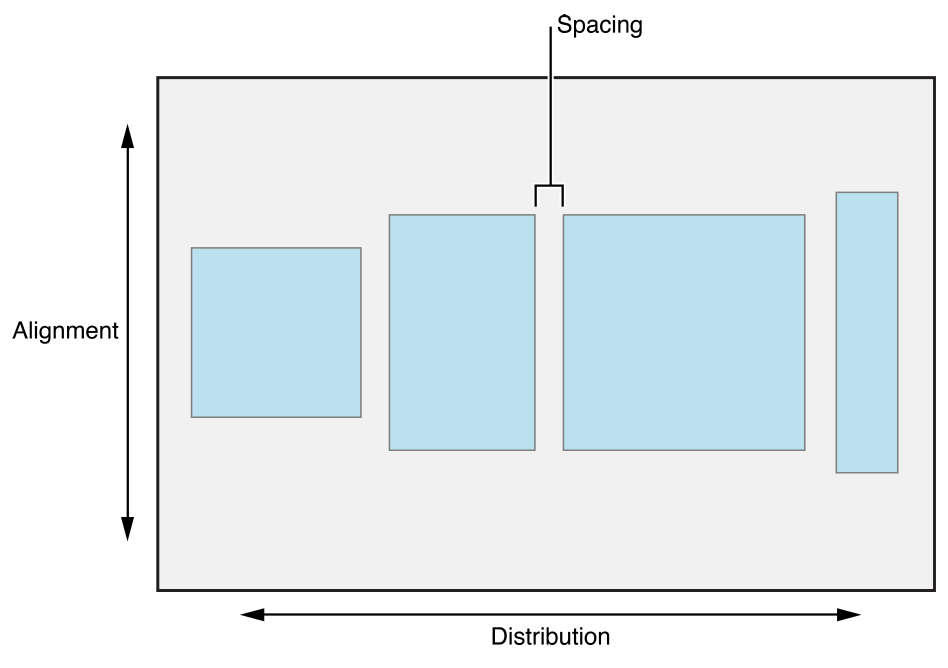


要使用UIStackView，请打开要编辑的Storyboard。从对象库中拖出水平UIStackView或垂直UIStackView，并将UIStackView放在所需位置。接下来，拖出堆栈的内容，将视图或控件放入堆栈。您可以根据需要继续向堆栈添加视图和控件。 Interface Builder根据其内容调整堆栈大小。您还可以通过在 Attributes 检查器中修改 UIStackView 的属性来调整堆栈内容的外观。

> 注意
>
> 您负责定义UIStackView的位置和大小（可选）。然后，UIStackView会管理其内容的布局和大小


### Stack View and Auto Layout
UIStackView使用`Auto Layout`来管理其负责排列的视图的位置和大小。UIStackView将第一个和最后一个排列的视图与其沿堆栈轴的边缘对齐

- 在水平堆栈中，这意味着第一个排列视图的前缘固定到堆栈的前缘，最后排列的视图的后缘固定到堆栈的后缘。

- 在垂直堆叠中，顶部和底部边缘分别固定到堆叠的顶部和底部边缘

如果将UIStackView的isLayoutMarginsRelativeArrangement属性设置为true，则UIStackView会将其内容固定到相关边距而不是其边缘

- 对于除UIStackView.Distribution.fillEqually分布之外的所有分布，UIStackView在沿堆栈轴计算其大小时使用每个排列视图的intrinsicContentSize属性。 UIStackView.Distribution.fillEqually调整所有排列视图的大小，使它们的大小相同，沿着轴填充UIStackView。如果可能，UIStackView会拉伸所有排列的视图，以匹配沿堆栈轴具有最长内在大小的视图

- 对于除UIStackView.Alignment.fill对齐之外的所有对齐，UIStackView在计算垂直于堆栈轴的大小时使用每个排列视图的intrinsicContentSize属性。 UIStackView.Alignment.fill调整所有排列的视图的大小，以便它们垂直于其轴填充UIStackView。如果可能，UIStackView会拉伸所有排列的视图，以匹配垂直于堆栈轴的最大内在大小的视图

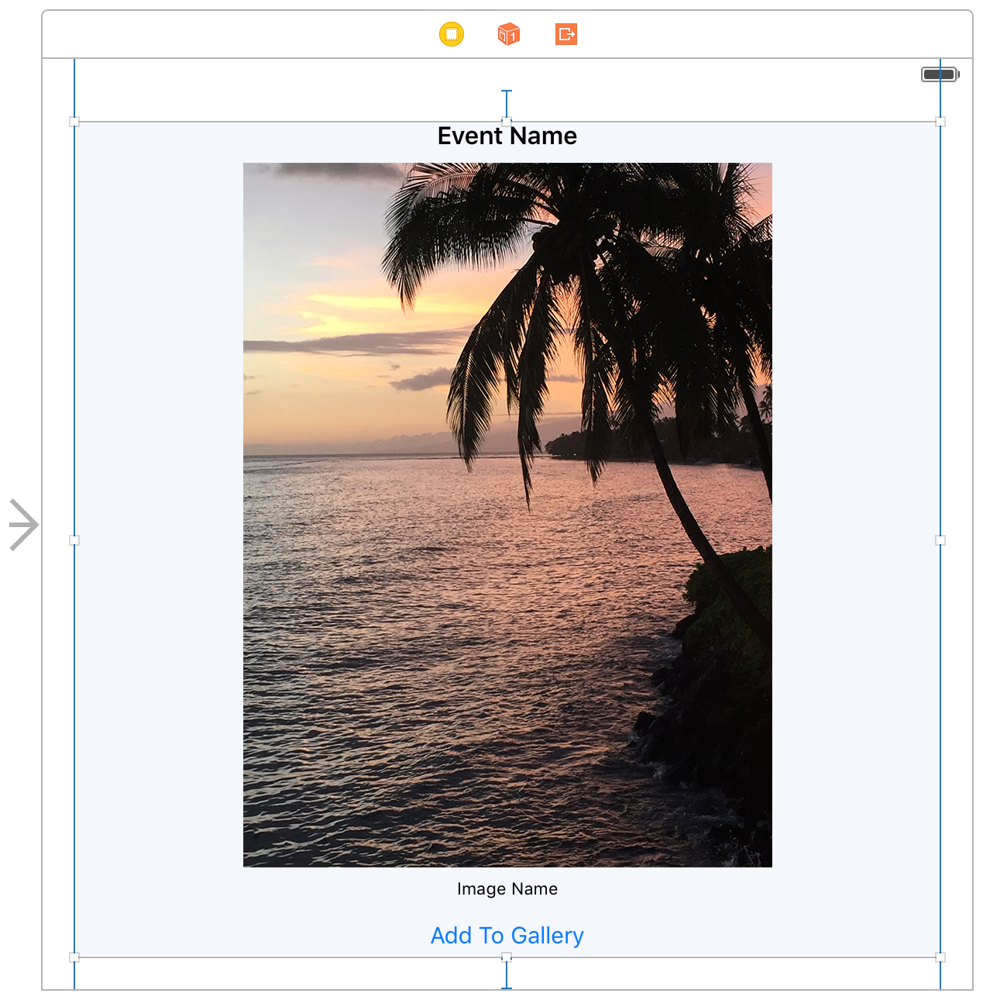

### 定位和调整 UIStackView 的大小
虽然UIStackView允许直接布局其内容而不直接使用`Auto Layout`，但您仍需要使用`Auto Layout`来定位UIStackView本身。通常，这意味着要钉住UIStackView的至少两个相邻边缘以限定其位置。如果没有其他constraint，系统将根据其内容计算UIStackView的大小。

- 沿着UIStackView的轴，其拟合大小等于所有排列视图的大小加上视图之间的空间的总和

- 垂直于UIStackView的轴，其拟合大小等于最大排列视图的大小

- 如果UIStackView的isLayoutMarginsRelativeArrangement属性设置为true，则UIStackView的拟合大小会增加，以包含边距的空间

可以提供其他constraint来指定UIStackView的高度，宽度或两者。在这些情况下，UIStackView会调整其排列视图的布局和大小以填充指定区域。确切的布局根据UIStackView的属性而有所不同。有关UIStackView如何处理其内容的额外空间或空间不足的完整说明，请参阅UIStackView.Distribution和UIStackView.Alignment枚举

还可以根据其第一个或最后一个基线定位UIStackView，而不是使用顶部，底部或中心Y位置。与UIStackView的拟合大小一样，这些基线是根据UIStackView的内容计算的。

- 水平UIStackView返回forFirstBaselineLayout和forLastBaselineLayout方法的最高视图。如果最高视图也是UIStackView，它将返回嵌套UIStackView的forFirstBaselineLayout或forLastBaselineLayout的调用结果

- 垂直UIStackView返回forFirstBaselineLayout的第一个排列视图及forLastBaselineLayout的最后排列视图。如果这些视图中的任何一个也是UIStackView，那么它将返回嵌套的UIStackView的forFirstBaselineLayout或forLastBaselineLayout的调用结果


> 注意
>
> 基线对齐仅适用于其高度与其内部内容大小的高度匹配的视图。 如果视图被拉伸或压缩，则基线显示在错误的位置。

### 常见的UIStackView 布局
#### 仅定义位置 

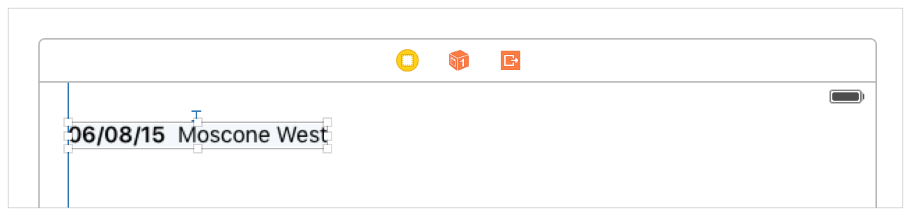

可以通过将两个相邻边缘固定到其父级视图来定义`UIStackView`的位置。 在这种情况下，`UIStackView`的大小基于其排列的视图在两个维度中自由增长。 当希望`UIStackView`的内容以其内部内容大小显示，并且希望相对于`UIStackView`排列其他用户界面元素时，此方法特别有用

#### 定义沿着轴的堆栈大小

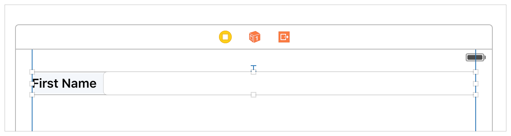

在这种情况下，将堆栈的两个边沿其轴线固定到其父级视图，从而在该维度中定义`UIStackView`的大小。 还需要固定其他边之一以定义`UIStackView`的位置。 `UIStackView`沿其轴，定位和调整大小，以填充其定义的空间; 然而，未固定的边缘基于最大排列视图的大小自由移动

#### 定义垂直于轴的堆栈大小

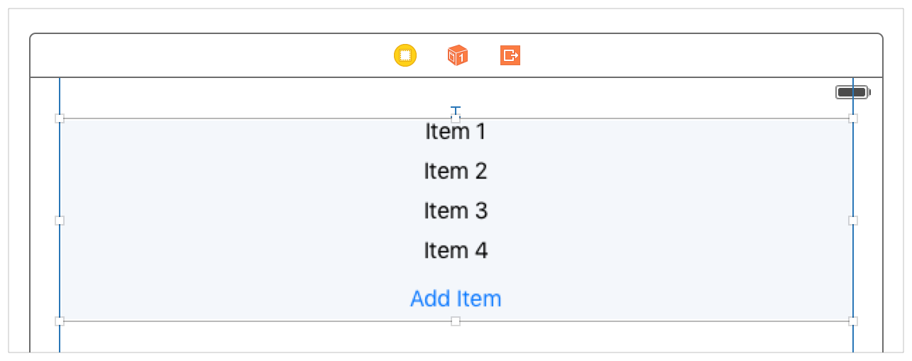

此方法与前面的示例类似，但是将两条边固定在`UIStackView`的轴上，并且沿轴只有一条边。 这样，当添加和删除排列的视图时，`UIStackView`可以沿其轴增大和缩小。 除非使用fillEqually分布，否则排列的视图将根据其内在内容大小进行调整。 垂直于轴，视图根据`UIStackView`的对齐方式在定义的空间中分布

#### 定义`UIStackView`的大小和位置。 

在这种情况下，将`UIStackView`的所有四个边都固定，从而使`UIStackView`在提供的空间内布置其内容

### 管理UIStackView的外观

`UIStackView`是`UIView`的 **非渲染** 子类;也就是说，它不提供自己的任何用户界面。相反，它只管理其排列视图的位置和大小。因此，某些属性（如backgroundColor）对`UIStackView`没有影响。同样，也不能覆盖layerClass，draw（_ :)或draw（_：in :)

有许多属性定义了`UIStackView`如何布置其内容：

- `axis` 属性可以垂直或水平确定堆栈的方向

- `distribution` 属性确定沿堆栈轴排列的视图的布局

- `alignment`属性确定垂直于堆栈轴的排列视图的布局

- `spacing` 属性确定排列视图之间的最小间距

- `isBaselineRelativeArrangement` 属性确定视图之间的垂直间距是否从基线测量

- `isLayoutMarginsRelativeArrangement` 属性确定`UIStackView`是否相对于其布局边距布置其排列的视图

通常，您使用单个`UIStackView`来布置少量项目。可以通过在其他`UIStackView`中嵌套`UIStackView`来构建更复杂的视图层次结构。例如，图7显示了包含两个水平`UIStackView`的垂直`UIStackView`，每个水平`UIStackView`都包含标签和文本字段

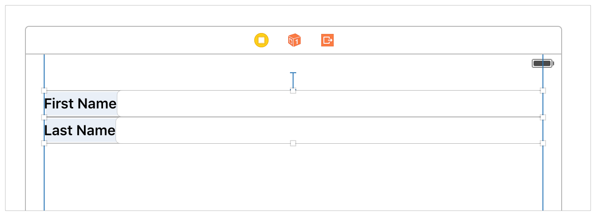


还可以通过向排列的视图添加其他constraint来微调排列视图的外观

例如，可以使用constraint来设置视图的最小或最大高度或宽度。或者，可以为视图定义宽高比

`UIStackView`在布置其内容时使用这些constraint

例如，在图像视图中有一个宽高比constraint，在调整图像大小时强制使用恒定的宽高比

> 注意
>
> 在向`UIStackView`中的视图添加constraint时，请小心避免引入冲突。作为一般经验法则，如果视图的大小默认为给定维度的内在内容大小，则可以安全地为该维度添加constraint


### 维护Arranged View 和Subviews 之间的一致性

`UIStackView`确保其arrangeSubviews属性始终是其子视图属性的子集。具体来说，`UIStackView`强制执行以下规则：

- 当`UIStackView`向其arrangeSubviews数组添加视图时，它还会将该视图添加为子视图（如果尚未添加）

- 从`UIStackView`中删除子视图时，`UIStackView`也会将其从arrangeSubviews数组中删除

- 从arrangeSubviews数组中删除视图不会将其作为子视图删除。`UIStackView`不再管理视图的大小和位置，但视图仍然是视图层次结构的一部分，如果可见，则在屏幕上呈现

虽然arrangeSubviews数组始终包含子视图数组的子集，但这些数组的顺序保持独立

- arrangeSubviews数组的顺序定义了视图在堆栈中的显示顺序。对于水平堆栈，视图按阅读顺序排列，较低的索引视图出现在较高的索引视图之前。例如，在英语中，视图按从左到右的顺序排列。对于垂直堆栈，视图从上到下排列，较低的索引视图位于较高的索引视图之上

- 子视图数组的顺序定义了子视图的Z顺序。如果视图重叠，则具有较低索引的子视图将显示在具有较高索引的子视图后面


### 动态更改`UIStackView`的内容

每当添加，删除或插入到arrangedSubviews数组中的视图时，或者每当排列的子视图的isHidden属性发生更改时，堆栈视图都会自动更新其布局

```swift
let firstView = stackView.arrangedSubviews[0]
firstView.isHidden = true
```


`UIStackView`还会自动响应其任何属性的更改。 例如，您可以通过更新`UIStackView`的axis属性来动态更改堆栈的方向

```swift
if stackView.axis == .Horizontal {
    stackView.axis = .Vertical
}
else {
    stackView.axis = .Horizontal
}
```


可以对已排列的子视图的isHidden属性和`UIStackView`的属性的更改放在动画块中来，实现动画效果

```swift
UIView.animateWithDuration(0.25) { () -> Void in
    let firstView = stackView.arrangedSubviews[0]
    firstView.isHidden = true
}
```


## Constraint

### 在布局 Margin 内定位内容

定位视图，以免他们被其他内容挤占(crowded)

#### 概述

布局边距(margin)提供视图内容与视图边界(bound)之外的任何内容之间的可视缓冲区。 布局边距(margin)由视图的每个边（顶部，底部，前导和尾部）的插入值(inset)组成。 这些插入值(inset)在视图边界(bound)矩形的边缘和视图内的内容之间创建一个间隔空间。 

下图显示了具有不同布局边距(margin)集的两个视图。 它们除了在内容周围添加的空白空间外，边距(margin)没有可见的表示。

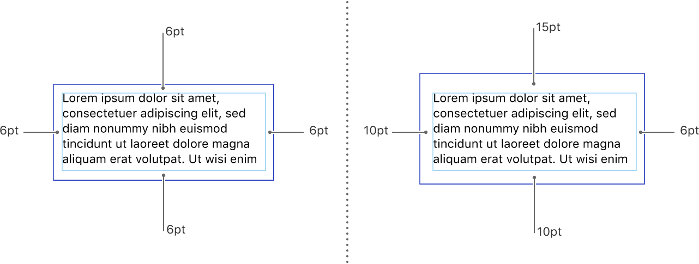


要设置遵循布局边距(margin)的约束，请在Xcode中启用Constrain to margin选项，如图2所示:

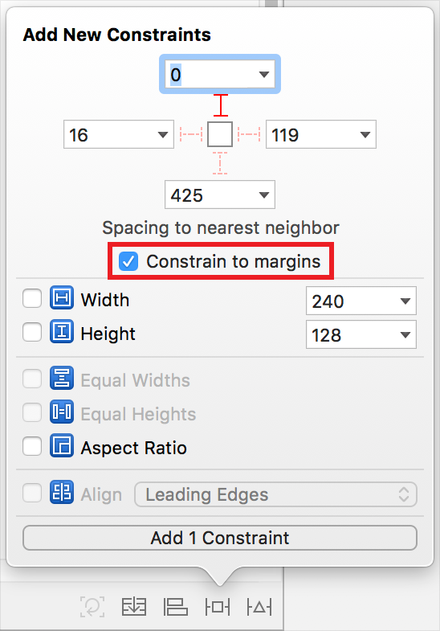

> 注意：
>
> 如果不启用该选项，Xcode将创建相对于视图边界矩形的约束

如果父级视图的边距(margin)稍后被更改，与这些边距(margin)相关联的元素的位置会相应更新

即使没有使用约束来定位内容，仍然可以相对于视图的布局边距(margin)手动定位内容

在计算视图中项目的位置时，请考虑这些边距值


每个视图的边距插入值(inset)，在视图中布局内容时，视图使用的默认间距

- iOS 8.0+，layoutMargins，语言方向无关

- iOS 11.0+，directionalLayoutMargins，语言方向有关，例如有些国家是RTL(Right To Left)

在iOS 11及更高版本中，使用directionalLayoutMargins属性指定布局边距而不是layoutMargins，directionalLayoutMargins属性中的Leading、Trailing inset 与此属性中的Right、Left inset同步。例如，将leading 方向边缘的inset设置为20个点会导致在具有从左到右语言的系统上将此属性的 left inset 设置为20个点。

#### Left，Right 和 Leading，Trailing 的区别

- 必须成对使用
- Left，Right 表示布局与语言方向无关，不管什么语言，都是从左到右布局
- Leading，Training 表示与语言方向有关，根据语言方向，从前向后布局

```objective-c
UILabel *cLable = [UILabel new];
    cLable.translatesAutoresizingMaskIntoConstraints = false;
    cLable.layer.borderColor = UIColor.cyanColor.CGColor;
    cLable.layer.borderWidth = 1;
    cLable.text = @"helloworld";
    [self.view addSubview:cLable];
    NSLayoutConstraint *widthConstraint = [NSLayoutConstraint constraintWithItem:cLable attribute:NSLayoutAttributeWidth relatedBy:NSLayoutRelationEqual toItem:self.view attribute:NSLayoutAttributeWidth multiplier:1.0 constant:-100];
    NSLayoutConstraint *heightConstraint = [NSLayoutConstraint constraintWithItem:cLable attribute:NSLayoutAttributeHeight relatedBy:NSLayoutRelationEqual toItem:nil attribute:NSLayoutAttributeWidth multiplier:1.0 constant:40];
// RTL
    NSLayoutConstraint *leftConstraint = [NSLayoutConstraint constraintWithItem:cLable attribute:NSLayoutAttributeLeft relatedBy:NSLayoutRelationEqual toItem:self.view attribute:NSLayoutAttributeLeft multiplier:1.0 constant:0];
// direction
// NSLayoutConstraint *leftConstraint = [NSLayoutConstraint constraintWithItem:cLable attribute:NSLayoutAttributeLeading relatedBy:NSLayoutRelationEqual toItem:self.view attribute:NSLayoutAttributeLeading multiplier:1.0 constant:0];
    NSLayoutConstraint *topConstraint = [NSLayoutConstraint constraintWithItem:cLable attribute:NSLayoutAttributeTop relatedBy:NSLayoutRelationEqual toItem:self.view attribute:NSLayoutAttributeTop multiplier:1.0 constant:300];
    [self.view addConstraints:@[leftConstraint, topConstraint, widthConstraint, heightConstraint]];
```


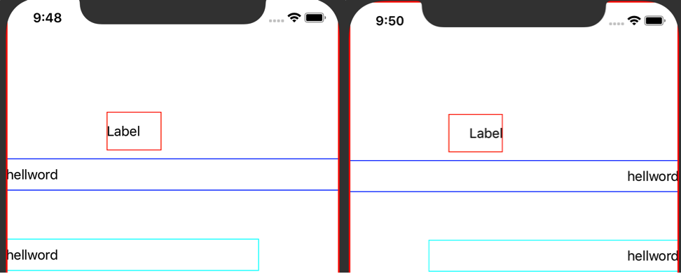


在Xcode中设置语言方向进行调试

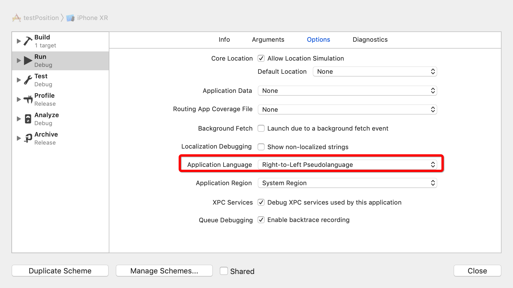


对于UIViewController的根视图，此属性的默认值反映系统最小margin和 safe area inset。对于视图层次结构中的其他子视图，**默认布局边距通常为每边8个点**，但如果视图未完全位于safe area 内或者preservesSuperviewLayoutMargins(指示当前视图是否也尊重其父级视图的margin)属性为YES，则值可能更大。

此属性指定视图边缘与任何子视图之间所需的空间量（以点为单位）。AutoLayout 使用margin作为放置内容的提示。例如，如果使用格式字符串`| - [subview] - |`指定一组水平约束，则子视图的左右边缘将通过相应的布局margin从父级视图的边缘插入。当视图的边缘靠近父级视图的边缘并且preservesSuperviewLayoutMargins属性为YES时，可以增加实际的布局margin以防止内容与superview的边距重叠。

#### 更改布局默认Margin

UIKit为每个视图提供默认布局边距，但可以将默认值更改为更适合自定义的视图的值。 要更改视图的边距值，请更新视图的directionalLayoutMargins(iOS 11.0+)属性或者是layoutMargins属性(iOS 8.0+)。 （您也可以使用 Size inspector 在设计时设置该属性的值。在 Layout Margins 中，选择 Language Directional 选项并输入每个视图边缘的边距值，如图:

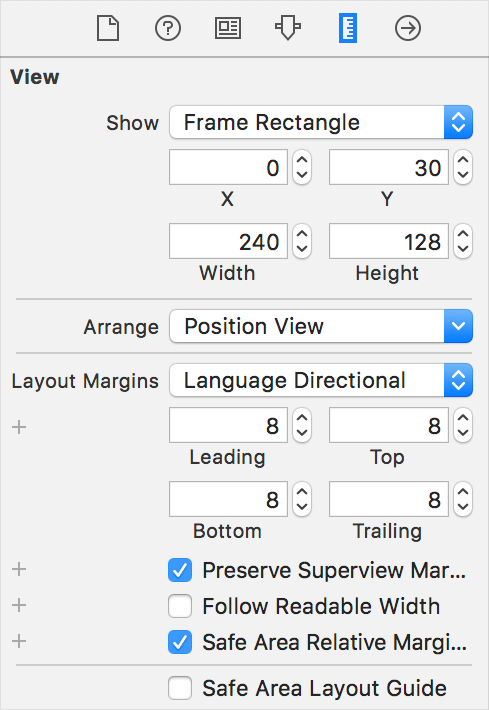


对于UIViewController的根视图，UIKit会强制执行一组最小布局边距，以确保正确显示内容。 当directionalLayoutMargins属性中的值小于最小值时，UIKit会使用最小值。 可以从UIViewController的systemMinimumLayoutMargins(iOS11.0+, readonly)属性中获取最小边距值。 要防止UIKit完全应用最小边距，请将UIViewController的viewRespectsSystemMinimumLayoutMargins(iOS11.0+, 指示UIViewController的视图是否使用系统定义的最小布局边距)属性设置为false

**视图的实际margin是使用视图的配置及其directionalLayoutMargins属性的值计算的**。视图的margin受其insetsLayoutMarginsFromSafeArea和preservesSuperviewLayoutMargins属性的设置影响，这些属性可以增加默认边距值以确保内容的适当间距

### 相对于 Safe Area 定位内容

定位视图，使其不受其他内容遮挡(obstructed)

#### 概述

Safe Area可帮助您将视图置于整个界面的可见部分。 UIKit 定义的UIViewController可以在内容之上放置特殊视图。 例如，navigation controller在底层UIViewController的内容之上显示navigation bar。 即使这些视图部分透明，它们仍然会遮挡它们下面的内容。 在tvOS中，Safe Area还包括屏幕的overscan insets，它代表屏幕边框覆盖的区域

使用Safe Area来帮助布置内容。 每个视图都有自己的layout guide（可从safeAreaLayoutGuide(iOS 11.0+)属性访问），可以使用它来为视图中的项创建约束。 如果未使用`AutoLayout`定位视图，则可以从视图的safeAreaInsets(iOS 11.0+)属性中获取原始 inset

Calendar应用程序的两个不同视图以及与其关联的Safe Area：

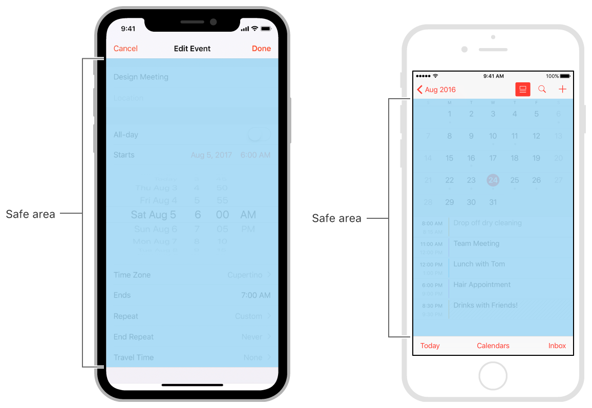

#### 扩展 Safe Area 以包含自定义视图

container View Controller可以在嵌入的child View Controller的视图上显示自己的内容视图。 在这种情况下，更新child View Controller的Safe Area以排除container View Controller的内容视图所覆盖的区域。 UIKitcontainer View Controller考虑了内容视图之后再调整其child View Controller的Safe Area。 例如，navigation controller考虑了navigation bar之后扩展其child View Controller的Safe Area。

要扩展嵌入式child View Controller的Safe Area，请修改其additionalSafeAreaInsets(iOS 11.0+)属性。 假设定义了一个container View Controller，它沿着屏幕的底部和右侧边缘显示自定义视图，如图:

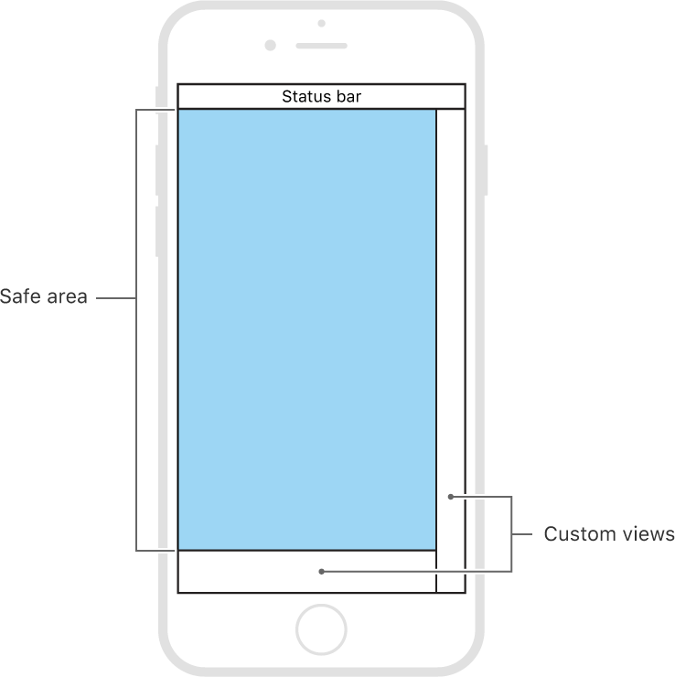

由于child View Controller的内容位于自定义视图的下面，因此为了考虑这些视图，必须扩展child View ControllerSafe Area的底部和右侧的 inset，调整child View ControllerSafe Area的代码：

```swift
override func viewDidAppear(_ animated: Bool) {
   var newSafeArea = UIEdgeInsets()
   // Adjust the safe area to accommodate 
   //  the width of the side view.
   if let sideViewWidth = sideView?.bounds.size.width {
      newSafeArea.right += sideViewWidth
   }
   // Adjust the safe area to accommodate 
   //  the height of the bottom view.
   if let bottomViewHeight = bottomView?.bounds.size.height {
      newSafeArea.bottom += bottomViewHeight
   }
   // Adjust the safe area insets of the 
   //  embedded child view controller.
   let child = self.childViewControllers[0]
   child.additionalSafeAreaInsets = newSafeArea
}
```


### 布局定位的API

明确 Margin 和 Safe Area 的概念之后，就可以通过 Constraint 类来实现界面元素的位置定位

#### NSLayoutConstraint(iOS 6.0+)

使用Layout布局的前提要关闭控件的translatesAutoresizingMaskIntoConstraints属性，以防止系统将autoresizing mask转换到Auto Layout constraints，从而让布局出现问题

##### VFL(Visual Formate Language)

```
+ (NSArray<__kindof NSLayoutConstraint *> *)constraintsWithVisualFormat:(NSString *)format options:(NSLayoutFormatOptions)opts metrics:(NSDictionary<NSString *,id> *)metrics views:(NSDictionary<NSString *,id> *)views;
```

| 功能      | 表达式   |
| --------- | -------- |
| 水平方向  | H:       |
| 垂直方向  | V:       |
| Views     | [view]   |
| SuperView | \|       |
| 逻辑关系  | >=,==,<= |
| 间隔      | -        |
| 优先级    | @value   |

```objective-c
//这个地方不要定义Frame，下面的Visual Format才是定义Frame相关的地方
UIView *redView = [[UIView alloc] init]; 
redView.backgroundColor = [UIColor redColor];
 
//为了不让Constraint与View本身的autoresize冲突
[redView setTranslatesAutoresizingMaskIntoConstraints:NO]; 
[self.view addSubview:redView];
    
UIView *blueView = [[UIView alloc] init];
blueView.backgroundColor = [UIColor blueColor];
[blueView setTranslatesAutoresizingMaskIntoConstraints:NO];
[self.view addSubview:blueView];
    
//绑定两个View相关
NSDictionary *views = NSDictionaryOfVariableBindings(redView, blueView);
//此处的constraint是为了定义Frame水平方向相关（x, width）
[self.view addConstraints: [NSLayoutConstraint constraintsWithVisualFormat:@"H:|-(>=10)-[redView(200)]"  options:0  metrics:nil views:views]];

//此处的constraint是为了定义Frame竖直方向相关（y, height）
[self.view addConstraints:  [NSLayoutConstraint constraintsWithVisualFormat:@"V:|-(>=240)-[redView(100)]"  options:0  metrics:nil views:views]];
[self.view addConstraints:  [NSLayoutConstraint constraintsWithVisualFormat:@"H:[blueView(==redView)]" options:0 metrics:nil views:views]];
[self.view addConstraints:  [NSLayoutConstraint constraintsWithVisualFormat:@"V:|-(40)-[blueView(==redView)]" options:0 metrics:nil views:views]];
 
// 实现子空间居中
NSDictionary *dic = @{@"centerLabel":centerLabel, @"superView":label};
[label addConstraints:[NSLayoutConstraint constraintsWithVisualFormat:@"H:[centerLabel(10)]-(<=1)-[superView]" options:NSLayoutFormatAlignAllCenterY metrics:nil views:dic]];
[label addConstraints:[NSLayoutConstraint constraintsWithVisualFormat:@"V:[centerLabel(10)]-(<=1)-[superView]" options:NSLayoutFormatAlignAllCenterX metrics:nil views:dic]];
// 快速实现关联关系的控件的大小一样
[label(button)]，这表明label的大小与button一样
```


##### View Attribute Relationship

创建一个约束，用于定义给定视图的属性之间的关系

```objective-c
+ (instancetype)constraintWithItem:(id)view1 attribute:(NSLayoutAttribute)attr1 relatedBy:(NSLayoutRelation)relation toItem:(id)view2 attribute:(NSLayoutAttribute)attr2 multiplier:(CGFloat)multiplier constant:(CGFloat)c;
```

每个约束都是一个线性方程式，格式如下：

`item1.attribute1 <relation> multiplier × item2.attribute2 + constant`

> 如果要表达的约束没有item2的视图和属性，使用 `nil` 和 `NSLayoutAttributeNotAnAttribute`
>
> 通常，应该使用 Layout Anchor API (iOS 9.0+)以编程方式创建约束。 此API包含额外的类型信息，当构建捕获到无效约束时

属性的枚举：

```objective-c
typedef enum NSLayoutAttribute : NSInteger {
    NSLayoutAttributeLeft = 1,
    NSLayoutAttributeRight,
    NSLayoutAttributeTop,
    NSLayoutAttributeBottom,
    NSLayoutAttributeLeading,
    NSLayoutAttributeTrailing,
    NSLayoutAttributeWidth,
    NSLayoutAttributeHeight,
    NSLayoutAttributeCenterX,
    NSLayoutAttributeCenterY,
    NSLayoutAttributeLastBaseline,
    NSLayoutAttributeBaseline = NSLayoutAttributeLastBaseline,
    NSLayoutAttributeFirstBaseline,
    NSLayoutAttributeLeftMargin,
    NSLayoutAttributeRightMargin,
    NSLayoutAttributeTopMargin,
    NSLayoutAttributeBottomMargin,
    NSLayoutAttributeLeadingMargin,
    NSLayoutAttributeTrailingMargin,
    NSLayoutAttributeCenterXWithinMargins,
    NSLayoutAttributeCenterYWithinMargins,
    NSLayoutAttributeNotAnAttribute = 0
} NSLayoutAttribute;
```

逻辑关系的枚举：

```objective-c
typedef enum NSLayoutRelation : NSInteger {
    NSLayoutRelationLessThanOrEqual = -1,    // <=
    NSLayoutRelationEqual = 0,		     // ==
    NSLayoutRelationGreaterThanOrEqual = 1   // >=
} NSLayoutRelation;
```

#### UILayoutSupport(iOS 7.0+)

一组方法，提供布局支持和访问布局锚点，被 UIViewController 和 UIView 实现

可以使用 layout guide 作为 NSLayoutConstraint 工厂方法中的布局项

- 该协议由UIViewController属性topLayoutGuide(iOS 7.0-11.0)和bottomLayoutGuide(iOS 7.0-11.0)实现，以支持使用`Auto Layout` 的 UIViewController视图

当UIViewController位于屏幕最前面时，topLayoutGuide属性将发挥作用。 它表示不希望在半透明或透明UIKit栏后面显示的内容的最高垂直范围（例如状态或navigation bar）

具体而言，此属性的值是查询此属性时返回的对象的length属性的值。此值受UIViewController或其封闭container View Controller（如导航或标签栏控制器）的约束，如下：

1. 不在container View Controller内的UIViewController约束此属性以指示status bar的底部（如果可见），或者指示UIViewController视图的上边缘

2. container View Controller中的UIViewController不会设置此属性的值。相反，container View Controller约束值以指示：

   如果navigation bar可见，则navigation bar的底部

   如果只显示status bar，则status bar的底部

   如果status bar和navigation bar都不可见，则UIViewController的视图的上边缘

如果container navigation controller的navigation bar是可见且不透明的，则navigation controller将显示最前面的UIViewController的视图，使其顶边邻接navigation bar的底部。在这种情况下，此属性的值为0

>在viewDidLayoutSubviews（）方法的实现中查询此属性

在布置storyboard scene时，`Top Layout Guide` 对象在Interface Builder大纲视图中可用作View Controller的子级对象。 使用Interface Builder添加`Top Layout Guide`可向后兼容iOS 6

- 该协议由UIView属性safeAreaLayoutGuide(iOS 11.0+)实现

用 Auto Layout 以编程方式使用此属性的示例：

##### topLayoutGuide(iOS 7.0-11.0)

假设要定位控件，使其顶部边缘位于top layout guide 下方20个点的(VFL)代码：

```objective-c
[button setTranslatesAutoresizingMaskIntoConstraints: NO];
id topGuide = myViewController.topLayoutGuide;
NSDictionary *viewsDictionary = NSDictionaryOfVariableBindings (button, topGuide);
[myViewController.view addConstraints:
    [NSLayoutConstraint constraintsWithVisualFormat: @"V:[topGuide]-20-[button]"
                                            options: 0
                                            metrics: nil
                                              views: viewsDictionary]];
// You must call this method here or the system raises an exception
[self.view layoutSubviews]; 
```


要在不使用约束的情况下使用 top layout guide，请获取 the guide 相对于包含视图顶部边界(bound)的位置。

在使用UIViewController子类的情况下，获取位置代码：

```objective-c
- (void) viewDidLayoutSubviews {
    CGRect viewBounds = self.view.bounds;
    CGFloat topBarOffset = self.topLayoutGuide.length;
}
```

在使用UIView子类的情况下，获取位置代码：

```objective-c
- (void) layoutSubviews {
    // You must call super here or the system raises an exception
    [super layoutSubviews];
    CGRect bounds = self.bounds;
    CGFloat topBarOffset = myVCReference.topLayoutGuide.length;
}
```

##### bottomLayoutGuide(iOS 7.0-11.0)

对比topLayoutGuide即可

##### safeAreaLayoutGuide(iOS11.0+)

当视图在屏幕上可见时，此属性将反映 navigation bars, tab bars, toolbars 和其他祖先视图未覆盖的视图部分。 （在tvOS中，安全区域反映未覆盖屏幕边框的区域。）如果视图当前未安装到视图层次结构中，或者在屏幕上尚未显示，则此属性的边缘等于视图的边缘

对于UIViewController的根视图，此属性包含 status bar，其他可见栏以及使用UIViewController的additionalSafeAreaInsets属性指定的任何其他inset。 对于视图层次结构中的其他视图，此属性仅反映其他内容所涵盖的视图部分。 例如，如果视图完全位于其父级视图的safe area 内，则此属性边缘等于视图的边缘

#### UILayoutGuide(iOS 9.0+)

一个矩形区域，可以与Auto Layout交互

##### 概述

使用layout guide替换已创建的虚拟视图，此视图表示用户界面中的视图空间或视图封装

传统上，有许多Auto Layout技术需要虚拟视图。虚拟视图是一个空视图，它没有自己的任何可视元素，仅用于在视图层次结构中定义矩形区域

例如，

- 如果要使用约束来定义视图之间空白空间的大小或位置，则需要使用虚拟视图来表示该空间。

- 如果要将一组对象居中，则需要一个虚拟视图来包含这些对象

虚拟视图可用于包含和封装部分用户界面，虚拟视图可以将大型复杂的用户界面分解为自包含的模块，如果使用得当，它们可以大大简化Auto Layout 约束逻辑

将虚拟视图添加到视图层次结构中会产生许多成本

- 首先，创建和维护视图本身是成本
- 其次，虚拟视图是视图层次结构的完整成员，这意味着它会增加层次结构执行的每个任务的开销。最糟糕的是，隐形虚拟视图**可以拦截**用于其他视图的消息，从而导致很难找到的问题


**UILayoutGuide类旨在执行先前由虚拟视图执行的所有任务，但是以更安全，更有效的方式执行**。

- 不定义新视图
- 不参与视图层次结构
- 相反，他们只是在他们自己的视图的坐标系中定义一个矩形区域，可以与自动布局交互


##### 创建UILayoutGuide

要创建一个layout guide，**必须**要完成以下步骤

1. 实例化一个新的layout guide 
2. 将上一步中的layout guide添加到视图中，通过调用`addLayoutGuide:` 接口
3. 使用 Auto Layout 定义 layout guide 的位置和大小

Ex:

用于在一系列视图之间定义相等间距的 layout guide

```swift
let space1 = UILayoutGuide()
view.addLayoutGuide(space1)
 
let space2 = UILayoutGuide()
view.addLayoutGuide(space2)
 
space1.widthAnchor.constraintEqualToAnchor(space2.widthAnchor).active = true
saveButton.trailingAnchor.constraintEqualToAnchor(space1.leadingAnchor).active = true
cancelButton.leadingAnchor.constraintEqualToAnchor(space1.trailingAnchor).active = true
cancelButton.trailingAnchor.constraintEqualToAnchor(space2.leadingAnchor).active = true
clearButton.leadingAnchor.constraintEqualToAnchor(space2.trailingAnchor).active = true
```

layout guide 也可以作为黑盒子，包含许多其他视图和控件， 封装部分视图，将布局模块化

```swift
let container = UILayoutGuide()
view.addLayoutGuide(container)
 
// Set interior constraints
label.lastBaselineAnchor.constraintEqualToAnchor(textField.lastBaselineAnchor).active = true
label.leadingAnchor.constraintEqualToAnchor(container.leadingAnchor).active = true
textField.leadingAnchor.constraintEqualToAnchor(label.trailingAnchor, constant: 8.0).active = true
textField.trailingAnchor.constraintEqualToAnchor(container.trailingAnchor).active = true
textField.topAnchor.constraintEqualToAnchor(container.topAnchor).active = true
textField.bottomAnchor.constraintEqualToAnchor(container.bottomAnchor).active = true
 
// Set exterior constraints
// The contents of the container can be treated as a black box
let margins = view.layoutMarginsGuide
 
container.leadingAnchor.constraintEqualToAnchor(margins.leadingAnchor).active = true
container.trailingAnchor.constraintEqualToAnchor(margins.trailingAnchor).active = true
container.topAnchor.constraintEqualToAnchor(topLayoutGuide.bottomAnchor, constant: 20.0).active = true
```

>此外，布局约束不会完全封装其内容。 系统仍然将 layout guide 内的可选约束的优先级与 layout guide 外的可选约束的优先级进行比较


#### Anchor(iOS 9.0+)

借助这些约束以编程的方式使用 Auto Layout 定义布局

不是直接创建NSLayoutConstraint对象，而是从希望约束的UIView，NSView或UILayoutGuide对象开始，并选择该对象的anchor属性之一。 这些属性对应于Auto Layout中使用的NSLayoutConstraint.Attribute，并提供适当的NSLayoutAnchor子类，用于为该属性创建约束。 使用anchor的方法来构造约束

> 注意：
>
> UIView不为布局边距(margin)属性提供anchor属性
>
> 相反，layoutMarginsGuide属性提供了一个UILayoutGuide对象用来表示这些边距，使用guide的anchor属性来创建约束

**顾名思义，此类对NSLayoutConstraint类的简化**

以下代码展示两者的区别：

```swift
// Creating constraints using NSLayoutConstraint
NSLayoutConstraint(item: subview,
                   attribute: .leading,
                   relatedBy: .equal,
                   toItem: view,
                   attribute: .leadingMargin,
                   multiplier: 1.0,
                   constant: 0.0).isActive = true

NSLayoutConstraint(item: subview,
                   attribute: .trailing,
                   relatedBy: .equal,
                   toItem: view,
                   attribute: .trailingMargin,
                   multiplier: 1.0,
                   constant: 0.0).isActive = true


// Creating the same constraints using Layout Anchors
let margins = view.layoutMarginsGuide

subview.leadingAnchor.constraint(equalTo: margins.leadingAnchor).isActive = true
subview.trailingAnchor.constraint(equalTo: margins.trailingAnchor).isActive = true
```

Anchor的优势

- 代码更干净、简洁、易读
- NSLayoutConstraint.Attribute子类提供额外类型检查，防止创建无效约束

##### NSLayoutAnchor(iOS 9.0+)

不需要直接使用此类，而根据需求使用它的以下子类：

##### NSLayoutDimension(iOS 9.0+)

一个工厂类，包含用于创建基于大小的布局约束对象的一系列接口

借助这些约束以编程的方式使用 Auto Layout 定义布局，所有的大小都是以点为单位，除了提供用于创建约束大小的方法之外，此类还将类型信息添加到从NSLayoutAnchor继承的方法中。 具体来说，NSLayoutAnchor声明的泛型方法现在必须采用匹配的NSLayoutDimension对象

```swift
// This works as expected.
saveButton.widthAnchor.constraintEqualToAnchor(cancelButton.widthAnchor).active = true
 
// This generates an incompatible pointer type warning.
saveButton.widthAnchor.constraintEqualToAnchor(cancelButton.leadingAnchor).active = true
```

##### NSLayoutXAxisAnchor(iOS 9.0+)

一个工厂类，包含用于创建水平的布局约束对象的一系列接口

```swift
// This constraint is valid
cancelButton.leadingAnchor.constraintEqualToAnchor(saveButton.trailingAnchor, constant: 8.0).active = true
 
// This constraint generates an incompatible pointer type warning
cancelButton.leadingAnchor.constraintEqualToAnchor(saveButton.topAnchor, constant: 8.0).active = true
```

##### NSLayoutYAxisAnchor(iOS 9.0+)

一个工厂类，包含用于创建垂直的布局约束对象的一系列接口

```swift
// This constraint is valid
cancelButton.topAnchor.constraintEqualToAnchor(saveButton.topAnchor, constant: 8.0).active = true
 
// This constraint generates an incompatible pointer type warning
cancelButton.topAnchor.constraintEqualToAnchor(saveButton.trailingAnchor, constant: 8.0).active = true
```

##  适配

### 概述

自适应界面是一个充分利用可用空间的界面。 自适应意味着能够调整内容，使其适合任何iOS设备。 iOS中的自适应模型支持简单但动态的方式来重新排列和调整内容以响应更改。 当利用此模型时，单个应用程序可以适应截然不同的屏幕尺寸，只需很少的额外代码

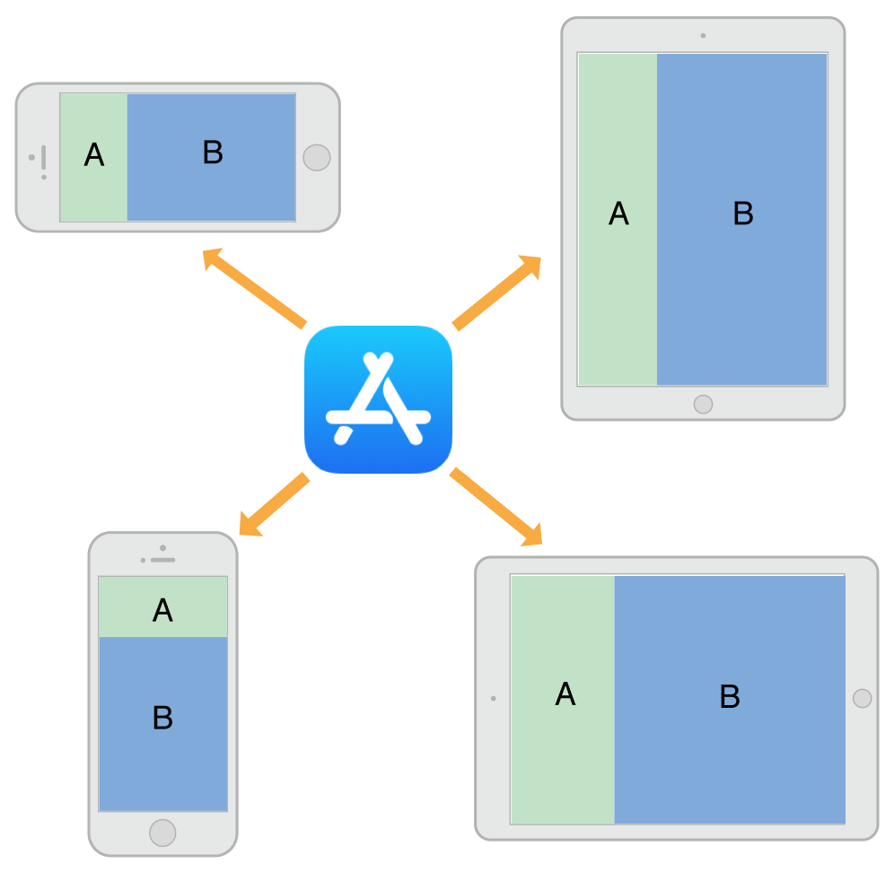

### 适配方式

- Auto Layout
- Traits

#### Auto Layout

参照上述


#### Trait

如果单独的约束不足以管理布局，则View Controller有几个机会进行更改

View Controller，视图和一些其他对象管理一组特征，这些特征指定与该对象关联的当前环境

下表介绍了这些特性以及如何使用它们来影响用户界面

| Trait                 | Examples                          | Description                                                  |
| --------------------- | --------------------------------- | ------------------------------------------------------------ |
| `horizontalSizeClass` | `UIUserInterfaceSizeClassCompact` | 此特征传达了界面的一般宽度。 使用它来进行粗略布局决策，例如视图是垂直堆叠，并排显示，完全隐藏还是通过其他方式显示 |
| `verticalSizeClass`   | `UIUserInterfaceSizeClassRegular` | 此特征传达了界面的一般高度。 如果设计要求所有内容都适合屏幕而不滚动，请使用此特性进行布局决策 |
| `displayScale`        | `2.0`                             | 此特征表达内容是显示在Retina显示器还是标准分辨率显示器上。 (根据需要)使用它做出像素级布局决策或选择要显示的图像版本 |
| `userInterfaceIdiom`  | `UIUserInterfaceIdiomPhone`       | 此特征用于向后兼容，并传达运行应用程序的设备类型（尽量避免使用这种特性） |

使用特征来决定如何呈现用户界面。 在Interface Builder中构建界面时，使用traits更改显示的视图和图像，或使用它们应用不同的约束集。 许多UIKit类（如UIImageAsset）使用指定的特征定制它们提供的信息

何时使用不同类型的特征：

- 使用 Size Class 对界面进行粗略更改。 Size Class 更改是添加或删除视图，添加或删除child View Controller或更改布局约束的适当时间。也可以不做任何事情，让界面使用现有的布局约束自动调整
- 永远不要假设 Size Class 对应于视图的特定宽度或高度。View Controller的 Size Class 可能会因多种原因而发生变化。例如，iPhone上的container view controller 可能使其某一个子项水平规则(hr)，以强制它以不同方式显示其内容
- 根据需要，使用Interface Builder为每个 Size Class 指定不同的布局约束。使用Interface Builder指定约束比自己添加和删除约束要简单得多。View Controller通过从storyboard应用适当的约束来自动处理 Size Class 更改
- 避免使用idiom信息来决定界面的布局或内容。在iPad和iPhone上运行的应用程序通常应显示相同的信息，并应使用 Size Class 来做出布局决策

##### Trait和Size的变化

特征变化不经常发生，但它们确实发生。 UIKit根据对底层环境的更改来更新View Controller的特征。Size Class特征比显示比例特征更可能发生变化。如果有的话，idiom特质应该很少改变。发生Size Class更改的原因如下：

- View Controllerwindow的垂直或水平尺寸类已更改，通常是因为设备旋转
- containerView Controller的水平或垂直Size Class已更改
- 当前View Controller的水平或垂直Size Class由其容器显式更改

View Controller层次结构中的Size Class更改向下传播到任何child View Controller。 window对象充当该层次结构的根，为其根View Controller提供基线Size Class特征。当设备方向在纵向和横向之间发生变化时，window会更新其自己的Size Class信息，并沿View Controller层次结构传播该信息。containerView Controller可以将更改传递给未经修改的child View Controller，也可以覆盖每个子视图的特征。

在iOS 8及更高版本中，window原点始终位于左上角，当设备在横向和纵向方向之间旋转时，window的边界会发生变化。window大小更改沿着View Controller层次结构传播，同时还有相应的特征更改。对于层次结构中的每个View Controller，UIKit调用以下方法来报告这些更改：

- willTransitionToTraitCollection：withTransitionCoordinator：告诉每个相关的View Controller它的特征即将改变
- viewWillTransitionToSize：withTransitionCoordinator：告诉每个相关的View Controller它的大小即将改变
- traitCollectionDidChange：告诉每个相关的View Controller它的特征现在已经改变

在遍历View Controller层次结构时，只有在报告发生更改时，UIKit才会向View Controller报告更改。如果containerView Controller覆盖其子级的Size Class，则在容器的Size Class更改时不会通知这些子级。同样，如果View Controller的视图具有固定的宽度和高度，则它不会收到大小更改通知

下图显示了在iPhone 6上发生旋转时如何更新View Controller的特征和视图大小。从纵向到横向的旋转会将屏幕的垂直Size Class 从常规更改为紧凑。然后，在View Controller层次结构中向下传播Size Class更改和相应的视图大小更改。在将视图设置为 new size 后，UIKit会在调用View Controller的`traitCollectionDidChange：`方法之前应用Size Class和视图大小更改

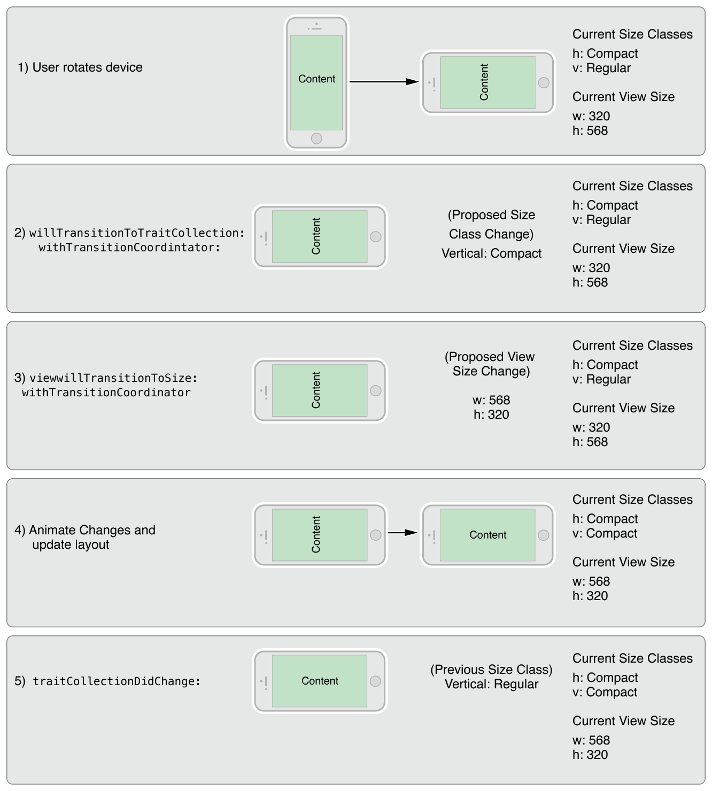

##### 不同设备默认的Size Class

| Device                     | Portrait                                                   | Landscape                                                  |
| -------------------------- | ---------------------------------------------------------- | ---------------------------------------------------------- |
| iPad (all)iPad Mini        | Vertical size class: RegularHorizontal size class: Regular | Vertical size class: RegularHorizontal size class: Regular |
| iPhone 6 Plus              | Vertical size class: RegularHorizontal size class: Compact | Vertical size class: CompactHorizontal size class: Regular |
| iPhone 6                   | Vertical size class: RegularHorizontal size class: Compact | Vertical size class: CompactHorizontal size class: Compact |
| iPhone 5siPhone 5ciPhone 5 | Vertical size class: RegularHorizontal size class: Compact | Vertical size class: CompactHorizontal size class: Compact |
| iPhone 4s                  | Vertical size class: RegularHorizontal size class: Compact | Vertical size class: CompactHorizontal size class: Compact |

>- 表中未列出的设备与具有相同屏幕尺寸的设备具有相同的 Size Class
>
>- 永远不要假设应用程序将在设备上以特定Size Class显示。 在决定如何配置该对象时，请始终检查对象的特征集合中的Size Class
