# iOS 事件处理机制

## 概述

iOS 是从 mac OS 衍生而来，通过 `Cocoa Touch API` 提供交互能力，与 PC 端最为不同的一点就是触屏操作，本文解析触屏操作产生事件的原理，事件被传递的路径、响应

## 事件分类

`Cocoa Touch` 框架在移动设备上主要提供的事件类型有：

- 触摸事件，Gesture 和 Touch
- 运动事件， 内置陀螺仪、加速计、磁力仪
- 远程控制事件(外设)，耳机等外设
- 按压事件，支持 3D Touch 的设备

## 事件生成

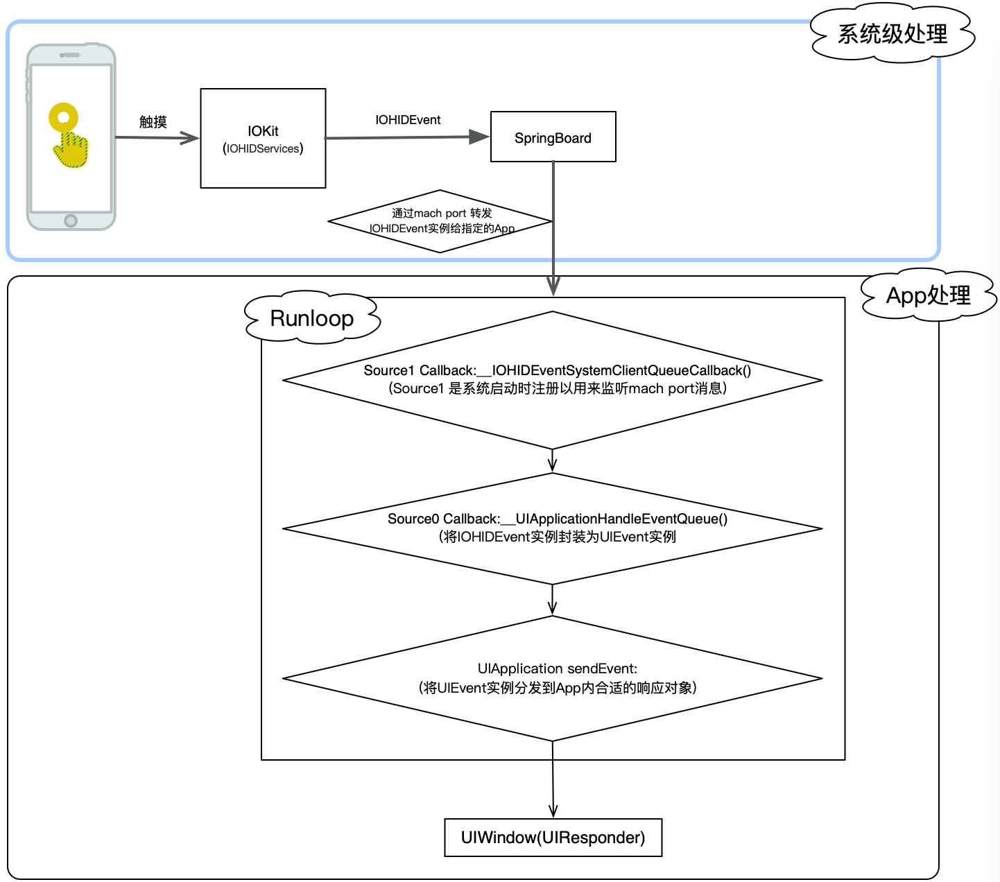

iOS中有很多进程通信的方式`Mach Ports`、`Distributed Notifications`、`Distributed Objects`、`XPC`等
`Core Foundation`和`Foundation`为 `mach port` 提供了高级API，在内核基础上封装的`CFMachPort / NSMachPort`可以作为 `runloop source`，而这个源正是我们经常在调用栈里看到的`source0`与`source1`

系统启动时会注册了一个 `source1` (基于 mach port 的) 用来接收系统事件，其回调函数为`__IOHIDEventSystemClientQueueCallback()`，
当触发了事件（触摸/锁屏/摇晃等）后由`IOKit.framework`生成一个 `IOHIDEvent`事件，而`IOKit`是苹果的硬件驱动框架，由它进行底层接口的抽象封装与系统进行交互传递硬件感应的事件，它专门处理用户交互设备，由`IOHIDServices`和`IOHIDDisplays`两部分组成，其中`IOHIDServices`是专门处理用户交互的，它会将事件封装成`IOHIDEvent`对象，然后这些事件又由`SpringBoard`接收，它只接收收按键(锁屏/静音等)，触摸，加速，接近传感器等几种 Event，接着用`mach port`转发给需要的App进程，随后系统注册的那个 `source1` 就会触发回调` _UIApplicationHandleEventQueue()`把`IOHIDEvent`处理包装成`UIEvent`进行应用内部的分发。

## 事件传递和响应

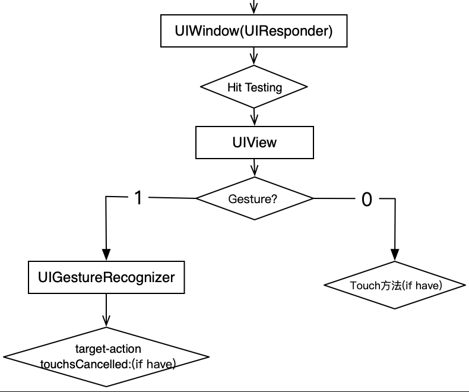

### 1. Hit-Testing

**这一过程主要来确定由哪个视图来首先处理事件**

当触摸事件传递到 ``UIWindow`` 之后，响应链回去遍历当前`window`内的 `view` 层级，直至找到合适的 `view` 来处理这个事件，这一过程也叫做 `Hit-Testing`

#### 遍历方式

首先，系统会根据添加 `view` 的先后顺序，确定 `view` 在 `subviews` 数组中的顺序

然后，根据这个顺序将视图层级转化为图层树，针对这个树，使用**倒着进行前序深度遍历**的算法，进行遍历

> 如果使用 `storyboard` 添加视图，添加顺序等同于使用 `addSubview()` 的方式添加视图。即先拖入的属于 `subviews` 数组中第 0 个元素。

例如下面一个图层，当点击了红色箭头标注的地方：

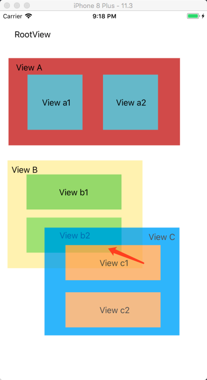

整个视图转化为图层树如下，同时遍历顺序也就确定：

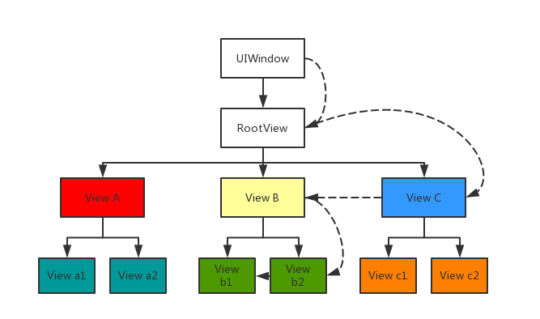

在上面图层树中，View A,B,C 平级，以 A,B,C 先后顺序加入。所以当我点击一个 point 的时候，会从 View C 开始遍历；判断点不在 View C 上，转向 View B；判断点在 View B 上，转向右子树 View b2;判断点不在 View b2 上，转向 View b1; 点在 View b1 上，且其没有子级视图，那么 View b1 为最合适的点

#### 实现原理

`UIWindow` 拿到事件之后，会 **先 **将事件传递给图层树中距离最靠近 `UIWindow` 那一层的 `view`，而 **后 ** 尝试调用其 `hitTest:withEvent:`，此方法使用 `pointInside:withEvent: `遍历此 `view` 层级 ，并遵循这样的原则：

- 如果点不在此视图内，其层次都将被忽略
- 如果点在此视图内
  1. 如果其还有子级视图，那么子级视图将尝试调用 `hitTest:withEvent:`遍历子级视图层级
  2. 如果其没有子级视图，`hitTest:withEvent:`接口返回的视图对象就是处理事件的对象。如果返回 nil，则当前视图不处理此事件，回溯事件由其父级视图处理

**注意上述执行路径中的视图如果出现以下情况，则事件不会被当前视图处理**

- 视图被隐藏：`hidden = YES`.
- 视图不允许响应交互事件：`userInteractionEnabled = NO`.
- 视图的 alpha 在 0~0.01 之间

综上，可以得出 `hitTest:withEvent:`接口实现大致如下：

```objective-c
- (UIView *)hitTest:(CGPoint)point withEvent:(UIEvent *)event {
    // 是否响应 Touch 事件
    if (!self.isUserInteractionEnabled || self.isHidden || self.alpha <= 0.01) return nil;
    
    // 点是否在 `view` 内
    if (![self pointInside:point withEvent:event]) return nil;
    
    for (UIView *subview in [self.`subviews` reverseObjectEnumerator]) {
        CGPoint convertedPoint = [subview convertPoint:point fromView:self];
        // point 进行坐标转化，递归调用，寻找自视图，直到返回 nil 或者 self
        UIView *hitTestView = [subview hitTest:convertedPoint withEvent:event];
        if (hitTestView) {
            return hitTestView;
        }
    }
    return self;
}
```

#### 

#### 应用举例

##### 重写 `hitTest:withEvent:`

- 返回自身实例(self) ，仅当前 `view` 处理事件，忽略其子级视图

- 返回nil，表示当前 `view` 不接受事件，忽略其子级视图

- 返回其他 UIResponder 实例对象，则指定此对象其响应事件

1.  假设父级视图中有多个子级视图 A,B,C，无论点击 B 还是 C，你都想让 A 响应。例如 App Store 中的预览 App 页面就属于这种类型：

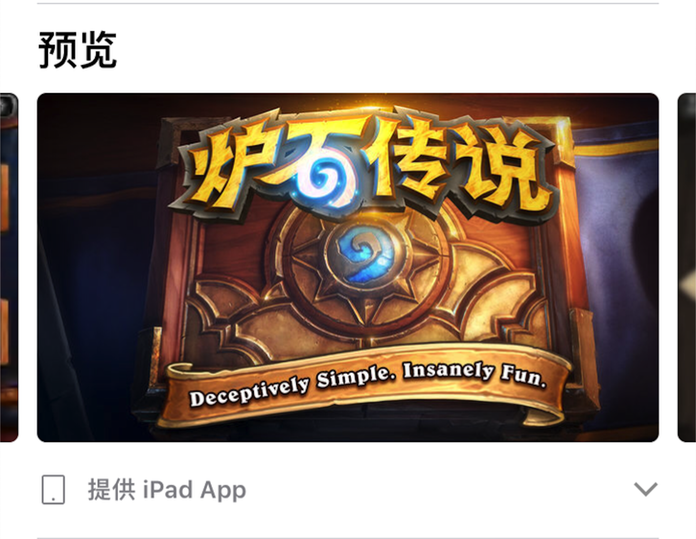

当点击两侧边缘的时候，想让中间的 `UIScrollView` 去响应，转化为模型如下图：

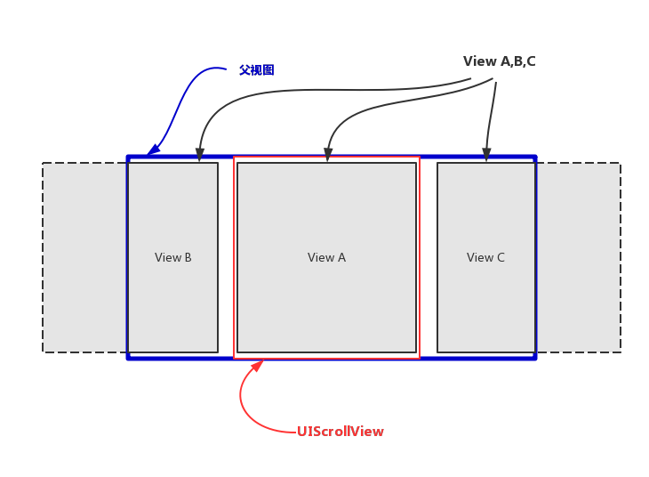

当点击边缘视图 B 和 C 时，希望 `UIScrollView` 能够响应事件，则可以重写**父级视图**的 `hitTest:withEvent:`，返回相应的视图实例即可

```objective-c
- (UIView *)hitTest:(CGPoint)point withEvent:(UIEvent *)event {
    UIView *hitTestView = [super hitTest:point withEvent:event];
    if (hitTestView) {
        hitTestView = self.scrollView;
    }
    return hitTestView;
}
```

2. 缩放响应对象的范围

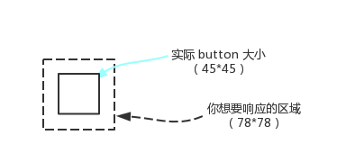

```objective-c
- (UIView *)hitTest:(CGPoint)point withEvent:(UIEvent *)event {
    if (!self.isUserInteractionEnabled || self.isHidden || self.alpha <= 0.01) 
        return nil;
    CGFloat inset = 45.0f - 78.0f;
    CGRect touchRect = CGRectInset(self.bounds, inset, inset);
    if (CGRectContainsPoint(touchRect, point)) {
        for (UIView *subview in [self.`subviews` reverseObjectEnumerator]) {
            CGPoint convertedPoint = [subview convertPoint:point fromView:self];
            UIView *hitTestView = [subview hitTest:convertedPoint withEvent:event];
            if (hitTestView) {
                return hitTestView;
            }
        }
        return self;
    }
    return nil;
}
```

> 因为遍历顺序在层级树中是从上向下，但是反应到视图上面，是从里向外传，所以这种情况也可以理解为 “透传”，即你点击了 View b2，但是最终响应的是 View B

##### 重写 `pointInside:withEvent:` (推荐)

- 返回 NO，通知响应链，当前发生的事件的点击的点不在此 `view` 内，并忽略其子级视图
- 返回 YES，通知响应链，当前发生的事件的点击的点在此 `view` 内，并向子级视图转发

1. 把可支持的点击区域修改为比实际UI尺寸大

实现代码如下：

```objective-c
- (BOOL)pointInside:(CGPoint)point withEvent:(UIEvent*)event {
    CGRect bounds = self.bounds;
    //若原热区小于44x44，则放大热区，否则保持原大小不变
    CGFloat widthDelta = MAX(44.0 - bounds.size.width, 0);
    CGFloat heightDelta = MAX(44.0 - bounds.size.height, 0);
    bounds = CGRectInset(bounds, -0.5 * widthDelta, -0.5 * heightDelta);
    return CGRectContainsPoint(bounds, point);
}
```

>  注意：`hitTest:withEvent:` 和 `pointInside:withEvent:`同时使用重写时，前者会被响应链自动执行，而后者不会

### 2. Gesture Recognizer

Gesture Recognizer（手势识别器）是系统封装的一些类，用来识别一系列的常见手势，例如点击、长按等。在上一步中确定了合适的 View 之后，**`UIWindow` 会首先将 touches 事件先传递给 Gesture Recognizer，再传递给视图**。

Gesture Recognizer 有一套 touches 事件的处理接口和状态转换机制

一个手势的响应到结束，流程如下：

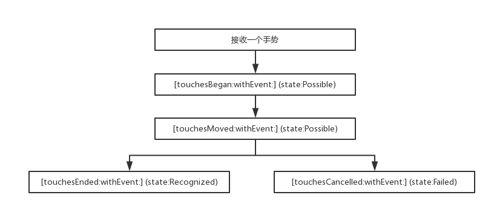

系统为 Gesture Recognizer 提供了如下几种状态：

- `UIGestureRecognizerStatePossible` : 未确定状态
- `UIGestureRecognizerStateBegan` : 接收到 touches，手势开始
- `UIGestureRecognizerStateChanged` : 接收到 touches，手势改变
- `UIGestureRecognizerStateEnded `: 手势识别结束，在下个 run loop 前调用对应的 action 接口
- `UIGestureRecognizerStateCancelled` : 手势取消，恢复到 possible 状态
- `UIGestureRecognizerStateFailed` : 手势识别失败，恢复到 possible 状态
- `UIGestureRecognizerStateRecognized` : 等同于 `UIGestureRecognizerStateEnded`

当接收到一个系统定义的手势，首先会调用 recognizer 的 `[touchesBegan:withEvent:]`接口，这时候 recognizer 的状态是未确定的；然后调用 `[touchesMoved:withEvent:]`接口，依然没有识别成功；接下来要么调用 `[touchesEnded:withEvent:]`接口，手势识别成功，调用对应的 action；要么调用 `[touchesCancelled:withEvent:]`接口，手势识别失败。

官方也给出了一张比较明晰的图：

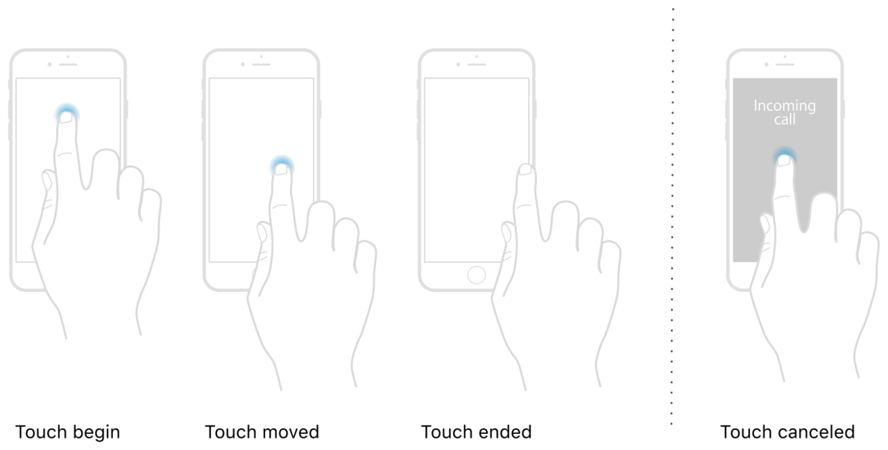

参考文档：

- [About the Gesture Recognizer State Machine](https://link.juejin.im/?target=https%3A%2F%2Fdeveloper.apple.com%2Fdocumentation%2Fuikit%2Ftouches_presses_and_gestures%2Fimplementing_a_custom_gesture_recognizer%2Fabout_the_gesture_recognizer_state_machine)
- [Implementing a Discrete Gesture Recognizer](https://link.juejin.im/?target=https%3A%2F%2Fdeveloper.apple.com%2Fdocumentation%2Fuikit%2Ftouches_presses_and_gestures%2Fimplementing_a_custom_gesture_recognizer%2Fimplementing_a_discrete_gesture_recognizer)
- [Implementing a Continuous Gesture Recognizer](https://link.juejin.im/?target=https%3A%2F%2Fdeveloper.apple.com%2Fdocumentation%2Fuikit%2Ftouches_presses_and_gestures%2Fimplementing_a_custom_gesture_recognizer%2Fimplementing_a_continuous_gesture_recognizer)


### 3. Response Chain

关于 Touch 事件，UIResponder 提供了四个接口来处理：

```objective-c
- (void)touchesBegan:(NSSet<UITouch *> *)touches withEvent:(UIEvent *)event;
- (void)touchesMoved:(NSSet<UITouch *> *)touches withEvent:(UIEvent *)event;
- (void)touchesEnded:(NSSet<UITouch *> *)touches withEvent:(UIEvent *)event;
- (void)touchesCancelled:(NSSet<UITouch *> *)touches withEvent:(UIEvent *)event;

/**
  iOS 9.1 增加的 API，当无法获取真实的 touches 时，UIKit 会提供一个预估值，并设置到 UITouch 对应的 estimatedProperties 中监测更新。当收到新的属性更新时，会通过调用此接口来传递这些更新值。
  
  eg: 当使用 Apple Pencil 靠近屏幕边缘时，传感器无法感应到准确的值，此时会获取一个预估值赋给 estimatedProperties 属性。不断去更新数据，直到获取到准确的值
  */
- (void)touchesEstimatedPropertiesUpdated:(NSSet<UITouch *> *)touches NS_AVAILABLE_IOS(9_1);
```

- 默认情况下，当发生一个事件时，根据**同时**触摸手指的数量来决定 `UITouch`实例的数量
- 如果想在事件发生时做额外的处理逻辑，可以重写以上四个接口，之后不要忘记调用 `[super touchexxxx]`接口，否则事件响应链就中断于此 当前的视图中


Hit-Tesing 过程是从上向下（从父级视图到子级视图）遍历

Touch 事件处理的传递过程与 Hit-Testing 过程正好相反，Touch 事件处理传递是从下向上（从子级视图到父级视图）传递，即 **Response Chain**

通过 Hit-Testing 找到的视图或者第一响应者是优先处理事件的对象；如果两者都能处理，则传递给下一个响应者，之后依次传递


> 如果不重写UIResponder子类的 touches 系列接口，系统会通过响应链找到响应视图对象

### 4. UIResponder

UI控件使用 `UIResponder`对象来接收和处理事件，`UIResponder`类为需要响应事件的对象定义了一组接口。在 `UIKit`中，`UIView`、`UIViewController`和 `UIApplication`这些类都是继承自 `UIResponder`类

#### 确定第一响应者

对于每个事件发生之后，系统会去找能处理这个事件的第一响应者。根据不同的事件类型，第一响应者也不同：

- 触摸事件：被触摸的 `view`
- 按压事件：被聚焦按压的对象
- 摇晃事件：用户或者 `UIKit`指定的那个对象
- 远程事件：用户或者 `UIKit`指定的那个对象
- 菜单编辑事件：用户或者 `UIKit`指定的那个对象。

> 1. 与加速计、陀螺仪、磁力仪相关的运动事件，是不遵循响应链机制传递的
> 2. Core Motion 会将事件直接传递给指定的第一响应者

`UIResponder`提供了几个接口（属性）来管理响应链 ：

```objective-c
#if UIKIT_DEFINE_AS_PROPERTIES
@property(nonatomic, readonly, nullable) UIResponder *nextResponder;
#else
- (nullable UIResponder*)nextResponder;
#endif

#if UIKIT_DEFINE_AS_PROPERTIES
@property(nonatomic, readonly) BOOL canBecomeFirstResponder;    // default is NO
#else
- (BOOL)canBecomeFirstResponder;    // default is NO
#endif
- (BOOL)becomeFirstResponder;

#if UIKIT_DEFINE_AS_PROPERTIES
@property(nonatomic, readonly) BOOL canResignFirstResponder;    // default is YES
#else
- (BOOL)canResignFirstResponder;    // default is YES
#endif
- (BOOL)resignFirstResponder;

#if UIKIT_DEFINE_AS_PROPERTIES
@property(nonatomic, readonly) BOOL isFirstResponder;
#else
- (BOOL)isFirstResponder;
#endif
```

- `-[nextResponder]`接口负责事件传递，默认返回 nil；子类必须实现此接口；例如 `UIView`返回的是管理它的 `UIViewController`对象或者其父级视图；`UIViewController`返回的是它控制的视图的父级视图；``UIWindow``返回的是 UIApplication 对象；`UIApplication`返回的是 nil
- 使用 `-[isFirstResponder]`来判断响应对象是否为第一响应者
- 使用 `-[canBecomeFirstResponder]`接口判断是否可以成为第一响应者
- 使用 `-[becomeFirstResponder]`接口将响应对象设置为第一响应者

 带有`resign`系列的接口与带有`become`系列的接口操作相反

#### 处理事件

`UIResponder`定义了 touches 系列接口用来处理触摸事件:

- 定义了 press 系列接口处理按压事件；

- 定义了 motion 系列接口处理运动事件；

- 定义了 remote 系列接口处理远程事件

大部分事件都是通过这个类提供的接口来处理

#### 输入视图相关

当我们使用 `UITextView`或者 `UITextField`时，点击视图会让其成为 First Responder，然后弹出一个视图（系统键盘 或者 自定义键盘）让用户进行文本输入。在 `UIResponder + UIResponderInputViewAdditions`这个分类中，定义了 `inputView`和 `inputAccessoryView`两个输入视图，样式分别如下：

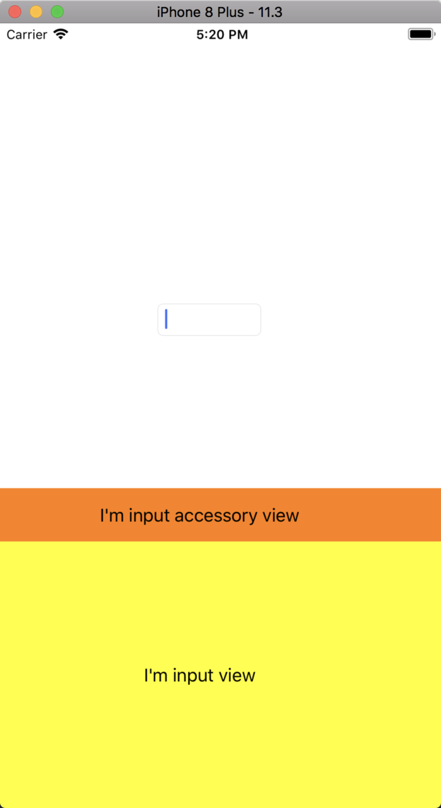

- 设置了 `UITextView` 的 `inputView`属性之后，将不再弹出系统键盘，而是自定义的 `view`；

- 设置了 `UITextView` 的`inputAccessoryView`属性之后，将会在键盘上面显示一个自定义图，这个属性默认为 nil

#### 复制粘贴相关

例如，微信读书的自定义菜单：

在文本中选中一些文字后，会弹出一个编辑菜单，我们可以通过这些菜单进行复制、粘贴等操作

如下图：

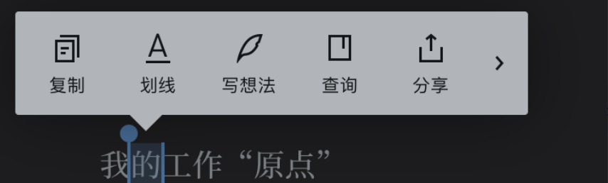

`UIResponder`类中声明了 `UIResponderStandardEditActions`protocol，来处理复制、粘贴相关事件，通过重写下面的两个接口：

1. 通过重写 `UIResponder`提供的 `-[canPerformAction:withSender]`接口，来控制 action 是否支持自定义逻辑

```objective-c
- (BOOL)canPerformAction:(SEL)action withSender:(id)sender {
    BOOL result = NO;
    if (action == @selector(copy:)) {
        result = YES;
    }
    return result;
}
```

2. 通过重写 `UIResponder`提供的 `-[targetForAction:withSender:]`接口，来实现自定义的逻辑处理

```objective-c
- (id)targetForAction:(SEL)action withSender:(id)sender {
    if (action == @selector(cut:)) {
        // logic
    }
    return [super targetForAction:action withSender:sender];
}
```

#### 响应键盘快捷键

iOS 7.0+ 新增 `UIResponder + UIResponderKeyCommands`分类，添加了一个 `keyCommands`属性，同时还定义了 `UIKeyCommands`类和一系列接口，使用这些接口，我们可以处理一些键盘快捷键

#### Handoff

iOS 8.0+ 新增 Handoff 功能，通过这个模块，用户可在多设备中共同处理一件事

例如使用 Mac 的 Safari 浏览一些东西，因为某些事情离开，这时候可以使用移动设备（iPad）上的的 Safari 继续浏览

Handoff 的基本思想是用户在一个应用里所做的任何操作都可以看作是一个 Activity，一个 Activity 可以和一个特定 iCloud 用户的多台设备关联起来；设备和设备之间使用 Activity 传递信息，达到共享操作

为了支持这个功能，iOS 8.0+ 新增 `UIResponder + ActivityContinuation`分类，提供了一些接口来处理这些事件，对于继承自 `UIResponder`的对象，新增 `userActivity`属性，多个响应者可以共享`NSUserActivity`类型的属性，另外，

可用 `-[updateUserActivityState:]`接口来更新这个属性

可用 `-[restoreUserActivityState:]`接口重置这个属性的状态

[iOSActivityDemo](https://github.com/forwardto9/iOSActivityDemo)

### 5.Frist Responder

与加速计、陀螺仪、磁力仪相关的运动事件，是不遵循响应链机制传递的，而是 Frist Responder 直接指定处理事件的对象，此对象需要需要遵循：

- `自定义类的` `-[canBecomeFirstResponder]`接口必须返回 YES
- 在合适的地方调用自定义类实例的 `-[becomeFirstResponder]`和 `-[resignFirstResponder]`接口

处理摇一摇事件：

```objective-c
// 自定义视图
@implementation CustomShakeView

#pragma mark - Overrid Method

- (BOOL)canBecomeFirstResponder {
    return YES;
}

- (void)motionBegan:(UIEventSubtype)motion withEvent:(UIEvent *)event {
    if (motion == UIEventSubtypeMotionShake) {
        CGFloat width = self.frame.size.width;
        CGFloat height = self.frame.size.height;
        UILabel *label = [[UILabel alloc] initWithFrame:CGRectMake(0, 0, width, height)];
        label.text = @"phone was shaked";
        label.textAlignment = NSTextAlignmentCenter;
        [self addSubview:label];
    }
}

- (void)motionEnded:(UIEventSubtype)motion withEvent:(UIEvent *)event {
    // nothing
}

- (void)motionCancelled:(UIEventSubtype)motion withEvent:(UIEvent *)event {
    // nothing
}
@end

// 视图控制器
@interface ViewController ()
@property (nonatomic, strong) CustomShakeView *shakeView;
@end

@implementation ViewController

- (void)viewDidLoad {
    self.shakeView = [[CustomShakeView alloc] initWithFrame:CGRectMake(0, 250, viewWidth, 60)];
    self.shakeView.backgroundColor = [UIColor grayColor];
    [self.`view` addSubview:_shakeView];
}

- (void)viewWillAppear:(BOOL)animated {
    [super viewWillAppear:animated];
    [self.shakeView becomeFirstResponder];
}

- (void)viewWillDisappear:(BOOL)animated {
    [super viewWillDisappear:animated];
    [self.shakeView resignFirstResponder];
}
```

**远程控制事件与此类似**

## 参考文章

[View Programming Guide for iOS](https://developer.apple.com/library/archive/documentation/WindowsViews/Conceptual/ViewPG_iPhoneOS/CreatingViews/CreatingViews.html)

[iOS 中的事件响应与处理](https://juejin.im/post/5b1cf9f0e51d4506af2e9ba0#heading-1)

[iOS底层原理总结 - RunLoop](https://juejin.im/post/5add46606fb9a07abf721d1d)