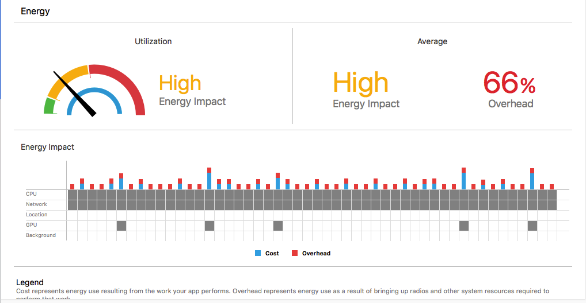

优化

# 耗电量检测

1. 进入手机"设置" -> "电池",可以直观的看出来手机应用的耗电情况.
2. 使用xcode打开你的工程,然后插上手机,使用真机running项目(必须是真机),然后comand + 6,点击Energy Impact



蓝色表示--合理,黄色--表示程序比较耗电,红色--表示仅仅轻度使用你的程序,就会很耗电.

图表中Utilization栏中是表示瞬时耗电情况

图表中Average栏中,表示平均耗电情况

图表中Energy Impact中cost(蓝色)表示运行项目代码需要电量,Overhead(红色)表示开销,包括CPU的唤起,无线电模组(蓝牙&WiFi),和其他系统资源的调用等

影响电量的五个因素,灰色表示有电量消耗,白色表示没有电量消耗

- CPU : CPU使用率超过20%就会快速耗干电池电量.高效使用CPU,并且当用户出现模糊输入时快速做出不做事情的反应.

- Network : 网络活动会唤起需要长时间周期性供电的无线电模组,可以分批次进行网络请求,来降低开销.

- Location : 精密&高频的的定位会增加开销,需要按需使用.

- GPU : 图形处理器(显卡的处理器),乱使用GPU会导致交互差,并且降低电池寿命.

- Background : 后台状态App仍会消耗电量,App要按需执行后台操作,并使用延迟APIs来保证系统运算高效执行.另外,在app进入后台状态是,立即减少动作,并且通知系统一次这些动作已经完成.

3. 使用Instrument的Energy Log

第一步 : 打开手机设置,点击"开发者"

第二步 : 点击Logging

第三步 : 勾选Energy,并点击startRecording

第四步 : 运行需要测试的App(确保手机消耗的是手机自身的电池),运行3 - 5分钟,再进入手机设置点击stopRecording

第五步 : 使用xcode,把手机和xcode相连,并打开Instruments中的Energy Log,点击工具栏中import Logged Data from Device

第六步 : 得到了电池损耗日志

- Energy Usage Level的值(0 -- 20),值越大表示越耗电

- CPU Activity 表示CPU各种活动


# 耗电量优化

## 一.代码层面

### 1.合理使用NSDateFormatter 和 NSCalendar这种高开销对象

- 性能测试表明,NSDateFormatter的性能瓶颈是由于NSDate格式到NSString格式的转化,所以把NSDateFormatter创建单例意义不大.推荐的做法是,把最常用到的日期格式做缓存.

```
static NSDateFormatter *cachedDateFormatter = nil;

+ (NSDateFormatter *)cachedDateFormatter {

if (!dateFormatter) {

dateFormatter = [[NSDateFormatter alloc] init];


[dateFormatter setDateFormat: @“YYYY-MM-dd HH:mm:ss”];

}

return dateFormatter;

}
```

### 2.不要频繁的刷新页面,能刷新1行cell最好只刷新一行,尽量不要使用reloadData.

### 3.选择正确的集合

- NSArray,使用index来查找很快(插入和删除很慢)
- 字典,使用键来查找很快
- NSSets,是无序的,用键查找很快,插入/删除很快

### 4.少用运算获得圆角,不论view.maskToBounds还是layer.clipToBounds都会有很大的资源开销,必须要用圆角的话,不如把图片本身就做成圆角

### 5.懒加载,不要一次性创建所有的subview,而是需要时才创建.

### 6.重用

- 可以模仿UITableView和UICollectionView,不要一次性创建所有的subview,而是需要时才创建.完成了使命,把他放入到一个可重用集合中

### 7.图片处理

- 图片与imageView相同大小,避免多余运算
- 可以使用整副的图片,增加应用体积,但是节省CPU
- 可调大小的图片,可以省去一些不必要的空间
- CALayer,CoreGraphics,甚至OpenGL来绘制,消耗CPU

### 8.cache,cache,cache(缓存所有需要的)

- 服务器相应结果的缓存(图片)
- 复杂计算结果的缓存(UITableView的行高)

### 9.尽量少用透明或半透明,会产生额外的运算.

### 10.使用ARC减少内存失误,dealloc需要重写并对属性置为nil

### 11.避免庞大的xib,storyBoard,尽量使用纯代码开发

## CPU层面

- Timer的时间间隔不宜太短,满足需求即可

- 线程适量,不宜过多,不要阻塞主线程

- 优化算法,减少循环次数

- 定位和蓝牙按需取用,定位之后要关闭或降低定位频率


https://www.jianshu.com/p/4555704f9696

https://www.jianshu.com/p/9a5e94e7b7c3

https://www.jianshu.com/p/70bf409597ca

https://juejin.im/post/5b10fc11f265da6e484ce8c7


# 内存优化

https://juejin.im/post/5b23dafee51d4558e03cbf4f

https://developer.apple.com/videos/play/wwdc2018/416/
