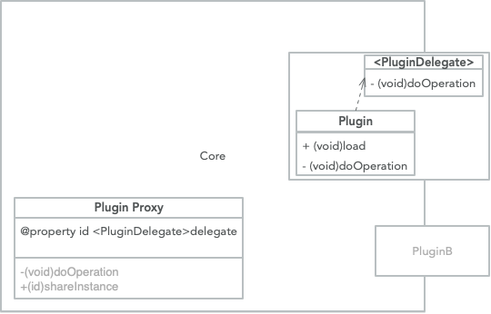

#```iOS``` 简化集成接入方案

```SDK```，顾名思义，提供了某些业务实现的具体接口的集合，在 Apple OS(mac OS、iOS、watch OS、tv OS) 上，分为：

- 静态库(static library，以 ```.a``` 或者是 ```framework``` 的形式展现)
- 动态库(dynamic library，以 ```.dylib```的形式展现)

在平台上通过```SaaS```形式提供终端服务的途径多数是平台提供了```SDK```以供第三方开发者接入，从接入到使用，这个过程中有可能存在问题的环节很多：

1.集成复杂，一般路径：在平台上注册应用信息，获取应用信息，根据```Demo```或者是开发文档，逐步实现```SDK```接口的代码逻辑；

2.```SDK```臃肿，一般路径：接入方对于```SDK```提供的服务接口是根据自身业务需求而定，与平台提供的集大成者的```SDK```存在差距，将这样 n 个```SDK```嵌入```App```中，体积势必无奈的增大，在接入方推广```App```的时候，C 端用户将面临设备存储、网络带宽、安装周期的多重挣扎


##自动化集成方案

### 解决思路

1.```CocoaPods，Carthage```

2.```Xcode``` 工程文件抽象

### 实现原理

```Xcode```工程文件(.proj)的格式，本质上是一个类```XML```格式的文件，根据Apple给出的不同节点的构成规则，抽象出解析工程文件的框架

Ex:

``` xml
/* Begin PBXSourcesBuildPhase section */

		C24A819A1FFE4021000AFA84 /* Sources */ = {

			isa = PBXSourcesBuildPhase;

			buildActionMask = 2147483647;

			files = (

				C24A81C01FFE4134000AFA84 /* UnusedClass1.m in Sources */,

				C24A81C11FFE4134000AFA84 /* UnusedClass2.m in Sources */,

				C24A81A61FFE4021000AFA84 /* ViewController.m in Sources */,

				C24A81C31FFE4134000AFA84 /* UsedClass2.m in Sources */,

				C24A81B11FFE4021000AFA84 /* main.m in Sources */,

				C24A81A31FFE4021000AFA84 /* AppDelegate.m in Sources */,

				C24A81C21FFE4134000AFA84 /* UsedClass1.m in Sources */,

			);

			runOnlyForDeploymentPostprocessing = 0;

		};

/* End PBXSourcesBuildPhase section */

```

### 具体应用

```SDK```一键集成工具

### 优劣势

|                       | 优势                         | 劣势                               |
| --------------------- | ---------------------------- | ---------------------------------- |
| CocoaPods，Carthage   | 集成速度快，一行命令更新全部 | 不贴合业务，可视化效果差，发布复杂 |
| ```SDK```一键集成工具 | 更加贴合业务，可视化体验     | 集成步骤冗余                       |

## ```SDK``` 高内聚

### 设计思路

将```SDK```对外提供的业务强关联接口，通过对外提供配置接口，让接入方选择是```SDK```内部处理或者是自定义处理

### 实现原理

1.提供自动化配置类，让```SDK```高内聚的同时，不时灵活性，不赘述

2.在调用其他类的方法实现时，先转给```SDK```内部逻辑类处理，待```SDK```内部逻辑处理完成之后再转给其他类继续执行逻辑

AOP实现

1. Method Swizzling
2. Logic Proxy


### 具体应用

信鸽实现一行代码接入，具体业务逻辑是：注册```APNs```，在实现了```UIApplicationDelegate``` 协议的类中的回调方法中完成：

1. 获取 ```Device Token```
2. 将 ```Device Token``` 转换为可识别的 ```Token String``` 字符串
3. 将 ```Token String``` 注册到信鸽服务器
4. 在收到消息的回调中上报消息统计数据

按照原理部分中的说明，采用的实现逻辑是：

首先，通过```method swizzling hook UIApplication``` 的```setDelegate```方法，拿到```UIApplication``` 的 ```delegate``` 对象

然后，根据```Logic Proxy```，将```delegate```的 ```is a``` 指针指向一个继承自```UIApplication``` 的 ```delegate``` 类的内部扩展类，这样，当```Device Token```获取之后，回调就会走到内部扩展类的实现中，另外再创建一个逻辑类，实现```Device Token```的自定义的逻辑，并将新扩展类的处理```Device Token```的回调方法的指针指向逻辑类的方法，这样就可以在代理对象执行方法的时候，执行流先走逻辑类，然后在逻辑类的实现执行完成之后再将执行流交还给代理类，从而实现了```Device Token``` 回调之后的自动注册和消息接收回调之后的自动消息上报

### 优劣势

优势：通过 ```Objective-C  Runtime``` 完成了```SDK```的高内聚，让核心功能接口可以一行代码完成接入，有效的解决了集成接入复杂的问题

劣势：```Runtime```带来的代码晦涩难懂，代码量增加，为了灵活性而增加的配置类可能会被滥用


## SDK 插件化

### 设计思路

将SDK对外提供的业务弱关联接口，以功能模块为单位，从```SDK```中剥离出```Solt SDK```，让接入方可以在```Core SDK```之外根据自身需求自由选择```Solt SDK```

### 实现原理



在```Core SDK```的工程中新建```Solt SDK```类的代理类，定义```SDK```对外接口，然后定义代理```Protocol```及其方法(推荐与```SDK```对外接口同名)，代理成员变量，在实现代理类的接口中，通过代理成员变量调用```Solt SDK```中的接口类的实现

```Solt SDK```中的接口类需要遵守```Core SDK```中的代理类的Protocol，并实现代理类Protocol中方法，然后在```Solt SDK```中的接口类的```+load```方法中将```Core SDK```中的代理成员变量指向```Solt SDK```的接口类实例

以上完成了插件化，```Core SDK```中的插槽接口依赖```Solt SDK```中的实现，插槽接口的目的是控制```SDK```功能集合，如果接入方需要使用插槽接口来使用```SDK```提供的更多的功能，只需要在项目工程中引用```Solt SDK```即可(注意：链接参数必须要添加```-ObjC```, 可视化添加方法：```Xcode IDE -> Target -> Build Setting -> Other Linker Flags```)

### 具体应用

```MTA SDK``` 提供设备画像能力，```Core SDK```中有获取设备```IDFA```标识的接口，此接口是按照上述插件化思想设计的，如果接入方需要使此高级功能，只且需要集成```IDFA SDK```，不需要额外添加任何的逻辑代码

### 优劣势

优势：通过 ```Objective-C Runtime``` 加载类或者分类的特性，实现了 ```SDK``` 插件化改造，解决了用户集成臃肿```SDK```痛处，减少```SDK```给```App```带来的体积增加

劣势：需要通过代理类实现插件，在接入方没有集成```Solt SDK```的情况下，```Core SDK```中会存在代理类的冗余代码段；```Solt SDK```接口和```Core SDK```接口有依赖关系，迭代版本的时候，第三方需要变更的文件增多，存在错乱的可能性，且导致的问题不好定位

## 综述

业务成就技术，技术用来解决业务场景下的问题；方案没有最优，只有结合业务场景下更适合的方案

不管是自动化集成还是高内聚、低耦合的框架设计，都是为了在移动开发解决方案中更好地适应接入方，更好地工程化开发迭代


参考

- [Xcode Project File Format](https://blog.csdn.net/forwardto9/article/details/53129211)
- [CocoaPods发布SDK](https://juejin.im/post/5b6af590e51d451905714563)
- [如何写一个pod并发布到CocoaPods](https://www.jianshu.com/p/89605e02bf18)
- [Objective-C Runtime](https://developer.apple.com/documentation/objectivec/objective-c_runtime?language=objc)
- [Objective-C Runtime Programming Guide](https://developer.apple.com/library/archive/documentation/Cocoa/Conceptual/ObjCRuntimeGuide/Introduction/Introduction.html#//apple_ref/doc/uid/TP40008048?language=objc)
- [RSSwizzle](https://github.com/rabovik/RSSwizzle/)
- [Objective-C 深入理解 +load 和 +initialize](https://juejin.im/entry/5837a4fac59e0d006b2ab8d5)
- [iOS静态库中类的分类问题和符号冲突问题](https://www.jianshu.com/p/f7b0aa817cff)
- [man ld]()

