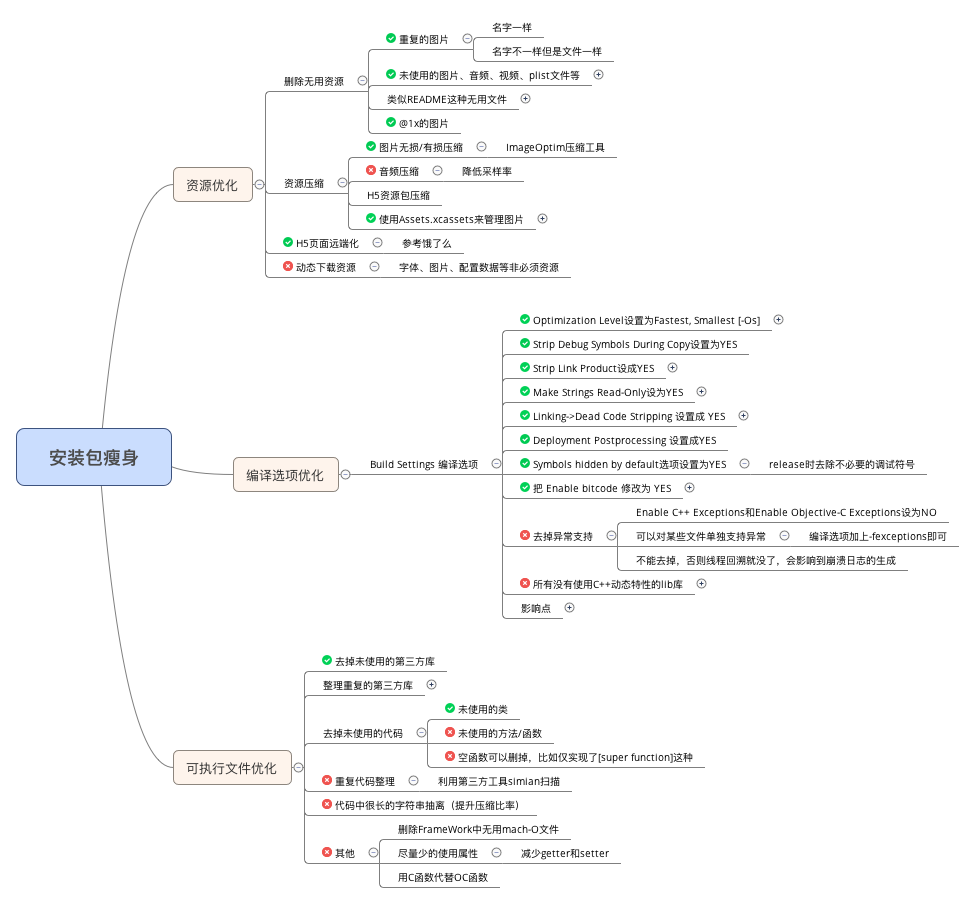

# iOS安装包瘦身指南

[Maximum build file sizes](https://help.apple.com/app-store-connect/#/dev611e0a21f)

## 资源优化

### 删除无用资源

解压ipa文件，检查是否有无用资源存在。

现在应该没有APP需要支持iPhone4以下的机型了，所以1X的图片可以全部删掉。3X的图片是保留还是删掉看具体情况。

重复的图片分两种，一种是名字一样的图片，如果你使用.xcassets来管理图片，那么Xcode的左边栏会有警告提示图片名字重复，直接按提示一一处理即可。另一种是名字不一样但是文件一样的图片，我们使用了一个Python脚本（[@甘超江](http://weibo.com/ganchaojiang?from=profile&wvr=6&is_hot=1) 大神出品）来扫描，每次编译的时候执行该脚本，如果有扫描命中则会让Xcode编译失败，此时需要人工去处理。需要注意的一点就是使用.xcassets来管理图片的时候回存在一个映射关系，通过imageNamed:方法使用的名字和图片的真实名字有可能不一样，脚本扫描的时候需要特别处理下。

未使用的图片可以通过[LSUnusedResources](http://www.jianshu.com/p/a72d03e92c80)扫描出来，不过要注意的是可能会有误伤，该工具是全匹配，一些拼接名字来使用的图片要注意手动剔除。笔者就因为误删图片被惩罚过o(╯□╰)o

一些音频、视频和多余的plist文件以及readme文件什么的目测只能肉眼扫描了，我们没用到这些资源暂时没这个问题。

### 资源压缩

首先是图片压缩，ImageOptim工具可以实现无损压缩。

另外关于图片，建议使用Apple推荐的.xcassets来管理，它会把里边的所有png格式的图片压缩成一个Assets.car文件，压缩比率比其他方式管理图片要高。不过测试发现jpg图片不会在Assets.car文件里。

另如果你有用到音频或视频资源，也可以考虑压缩。

### H5页面远端化

如果你的H5有本地页面和资源，可以考虑全部远端化。本地资源主要是一些js、html文件和图片。

## 编译器选项优化

这个最有用的一个选项是`Deployment Postprocessing`和`Strip Linked Product`，两个需要都设置为YES才有用

原理是打开这两个选项后构建ipa会去除掉symbol符号，就是那些类名啊函数名啊啥的。这样子的影响就是运行时你没法进行线程回溯，符号都没了回溯了也是乱码。但是不会影响正常的崩溃日志生成和解析。在本机专门测试过，如果使用符号表来解析崩溃日志，则完全不受影响。

其他编译选项见下方的思维导图。

## 可执行文件优化

### 去除无用类、方法、属性

原理直接参考[微信的这篇文章](http://www.cocoachina.com/ios/20151211/14562.html)，主要是使用otool这个工具去取出可执行文件里的一些编译信息，可以拿到该可执行文件里所有的类和函数列表，以及使用过的类，两者相减就得到一个初步的未使用的类的列表，不过可能会有误伤，需要一一确认。

### 混淆压缩类名，方法名，属性名字符串

### 去除空函数及默认实现的函数

有些函数只是实现了一个[super function],例如didReciveMemoryWarning，或者viewDidAppear如果没做额外的处理其实都是可以删除的。
### 去除常量字符创
对于项目中使用到的字符串常量，可以考虑替换策略，比如用code代替message

### 统计项目中各工程在可执行文件的大小占比

可以在每个版本开发结束时统计一下各工程所占可执行文件的大小，这样可以看到size的趋势

## 代码重构

重构以避免重复代码，以及未使用函数的扫描和删除都对减少ipa size有帮助，不过这两者不像上面提到的那些方法效果好，而且难度更大一些。尤其是重构，如果一开始设计的不好，可能一些重复的代码到处都是，比如屏幕宽高的宏，计算给定字符串高度的代码，给定宽高和颜色画一张图片等等这些代码都很可能被复制的很多份。

引入第三方库要慎重评估是否值得，有时候为了一个功能引入了一个很大的第三库，造成ipa size的显著增加，但是其实你只用到了其中一小部分功能，这个时候可以考虑自己实现其功能，而不是引入该库。

我们在实践中发现，技术上对于减少ipa大小最有用的主要是删掉未使用图片、去掉一些重复功能的第三方库以及编译选项去掉symbol符号。从产品角度砍掉部分鸡肋的功能效果却更明显，版本在迭代的过程中会有很多功能的尝试，功能收敛对ipa size的减少也很有帮助。

## 思维导图总结

参考链接和拓展阅读

1.[iOS APP可执行文件的组成](http://blog.cnbang.net/tech/2296/)

2.[iOS 可执行文件瘦身方法](http://blog.cnbang.net/tech/2544/)

3.[减少iOS应用程序的大小](http://beyondvincent.com/2014/03/24/2014-03-20-reducing-the-size-of-my-app/)

4.[你的iOS安装包真的“脱光”了么](https://zhuanlan.zhihu.com/p/19925959)
