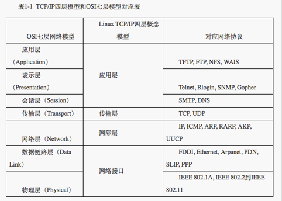

TCP/IP模型各个层次的功能和协议

| 层次名称   | 功能                         | 协议                        |
| ---------- | ---------------------------- | --------------------------- |
| 网络接口层 | 负责实际数据的传输           | HDLC，PPP，SLIP             |
| 网际层     | 负责网络间的寻址             | IP，ICMP，ARP，RARP         |
| 传输层     | 负责提供传输服务             | TCP/UDP                     |
| 应用层     | 负责实现与应用程序相关的功能 | HTTP/HTTPs,FTP,SMTP,DNS,NFS |

Linux环境下地TCP/IP模型与OSI七层模型不同的是，前者是实际运行的，而后者是理论概念 

