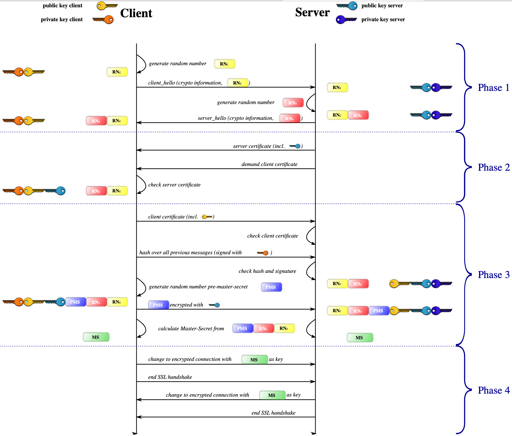

# TSL/SSL

> 握手阶段分成五步:
>
> 第一步，爱丽丝给出协议版本号、一个客户端生成的随机数（Client random），以及客户端支持的加密方法。
>
> 第二步，鲍勃确认双方使用的加密方法，并给出数字证书、以及一个服务器生成的随机数（Server random）。
>
> 第三步，爱丽丝确认数字证书有效，然后生成一个新的随机数（Premaster secret），并使用数字证书中的公钥，加密这个随机数，发给鲍勃。
>
> 第四步，鲍勃使用自己的私钥，获取爱丽丝发来的随机数（即Premaster secret）。
>
> 第五步，爱丽丝和鲍勃根据约定的加密方法，使用前面的三个随机数，生成"对话密钥"（session key），用来加密接下来的整个对话过程。

[SSL/TLS工作原理](https://blog.csdn.net/ustccw/article/details/76691248)

[SSL/TLS协议运行机制的概述](http://www.ruanyifeng.com/blog/2014/02/ssl_tls.html)

