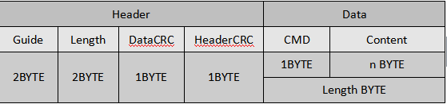
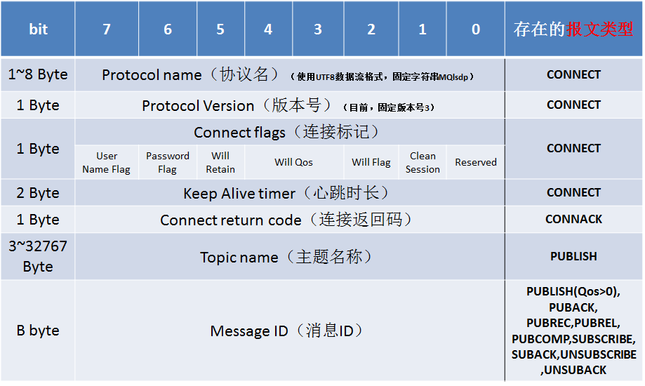
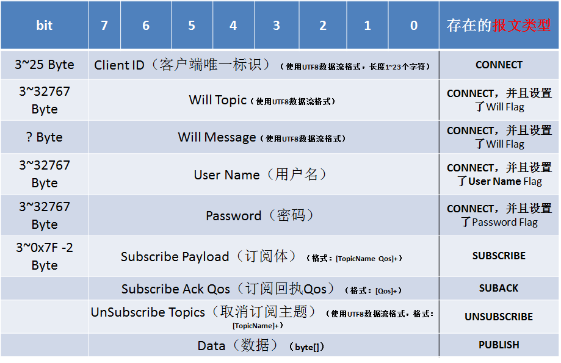
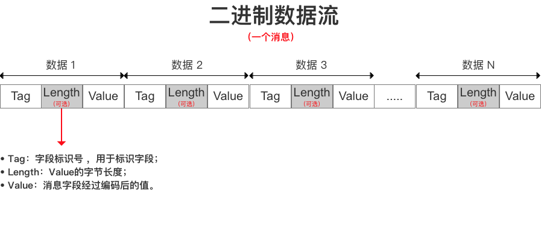
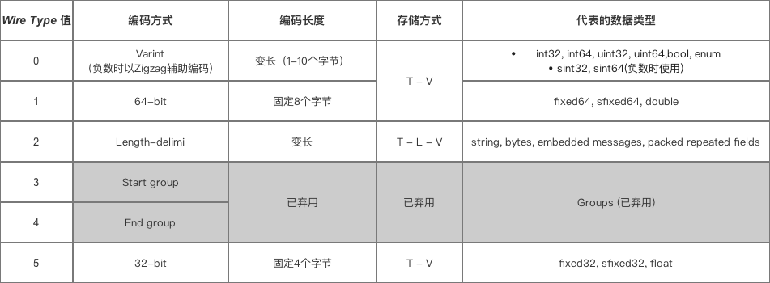
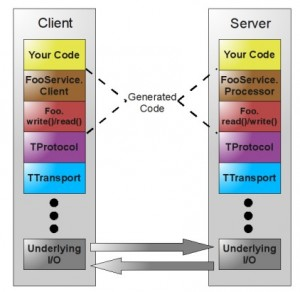

# 编程之网络通信协议

## 概述

关于网络通信协议，描述的是C/S结构中的客户端与服务端将以何种数据格式进行交互，即数据在网络中的上行和下行。概括的说，就是借助TCP/IP，将数据以某种确定的格式封装并传递。

标准定义：

为计算机网络中进行数据交换而建立的规则、标准或约定的集合。网络协议至少包括三要素：

- 语法：语法是用户数据与控制信息的结构与格式，以及数据出现的顺序
- 语义：解释控制信息每个部分的意义。它规定了需要发出何种控制信息，以及完成的动作与做出什么样的响应
- 时序：时序是对事件发生顺序的详细说明。

形象地把这三个要素描述为：语义表示要做什么，语法表示要怎么做，时序表示做的顺序

通俗地说，协议就是通信双方能够理解的一种数据格式。格式分类大概有：

| 协议种类   | 描述                                                         | 主流格式                                                     |
| ---------- | ------------------------------------------------------------ | ------------------------------------------------------------ |
| 文本协议   | 文本协议一般是由一串ACSII字符组成的数据，这些字符包括数字，大小写字母、百分号，还有回车(\r)，换行(\n)以及空格等 | `String`、`XML`、`JSON`                                      |
| 二进制协议 | 二进制协议就是一串字节流，通常包括 `header`(消息头)和 `body`(消息体)，`header` 的长度固定，并且 `header `包括了 `body `的长度。这样就能够从数据流中解析出一个完整的二进制数据 | `Protobuf`(google)<br/>`MQTT`(IBM)<br/>`Thrift`(facebook)<br/>`JCE`(tencent) |

文本协议设计的目的就是方便解读和理解，常见，协议中通常会加入一些特殊字符用于分隔，但为了便于解析，文本协议不得不添加一些冗余的字符用于分隔命令，降低了其传输的效率；而且只适于传输文本，很难嵌入其他数据，比如一张图片

二进制协议就是一串字节流，如下是一个典型的二进制协议：



其中，`Guide` 用于标识协议起始，`Length` 是消息体 `Data` 的长度，为了数据完整性，还会加上相应的校验(DataCRC，HeaderCRC)；`Data` 中又分为命令字 `CMD`，和命令内容 `Content`。命令字是双方协议文档中规定好的，比如，`0x01` 代表登录，`0x02` 代表登出，一般数据字段的长度也是固定的。正因为长度的固定，所以少了冗余数据，传输效率较高


综上，我们大致总结文本协议和二进制协议的优缺点：

| 协议类型   | 优点                                                         | 缺点                                                         | 使用场景                               |
| ---------- | ------------------------------------------------------------ | ------------------------------------------------------------ | -------------------------------------- |
| 文本协议   | 直观、描述性强，容易理解，便于调试，一般都提供系统级原生API支持 | 冗余数据多，解析复杂(字符创比较)，不适宜传输二进制文件       | 调试方便、接口灵活性高                 |
| 二进制协议 | 冗余数据少，传输高效，方便解析(固定长度，可以直接比较字节)   | 格式固定死板，灵活性低，不易复用，代码更复杂（序列化和反序列化），没有系统级支持，需要引用第三方库（序列化和反序列化） | 性能要求高，数据私密性强，固定业务场景 |

总之，没有最好的技术，只有更适合业务场景的方案


## 文本协议

### String

示例：

```scala
// response
!set chl 003#
```

其中，以 `!` 标识命令的开始，`#` 标识命令结束，`空格 `用来分隔命令字段，请求 chl 的值和设置 chl 的值都是比较清晰明了

### XML

可扩展标记语言，用于标记电子文件使其具有结构性的标记语言，可以用来标记数据、定义数据类型，是一种允许用户对自己的标记语言进行定义的源语言

易读性高，编码手写难度小，数据量大

示例：

```xml
<!-- 获取指定日期的体育新闻 -->
<newslist>
    <news>
        <title>title1</title>
        <detail>detail1</detail>
        <comment>commentcount1</comment>
        <image>url1</image>
    </news>
    <news>
        <title>title2</title>
        <detail>detail2</detail>
        <comment>commentcount2</comment>
        <image>url2</image>
    </news>
</newslist>
```


| 解析方式 | 优点                                                         | 缺点                                                 | 场景                                                         |
| -------- | ------------------------------------------------------------ | ---------------------------------------------------- | ------------------------------------------------------------ |
| DOM      | 整个文档树在内存中，便于操作；支持删除、修改、重新排列等多种功能 | 将整个文档调入内存（包括无用的节点），浪费时间和空间 | 一旦解析了文档还需多次访问这些数据；硬件资源充足（内存、CPU）；适合解析小型文档，不适合移动设备 |
| SAX      | 解析速度快，不用事先调入整个文档，占用资源少                 | 只能读，不能修改，只能顺序访问                       | 常应用于处理大量数据的XML，实现异构系统的数据访问，实现跨平台从文档的开始通过每一节点移动，定位一个特定的节点<br>NSXMLParser 是 iOS 的封装 |
| PULL     | 类似 SAX                                                     | 类似 SAX                                             | 适用Android平台移动设备 <br>XmlPullParser 是 Android 的封装  |

#### XMPP

可扩展消息处理现场协议(eXtensible Messaging and Presence Protocol , XMPP) 是一种基于可扩展标记语言(eXtensible Markup Language, XML)的近端串流式即时通信协议。它将现场和上下文敏感信息标记嵌入到XML 结构化数据中, 使得人与人之间、应用系统之间以及人与应用系统之间能即时相互通信 

XMPP是一种基于XML架构的开放式协议.XMPP的基础部分已经在2002-2004年得到了互联网工程任务组(IETF)的批准，未来XMPP协议会理所当然的同Internet协议TCP/IP、HTTP、FTP、SMTP、POP一样成为Internet标准

> Google已经放弃

参照：[XMPP](https://www.ibm.com/developerworks/cn/xml/x-xmppintro/index.html)，[xmpp协议详解、优点、缺点及优化思路](https://blog.csdn.net/jessonlv/article/details/44811253)


### JSON

JSON是JavaScript Object Notation的缩写，是一种轻量级的数据交换形式，是一种XML的替代方案，而且比XML更小，更快而且更易于解析。因为JSON描述对象的时候使用的是JavaScript语法，它是语言和平台独立的，并且这些年许多JSON的解析器和类库被开发出来

示例：

```json
{
    "code": 0,
    "data": {
        "timeline": "20181119114822",
        "data": []
    }
}
```

常见平台JSON格式解析库

Android平台：

| 库         | 介绍                                                         | 开发团队        |
| ---------- | ------------------------------------------------------------ | --------------- |
| Gson       | 提供简单的toJson()方法和fromJson()去实现相互转换；可以从JSON中转换出之前存在的不可改变的对象；扩展提供了Java泛型；支持任意复杂的对象 | Google          |
| JSONObject | org.json下面的包中，是一个解析Json字符串的工具类             | Android SDK     |
| FastJson   | 将json字符串解析成java对象                                   | Alibaba         |
| Jackson    | 流式API或者增量解析/产生（ incremental parsing/generation）：读写JSON内容被作为离散的事件；树模型：提供一个可变内存树表示JSON文档；数据绑定（Data binding）：实现JSON与POJO（简单的Java对象（Plain Old Java Object））的转换 | Jackson 社区    |
| Json-lib   | 基于Douglas Crockford的工作成果，能转换bean，map，集合（collection），java数组和XML转换成JSON并能反向转换成beans和动态bean（DynaBean） | sourceforge社区 |

可以参照测评结果：

[JSON 库测评](https://blog.csdn.net/wojiaopanpan/article/details/71746517)

[Java几种常用JSON库性能比较](https://www.xncoding.com/2018/01/09/java/jsons.html)


iOS 平台：

| 库                  | 介绍                                                         | 开发团队                                              |
| ------------------- | ------------------------------------------------------------ | ----------------------------------------------------- |
| NSJSONSerialization | 手动进行 JSON/Model 转换，不用任何开源库，可以进行高效、自由的转换，但手写代码非常繁琐，而且容易出错 | Apple                                                 |
| Mantle              | JSON 模型转换库，Model 需要继承自 MTLModel。功能丰富，文档完善，使用广泛 | Github                                                |
| MJExtension         | 转换速度快、使用简单方便的字典转模型框架                     | [个人开源](https://github.com/CoderMJLee/MJExtension) |
| FastEasyMapping     | 可以自定义详细的 Model 映射过程，支持 CoreData               | Yalantis                                              |
| JSONModel           | Apple上多平台支持，简洁的接口，Model 需要继承自 JSONModel [源码解析](https://juejin.im/entry/58ada9f5128fe1006a5ccc3b) | [个人开源](https://github.com/jsonmodel/jsonmodel)    |
| YYModel             | JSON/Model 转换，支持定义映射过程                            | [个人开源](https://github.com/ibireme/YYModel)        |

可以参照测评结果：

[iOS JSON 模型转换库评测](https://blog.ibireme.com/2015/10/23/ios_model_framework_benchmark/)


## 二进制协议

### MQTT

MQTT（Message Queuing Telemetry Transport，消息队列遥测传输）是一种基于`发布/订阅`（`publish/subscribe`）模式的“轻量级”通讯协议，该协议构建于TCP/IP协议上，由IBM在1999年发布

MQTT最大优点在于，以 **极少的代码和有限的带宽**，为连接远程设备提供**实时可靠**的消息服务

作为一种低开销、低带宽占用的即时通讯协议，使其在物联网、小型设备、移动应用等方面有较广泛的应用

[初识 MQTT](https://www.ibm.com/developerworks/cn/iot/iot-mqtt-why-good-for-iot/index.html)


#### 特点

MQTT是一个基于**客户端-服务器**的消息发布/订阅传输协议。MQTT协议是轻量、简单、开放和易于实现的，这些特点使它适用范围非常广泛。在很多情况下，包括受限的环境中，如：机器与机器（M2M）通信和物联网（IoT）。其在，通过卫星链路通信传感器、偶尔拨号的医疗设备、智能家居、及一些小型化设备中已广泛使用

除标准版外，还有一个简化版`MQTT-SN`，该协议主要针对嵌入式设备，这些设备一般工作于百TCP/IP网络，如：ZigBee

MQTT协议运行在 `TCP/IP` 或其他网络协议，提供有序、无损、双向连接

> MQTT-SN 基于UDP协议

主要特性：

- 使用的发布/订阅消息模式，它提供了一对多消息分发，以实现与应用程序的解耦

- 屏蔽的消息传输机制

- 对传输消息有三种服务质量（QoS）：

  - `最多一次`，消息发布完全依赖底层TCP/IP，会发生消息丢失或重复；

  - `至少一次`，这一级别会确保消息到达，但消息可能会重复；
  - `只有一次`，确保消息只有一次到达；(适用：计费系统、推送系统)

- 数据传输和协议交换的最小化（协议头部只有2字节），以减少网络流量

- 通知机制，异常中断时通知传输双方


#### 原理

#####实现方式 


- 实现`MQTT`协议需要：`客户端`和`服务器端`
- `MQTT`协议中有三种身份：`发布者（Publish）`、`代理（Broker）`（服务器）、`订阅者（Subscribe）`。其中，消息的`发布者`和`订阅者`都是客户端，消息`代理`是服务器，消息`发布者`可以同时是`订阅者`。
- 传输的消息分为：主题（Topic）和 负载（payload）两部分
  - `Topic`，可以理解为消息的类型，`订阅者`订阅（Subscribe）后，就会收到该主题的消息内容（`payload`）
  - `payload`，可以理解为消息的内容


##### 网络传输与应用消息

`MQTT`会构建底层网络传输：它将建立客户端到服务器的连接，提供两者之间的一个有序的、无损的、基于字节流的双向传输

当应用数据通过`MQTT`网络发送时，`MQTT`会把与之相关的服务质量（QoS）和主题名（Topic）相关连


##### 客户端

一个使用`MQTT`协议的应用程序或者设备，它总是建立到服务器的网络连接。客户端可以：

- 发布其他客户端可能会订阅的信息
- 订阅其它客户端发布的消息
- 退订或删除应用程序的消息
- 断开与服务器连接


##### 服务器

`MQTT`服务器也称为“消息代理”（Broker），可以是一个应用程序或一台设备。它是位于消息`发布者`和`订阅者`之间，它可以：

- 接受来自客户的网络连接
- 接受客户发布的应用信息
- 处理来自客户端的订阅和退订请求
- 向订阅的客户转发应用程序消息


#### 协议数据格式

在`MQTT`协议中，一个`MQTT`数据包由：`固定头（Fixed header）`、 `可变头（Variable header）`、 `消息体（payload）`三部分构成

- MQTT`固定头`
  - MQTT`数据包类型]
  - 标识位
  - 余长度（Remaining Length）

- `MQTT`可变头
- `Payload`消息体


**MQTT 数据包结构**

- `固定头（Fixed header）`，存在于所有`MQTT`数据包中，表示数据包类型及数据包的分组类标识
- `可变头（Variable header）`，存在于部分`MQTT`数据包中，数据包类型决定了可变头是否存在及其具体内容
- `消息体（Payload）`，存在于部分`MQTT`数据包中，表示客户端收到的具体内容

##### `MQTT`固定头

`固定头`存在于所有`MQTT`数据包中，其结构如下：

| Bit    | 7                | 6    | 5    | 4    | 3                              | 2    | 1    | 0    |
| ------ | ---------------- | ---- | ---- | ---- | ------------------------------ | ---- | ---- | ---- |
| byte 1 | `MQTT`数据包类型 |      |      |      | 不同类型`MQTT`数据包的具体标识 |      |      |      |
| byte 2 | 剩余长度         |      |      |      |                                |      |      |      |

 `MQTT`数据包类型

**位置：**byte 1, bits 7-4

一个4位的无符号值，类型如下：

| 名称        | 值   | 流方向         | 描述                        |
| ----------- | ---- | -------------- | --------------------------- |
| Reserved    | 0    | 不可用         | 保留位                      |
| CONNECT     | 1    | 客户端到服务器 | 客户端请求连接到服务器      |
| CONNACK     | 2    | 服务器到客户端 | 连接确认                    |
| PUBLISH     | 3    | 双向           | 发布消息                    |
| PUBACK      | 4    | 双向           | 发布确认                    |
| PUBREC      | 5    | 双向           | 发布收到（保证第1部分到达） |
| PUBREL      | 6    | 双向           | 发布释放（保证第2部分到达） |
| PUBCOMP     | 7    | 双向           | 发布完成（保证第3部分到达） |
| SUBSCRIBE   | 8    | 客户端到服务器 | 客户端请求订阅              |
| SUBACK      | 9    | 服务器到客户端 | 订阅确认                    |
| UNSUBSCRIBE | 10   | 客户端到服务器 | 请求取消订阅                |
| UNSUBACK    | 11   | 服务器到客户端 | 取消订阅确认                |
| PINGREQ     | 12   | 客户端到服务器 | PING请求                    |
| PINGRESP    | 13   | 服务器到客户端 | PING应答                    |
| DISCONNECT  | 14   | 客户端到服务器 | 中断连接                    |
| Reserved    | 15   | 不可用         | 保留位                      |

标识位

**位置：**byte 1, bits 3-0

在不使用标识位的消息类型中，标识位被作为保留位。如果收到无效的标志时，接收端必须关闭网络连接：

| 数据包      | 标识位         | Bit 3 | Bit 2 | Bit 1 | Bit 0   |
| ----------- | -------------- | ----- | ----- | ----- | ------- |
| CONNECT     | 保留位         | 0     | 0     | 0     | 0       |
| CONNACK     | 保留位         | 0     | 0     | 0     | 0       |
| PUBLISH     | MQTT 3.1.1使用 | DUP1  | QoS2  | QoS2  | RETAIN3 |
| PUBACK      | 保留位         | 0     | 0     | 0     | 0       |
| PUBREC      | 保留位         | 0     | 0     | 0     | 0       |
| PUBREL      | 保留位         | 0     | 0     | 1     | 0       |
| PUBCOMP     | 保留位         | 0     | 0     | 0     | 0       |
| SUBSCRIBE   | 保留位         | 0     | 0     | 1     | 0       |
| SUBACK      | 保留位         | 0     | 0     | 0     | 0       |
| UNSUBSCRIBE | 保留位         | 0     | 0     | 1     | 0       |
| UNSUBACK    | 保留位         | 0     | 0     | 0     | 0       |
| PINGREQ     | 保留位         | 0     | 0     | 0     | 0       |
| PINGRESP    | 保留位         | 0     | 0     | 0     | 0       |
| DISCONNECT  | 保留位         | 0     | 0     | 0     | 0       |

- `DUP`：发布消息的副本。用来在保证消息的可靠传输，如果设置为 1，则在下面的变长中增加MessageId，并且需要回复确认，以保证消息传输完成，但不能用于检测消息重复发送。
- `QoS`：发布消息的服务质量，即：保证消息传递的次数
  - `00`：最多一次，即：<=1
  - `01`：至少一次，即：>=1
  - `10`：一次，即：=1
  - `11`：预留
- `RETAIN`： 发布保留标识，表示服务器要保留这次推送的信息，如果有新的订阅者出现，就把这消息推送给它，如果设有那么推送至当前订阅者后释放


剩余长度（Remaining Length）

**位置：**byte 2

固定头的第二字节用来保存变长头部和消息体的总大小的，但不是直接保存的。这一字节是可以扩展，其保存机制，前7位用于保存长度，后一部用做标识。当最后一位为 1时，表示长度不足，需要使用二个字节继续保存。 例如：计算出后面的大小为0

##### `MQTT`可变头



##### 

`MQTT`数据包中包含一个可变头，它驻位于固定的头和负载之间

可变头的内容因数据包类型而不同，较常的应用是作为包的标识

很多类型数据包中都包括一个2字节的数据包标识字段，这些类型的包有：PUBLISH (QoS > 0)、PUBACK、PUBREC、PUBREL、PUBCOMP、SUBSCRIBE、SUBACK、UNSUBSCRIBE、UNSUBACK

#####  `Payload`消息体



`Payload`消息体位`MQTT`数据包的第三部分，CONNECT、SUBSCRIBE、SUBACK、UNSUBSCRIBE四种类型的消息体：

- `CONNECT`，消息体内容主要是：客户端的ClientID、订阅的Topic、Message以及用户名和密码
- `SUBSCRIBE`，消息体内容是一系列的要订阅的主题以及`QoS`
- `SUBACK`，消息体内容是服务器对于`SUBSCRIBE`所申请的主题及`QoS`进行确认和回复
- `UNSUBSCRIBE`，消息体内容是要订阅的主题


#### 测试环境搭建(mac OS)

mosquitto 是一个实现了 MQTT3.1 协议的代理服务器，由 MQTT 协议创始人之一的Andy Stanford-Clark开发，它为我们提供了非常棒的轻量级数据交换的解决方案

1. 安装 mosquitto

```shell
brew install mosquitto
```

2. 启动服务

   - 常驻后台Service

     ```shell
     brew services start mosquitto
     
     // 终止 service
     brew services stop mosquitto
     ```

   - 前台临时启动

     ```shell
     // 找到 mosquitto可执行文件所在，一般是brew install 安装目录
     // 找到 mosquitto 配置文件所在
     cd /usr/local/Cellar/mosquitto/1.5.4/sbin
     ./mosquitto -c /usr/local/etc/mosquitto/mosquitto.conf 
     ```

3. 测试服务

   默认是支持匿名登录的，且已经配置好测试用 user 和 topic，可以在`/usr/local/etc/mosquitto/` 目录下查看 aclfile.example 文件中默认的测试数据

   ```shell
   // 新建终端，订阅指定的 topic
   mosquitto_sub -h "ip" -t foo/bar
   // 再新建终端，发布指定 topic 和 payload
   mosquitto_pub -h "ip" -t foo/bar -u roger -m "test message"
   ```

> 如果需要配置自定义 topic 或者是 新增用户和密码等可以参照[Mosquitto用户名密码配置](https://blog.csdn.net/u012377333/article/details/69397124)


#### 参考

[MQTTClient](https://github.com/novastone-media/MQTT-Client-Framework)， iOS开发常用的

[在 iOS 中使用 MQTT 协议](https://www.jianshu.com/p/0515fe4286ec)， [iOS MQTT----MQTTClient实战-看这篇的就够了](https://www.jianshu.com/p/80ea4507ca74)


[org.eclipse.paho.client.mqttv3](https://github.com/eclipse/paho.mqtt.android)，Java常用库

[MQTT协议学习与在Java（Android通用）中的使用](https://juejin.im/post/5a3119fb5188252754105159)，[Android中Mqtt协议的使用](https://blog.csdn.net/Jiang_Rong_Tao/article/details/74817294)


[EMQTT](https://github.com/emqtt)

[EMQ - 百万级开源MQTT消息服务器](http://emqtt.com/docs/v2/getstarted.html#emq-2-0)


### Protobuf

[Google Protocol Buffer](https://developers.google.com/protocol-buffers/)( 简称 Protobuf) 是 Google 公司内部的混合语言数据标准

Protocol Buffers 是一种轻便高效的结构化数据存储格式，可以用于结构化数据串行化，或者说序列化。可用于通讯协议、数据存储等领域的语言无关、平台无关、可扩展的序列化结构数据

支持序列化和反序列化数据结构和类对象

Protobuf 3 支持 Java, Python, Objective-C, C++, C#, Go

它很适合做数据存储或 RPC 数据交换格式

适用场景：量级大、网络环境不稳定

#### 特点

- 序列化速度快
- 数据压缩能力强
- 跨平台，可扩展
- 易维护，多平台使用同一套协议文件


#### 原理

根据 `Varint` 和 `Zigzag` 编码方式对 Protobuf 定义的消息体结构进行编码，再利用Tag-Length-Value格式进行数据组装，最终得到数据的二进制表示



*若字段没有被设置字段值，那么该字段在序列化时的数据中是不存在的，即不需要编码，相应字段在解码的时候才会被设置默认值*

不同的数据类型，采用的序列化方式不同，具体规则：


*对于Varint编码数据，不需要Length*

##### Varint

varint编码每个字节前1位表示下一个字节是否也是该数字的一部分，后7位表示实际的值，最后，先低位后高位，对于int类型来说，varint编码最少占用1个字节，最多占用5个字节

例如，对于int类型1来说，二进制表示为`00000000 00000000 00000000 00000001`，总共占用4个字节，然而，前3个字节都是0，varint就是通过压缩高位的0来达到节省空间的目的，使用varint压缩后，二进制表示为`00000010`，只占用1个字节。

对于int类型2^30来说二进制表示为`01000000 00000000 00000000 00000000`，使用varint压缩后，二进制表示为`00000001 00000001 00000001 00000001 00001000`，占用5个字节


##### Zigzag

对于负数来说，因为最高位符号位始终为1，使用varint编码就很浪费空间，zigzag编码就是解决负数的问题的，同时其对正数也没有很大的影响。

int类型zigzag变换的代码表示为`(n << 1) ^ (n >> 31)`

- 左移1位可以消去符号位，低位补0
- 有符号右移31位将符号位移动到最低位，负数高位补1，正数高位补0
- 按位异或
  - 对于正数来说，最低位符号位为0，其他位不变
  - 对于负数，最低位符号位为1，其他位按位取反

-1的二进制表示为`11111111 11111111 11111111 11111111`，zigzag变换后`00000000 00000000 00000000 00000001`，再用varint编码

1的二进制表示为`00000000 00000000 00000000 00000001`，zigzag变换后`00000000 00000000 00000000 00000010`，再用varint编码


#### 协议数据格式（Tag-Length-Value）

Tag:

- 标识数据结构中的字段
- 一般占一个字节，超过16，则两个字节

```c
// Tag 的具体表达式如下
 Tag  = (field_number << 3) | wire_type
// 参数说明：
// field_number：对应于 .proto文件中消息字段的标识号，表示这是消息里的第几个字段
// field_number << 3：表示 field_number = 将 Tag的二进制表示 右移三位 后的值 
// field_num左移3位不会导致数据丢失，因为表示范围还是足够大地去表示消息里的字段数目

//  wire_type：表示 字段 的数据类型
//  wire_type = Tag的二进制表示 的最低三位值
//   wire_type的取值
 enum WireType { 
      WIRETYPE_VARINT = 0, 
      WIRETYPE_FIXED64 = 1, 
      WIRETYPE_LENGTH_DELIMITED = 2, 
      WIRETYPE_START_GROUP = 3, 
      WIRETYPE_END_GROUP = 4, 
      WIRETYPE_FIXED32 = 5
   };

// 从上面可以看出，wire_type 最多占用 3 bit 的内存空间（ 3bit 足以表示 0-5 的二进制）

//  wire_type 对应的数据类型表，在上面已经提到

```


举例：

```protobuf
message Test
{
	required int32 id1 = 1；
	required int32 id2 = 2；
}

// 在代码中给id1 附上1个字段值：296
// 在代码中给id2 附上1个字段值：296
Test.setId1（300）；
Test.setId2（296）；
// 因为字段类型是int32，通过wire_type表可知，需要采用T-V方式，而不需要使用Length
// Tag 需要一个字节，296 需要2个字节，所以此结构体需要6个字节
// 编码结果为：二进制字节流 = [8，-84，2，16, -88, 2]
```

#### Tips

- 若 required 字段没有被设置字段值，那么在 `IsInitialized()` 进行初始化检查会报错并提示失败 
  所以 required 字段必须要被设置字段值

- 序列化顺序是根据 Tag标识号从小到大 进行编码 和 .proto文件内字段定义的数据无关

- T - V的数据存储方式保证了Protobuf的版本兼容：高<->低 或 低<->高都可以适配

  若新版本增加了required 字段，旧版本在数据解码时会认为IsInitialized() 失败

- 多用 optional或 repeated修饰符 
  因为若optional 或 repeated 字段没有被设置字段值，那么该字段在序列化时的数据中是完全不存在的，即不需要进行编码

- 字段标识号（Field_Number）尽量只使用 1-15，且不要跳动使用 
  因为Tag里的Field_Number是需要占字节空间的。如果Field_Number>16时，Field_Number的编码就会占用2个字节，那么Tag在编码时也就会占用更多的字节；如果将字段标识号定义为连续递增的数值，将获得更好的编码和解码性能

- 若需要使用的字段值出现负数，请使用 sint32 / sint64，不要使用int32 / int64 
  因为采用sint32 / sint64数据类型表示负数时，会先采用Zigzag编码再采用Varint编码，从而更加有效压缩数据

- 对于repeated字段，尽量增加packed=true修饰 
  因为加了packed=true修饰repeated字段采用连续数据存储方式，即T - L - V - V -V方式

#### 参考

[Android Protobuf应用及原理](https://juejin.im/post/5ab85c92518825556a7265e3)

[Protocol Buffer 序列化原理大揭秘](https://blog.csdn.net/carson_ho/article/details/70568606)

[Protobuf GitHub](https://github.com/protocolbuffers/protobuf)


### Thirft

[Thrift]( http://thrift.apache.org)源于Facebook，目前已经作为开源项目提交给了Apahce

通过一个代码生成引擎联合了一个软件栈，来创建不同程度的、无缝的跨平台高效服务

Thrift解决了Facebook各系统的大数据量传输通信和内部不同语言环境的跨平台调用


#### 特点

- 支持IDL跨**多**平台调用
- 隔离性，应用层通讯格式与序列化层通讯格式是完全分离的，都可以独立修改
- 高性能编解码
- 服务模型调用简便
- 开发效率高


#### 原理

##### 实现方式

Thrift项目主要分为2个部分

- Compiler:负责IDL解析以及不同语言代码的生成，由C++编写，基于yacc和bison做语法分析，抽象出Generator生成不同语言的原生代码
- Library:各个不同语言的运行时类库，大致上可以分成几个部分：
  - Transport:网络连接抽象，包括InputStream和OutputStram
  - Protocol:序列化协议，读写数据到Transport中，包括原生类型和结构化类型的对象
  - Processor:服务端接收请求的处理器，负责选择调用方法对应的Function
  - Function:由Processor管理，对应一个IDL中定义的方法，内部调用对应方法的实现，框架定义整体的处理流程(模板模式)，业务逻辑需要开发人员实现
  - Client:客户端，依赖Protocol，框架只定义抽象，实现部分是根据IDL自动生成的(参数序列化和结果反序列化)




图中，TProtocol（协议层），定义数据传输格式，例如：

- TBinaryProtocol：二进制格式；
- TCompactProtocol：压缩格式；
- TJSONProtocol：JSON格式；
- TSimpleJSONProtocol：提供JSON只写协议, 生成的文件很容易通过脚本语言解析；
- TDebugProtocol：使用易懂的可读的文本格式，以便于debug

TTransport（传输层），定义数据传输方式，可以为TCP/IP传输，内存共享或者文件共享等）被用作运行时库。

- TSocket：阻塞式socker；
- TFramedTransport：以frame为单位进行传输，非阻塞式服务中使用；
- TFileTransport：以文件形式进行传输；
- TMemoryTransport：将内存用于I/O，java实现时内部实际使用了简单的ByteArrayOutputStream；
- TZlibTransport：使用zlib进行压缩， 与其他传输方式联合使用，当前无java实现；

 

Thrift支持的服务模型

- TSimpleServer：简单的单线程服务模型，常用于测试；
- TThreadPoolServer：多线程服务模型，使用标准的阻塞式IO；
- TNonblockingServer：多线程服务模型，使用非阻塞式IO（需使用TFramedTransport数据传输方式）；


Thrift实际上是实现了C/S模式，通过代码生成工具将thrift文生成服务器端和客户端代码（可以为不同语言），从而实现服务端和客户端跨语言的支持

用户在Thirft文件中声明自己的服务，这些服务经过编译后会生成相应语言的代码文件，然后客户端调用服务，服务器端提服务

 一般将服务放到一个.thrift文件中，服务的编写语法与C语言语法基本一致，在.thrift文件中有主要有以下几个内容：变量声明（variable）、数据声明（struct）和服务接口声明（service, 可以继承其他接口）

##### 调用过程

`Thrift`框架的远程过程调用的工作过程：

1. 通过IDL定义一个接口的thrift文件，然后通过thrift的多语言编译功能，将接口定义的thrift文件翻译成对应的语言版本的接口文件；
2. Thrift生成的特定语言的接口文件中包括客户端部分和服务器部分；
3. 客户端通过接口文件中的客户端部分生成一个Client对象，这个客户端对象中包含所有接口函数的存根实现，然后用户代码就可以通过这个Client对象来调用thrift文件中的那些接口函数了，但是，客户端调用接口函数时实际上调用的是接口函数的本地存根实现；
4. 接口函数的存根实现将调用请求发送给thrift服务器端，然后thrift服务器根据调用的函数名和函数参数，调用实际的实现函数来完成具体的操作；
5. Thrift服务器在完成处理之后，将函数的返回值发送给调用的Client对象；
6. Thrift的Client对象将函数的返回值再交付给用户的调用函数


#### 协议数据格式

Thrift的协议比较简单，它把协议和编解码整合在一起

抽象类TProtocol定义了协议和编解码的顶层接口

TProtocol：

- 关联一个TTransport传输对象
- 定义一系列读写消息的编解码接口，包括两类：
  - 复杂数据结构比如readMessageBegin, readMessageEnd,  writeMessageBegin, writMessageEnd
  - 基本数据结构，比如readI32, writeI32, readString, writeString

TProtocol的实现类有：

- `TBinaryProtocol`：二进制协议
- `TCompactProtocl`：带压缩的二进制(使用zigzag编码，对i16、i32、i64这3种类型以及field的编号进行压缩)

以`TBinaryProtocol`为例说明，协议如下所示：

```
----------------------------------------------------------------------------------------
|                              header                            |        body         |
|  magic  | method name length |  method name  | sequence number |       result        |
|    4    |         4          | N length size |        4        |          X          |   
----------------------------------------------------------------------------------------
```

总体我们可以分为`header`和`body`。

`header` ：

1. 开始是4个字节的magic，Thrift协议的magic是一个32位的数字，高16位是`8001`(个人理解代表版本号，目前是第一个版本)，低16位根据TMessageType得到，目前TMessageType分为4种：
   - CALL = 1 调用消息，如`0x80010001`
   - REPLY = 2 应答消息，如`0x80010002`
   - EXCEPTION = 3 异常消息，如`0x80010003`
   - ONEWAY = 4 单向消息，属于调用消息，但是不需要应答，如`0x80010004`

2. 其次是4个字节表示方法名称的长度N

3. 再次是N方法名称的字节

4. 最后是4个字节的序列号

`body` ：

首先是一个`struct`类型，内部会根据类型的不同各不相同，同时支持不同类型的嵌套，目前支持的类型包括：

- byte
- bool
- short
- int
- long
- double
- string
- bytearray
- map
- list
- set
- field
- struct

> 注意：`exception`可以理解为struct的一种，按照struct来序列化和反序列化。

`byte`占1个字节，`bool`也是占用1个字节，true=1，false=0。

`short`占2个字节，`int`占4个字节，`long`和`double`都是占用8个字节。

`string`和`bytearray`类似，占4+N字节，描述如下：

```
--------------------
| size |  content  |
|   4  |     N     |
--------------------
```

> string使用UTF-8编码成byte数组

`map`占`1+1+4+N*X+N*Y`个字节，描述如下：

```
----------------------------------------------------------------------------------------
|  key-type  | value-type |  size  | key1 | value1 | key2 | value2 |...| keyN | valueN |
|      1     |      1     |    4   |   X  |   Y    |   X  |   Y    |...|   X  |   Y    |
----------------------------------------------------------------------------------------
```

其中key-type和value-type可以是任何以上的类型。

`list`和`set`类似，占`1+4+N*X`个字节，描述如下：

```
----------------------------------------------------------------
|  element-type  |  size  | element1 | element2 |...| elementN |
|        1       |    4   |    X     |    X     |...|    X     |
----------------------------------------------------------------
```

> 其中element-type可以是任何以上的类型

`field`占`1+2+X`个字节，描述如下：

```
---------------------------------------
| field-type | field-id | field-value |
|      1     |     2    |      X      |
---------------------------------------
```

`field`不是独立出现，而是出现在`struct`内部，其中field-type可以是任何以上的类型，field-id就是定义IDL时该`field`在`struct`的编号，field-value是对应类型的序列化结果。

`struct`占`X`个字节，需要具体定义具体计算，可以按照入下描述：

```
--------------------------------
| field1 | field2 |...| fieldN |
|    M   |    M   |...|    M   |
--------------------------------
```

在使用上有些需要注意的点：

- 对于方法定义了返回值为`struct`、`map`、`set`、`list`，如果服务端返回null，thrift是不能够很好的支持的(会报错)，需要根据具体情况返回empty的对象或者抛出定义的异常
- 如果参数或者返回值是`map`、`set`、`list`实例，该实例不能被其他线程修改，否则会报协议错误或者超时


#### 参考

[Thrift interface description language](http://thrift.apache.org/docs/idl)

[Thrift源码分析](https://www.kancloud.cn/digest/thrift/118983)

[Thrift工作原理](https://blog.csdn.net/houjixin/article/details/42779835)

[深入浅出 RPC - 深入篇](https://blog.csdn.net/mindfloating/article/details/39474123)

## 

